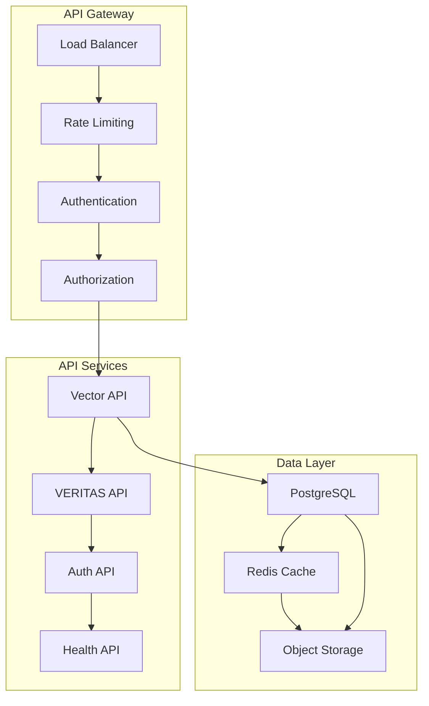

# 🌐 API DESIGN - AINDUSDB CORE

**Version** : 1.0.0  
**Niveau** : API Architecture  
**Date** : 21 janvier 2026  

---

## 🎯 **INTRODUCTION**

Design complet de l'API REST d'AindusDB Core suivant les meilleures pratiques RESTful, OpenAPI 3.0 et patterns enterprise pour une expérience développeur optimale.

### **🏆 PRINCIPES DE DESIGN API**
- **RESTful Architecture** : Resources, verbs, status codes
- **OpenAPI Specification** : Documentation auto-générée
- **Versioning Strategy** : Backward compatibility
- **Security First** : Authentication & authorization
- **Performance Optimized** : Pagination, caching, compression
- **Developer Experience** : Clear errors, examples, SDKs

---

## 🏗️ **API ARCHITECTURE**

### **📊 Architecture Globale**


### **🔄 Request Flow**
```
Client Request → Gateway → Auth → Rate Limit → 
API Service → Business Logic → Cache → Database → 
Response → Logging → Metrics
```

---

## 📋 **API SPECIFICATION**

### **🌐 Base Configuration**
```yaml
# OpenAPI 3.0 Specification
openapi: 3.0.3
info:
  title: AindusDB Core API
  description: |
    Enterprise vector database with VERITAS protocol support
    ## Features
    - Vector storage and similarity search
    - Mathematical computation with proofs
    - Enterprise-grade security
    - Real-time performance monitoring
  version: 1.0.0
  contact:
    name: AindusDB Team
    email: api@aindusdb.io
    url: https://aindusdb.io
  license:
    name: MIT
    url: https://opensource.org/licenses/MIT

servers:
  - url: https://api.aindusdb.io/v1
    description: Production server
  - url: https://staging-api.aindusdb.io/v1
    description: Staging server
  - url: http://localhost:8000/v1
    description: Development server

security:
  - BearerAuth: []
  - ApiKeyAuth: []

components:
  securitySchemes:
    BearerAuth:
      type: http
      scheme: bearer
      bearerFormat: JWT
    ApiKeyAuth:
      type: apiKey
      in: header
      name: X-API-Key
```

### **🔍 Vector API Endpoints**

#### **Create Vector**
```yaml
paths:
  /vectors:
    post:
      tags:
        - Vectors
      summary: Create a new vector
      description: |
        Create a new vector with automatic embedding generation.
        Supports multiple content types and custom metadata.
      operationId: createVector
      requestBody:
        required: true
        content:
          application/json:
            schema:
              $ref: '#/components/schemas/VectorCreate'
            examples:
              text_vector:
                summary: Text vector creation
                value:
                  content: "Machine learning is transforming industries"
                  metadata:
                    source: "technical_document"
                    category: "AI"
                    language: "en"
                  content_type: "text"
      responses:
        '201':
          description: Vector created successfully
          content:
            application/json:
              schema:
                $ref: '#/components/schemas/VectorResponse'
              examples:
                success:
                  summary: Created vector
                  value:
                    id: "550e8400-e29b-41d4-a716-446655440000"
                    content: "Machine learning is transforming industries"
                    embedding: [0.1, -0.2, 0.3, ...]
                    metadata:
                      source: "technical_document"
                      category: "AI"
                      language: "en"
                    content_type: "text"
                    created_at: "2026-01-21T10:00:00Z"
                    updated_at: "2026-01-21T10:00:00Z"
        '400':
          $ref: '#/components/responses/BadRequest'
        '401':
          $ref: '#/components/responses/Unauthorized'
        '429':
          $ref: '#/components/responses/RateLimited'
      security:
        - BearerAuth: []
        - ApiKeyAuth: []
```

#### **Search Vectors**
```yaml
  /vectors/search:
    post:
      tags:
        - Vectors
      summary: Search vectors by similarity
      description: |
        Perform semantic similarity search using vector embeddings.
        Supports filtering, pagination, and multiple similarity metrics.
      operationId: searchVectors
      requestBody:
        required: true
        content:
          application/json:
            schema:
              $ref: '#/components/schemas/VectorSearch'
            examples:
              semantic_search:
                summary: Semantic search
                value:
                  query: "artificial intelligence applications"
                  limit: 10
                  threshold: 0.8
                  filters:
                    category: "AI"
                    language: "en"
                  similarity_metric: "cosine"
      responses:
        '200':
          description: Search results
          content:
            application/json:
              schema:
                $ref: '#/components/schemas/VectorSearchResponse'
              examples:
                results:
                  summary: Search results
                  value:
                    results:
                      - id: "550e8400-e29b-41d4-a716-446655440000"
                        content: "Machine learning is transforming industries"
                        similarity_score: 0.95
                        metadata:
                          source: "technical_document"
                          category: "AI"
                      - id: "550e8400-e29b-41d4-a716-446655440001"
                        content: "AI applications in healthcare"
                        similarity_score: 0.87
                        metadata:
                          source: "medical_journal"
                          category: "healthcare"
                    total_count: 2
                    search_time_ms: 45
        '400':
          $ref: '#/components/responses/BadRequest'
        '401':
          $ref: '#/components/responses/Unauthorized'
```

### **🧮 VERITAS API Endpoints**

#### **Calculate with Proof**
```yaml
  /veritas/calculate:
    post:
      tags:
        - VERITAS
      summary: Calculate with VERITAS proof
      description: |
        Perform mathematical calculations with cryptographic proofs.
        Supports complex expressions, variables, and multiple verification levels.
      operationId: calculateWithVeritas
      requestBody:
        required: true
        content:
          application/json:
            schema:
              $ref: '#/components/schemas/VeritasCalculation'
            examples:
              simple_calculation:
                summary: Simple calculation
                value:
                  query: "calculate the area of a circle with radius 5"
                  variables:
                    radius: 5
                  enable_proofs: true
                  verification_level: "standard"
              complex_calculation:
                summary: Complex mathematical expression
                value:
                  query: "solve for x in equation 2x^2 + 5x - 3 = 0"
                  variables: {}
                  enable_proofs: true
                  verification_level: "high"
      responses:
        '200':
          description: Calculation completed with proof
          content:
            application/json:
              schema:
                $ref: '#/components/schemas/VeritasResponse'
              examples:
                with_proof:
                  summary: Calculation with proof
                  value:
                    answer: "The area of the circle is 78.54 square units"
                    veritas_proof:
                      proof_id: "veritas_1234567890"
                      calculation_steps:
                        - step: "Area = π × r²"
                          result: "Area = π × 5²"
                        - step: "Area = π × 25"
                          result: "Area = 78.5398..."
                      confidence_score: 0.999
                      verification_hash: "sha256:abc123..."
                    calculation_id: "calc_1234567890"
                    execution_time_ms: 125
        '400':
          $ref: '#/components/responses/BadRequest'
        '401':
          $ref: '#/components/responses/Unauthorized'
```

### **🔐 Authentication API**

#### **Login**
```yaml
  /auth/login:
    post:
      tags:
        - Authentication
      summary: Authenticate user
      description: |
        Authenticate with email/password and optionally MFA token.
        Returns JWT access and refresh tokens.
      operationId: login
      requestBody:
        required: true
        content:
          application/json:
            schema:
              $ref: '#/components/schemas/LoginRequest'
            examples:
              password_login:
                summary: Password authentication
                value:
                  email: "user@example.com"
                  password: "SecurePass123!"
                  mfa_token: "123456"
      responses:
        '200':
          description: Authentication successful
          content:
            application/json:
              schema:
                $ref: '#/components/schemas/AuthResponse'
              examples:
                success:
                  summary: Login successful
                  value:
                    access_token: "eyJhbGciOiJIUzI1NiIsInR5cCI6IkpXVCJ9..."
                    refresh_token: "eyJhbGciOiJIUzI1NiIsInR5cCI6IkpXVCJ9..."
                    token_type: "bearer"
                    expires_in: 3600
                    user:
                      id: "550e8400-e29b-41d4-a716-446655440000"
                      email: "user@example.com"
                      role: "user"
                      created_at: "2026-01-21T10:00:00Z"
        '401':
          description: Authentication failed
          content:
            application/json:
              schema:
                $ref: '#/components/schemas/Error'
              examples:
                invalid_credentials:
                  summary: Invalid credentials
                  value:
                    error: "Invalid credentials"
                    message: "Email or password is incorrect"
                    code: "AUTH_001"
```

---

## 📊 **DATA MODELS**

### **🔍 Vector Models**
```yaml
components:
  schemas:
    VectorCreate:
      type: object
      required:
        - content
      properties:
        content:
          type: string
          minLength: 1
          maxLength: 10000
          description: Text content to be vectorized
          example: "Machine learning is transforming industries"
        metadata:
          type: object
          description: Custom metadata key-value pairs
          additionalProperties:
            type: string
          example:
            source: "technical_document"
            category: "AI"
            language: "en"
        content_type:
          type: string
          enum: [text, image, audio, video]
          default: text
          description: Type of content being stored

    VectorResponse:
      type: object
      properties:
        id:
          type: string
          format: uuid
          description: Unique vector identifier
          example: "550e8400-e29b-41d4-a716-446655440000"
        content:
          type: string
          description: Original content
          example: "Machine learning is transforming industries"
        embedding:
          type: array
          items:
            type: number
            format: float
          description: Vector embedding (1536 dimensions)
          example: [0.1, -0.2, 0.3, 0.4, -0.5]
        metadata:
          type: object
          description: Custom metadata
          additionalProperties:
            type: string
        content_type:
          type: string
          description: Content type
        created_at:
          type: string
          format: date-time
          description: Creation timestamp
        updated_at:
          type: string
          format: date-time
          description: Last update timestamp

    VectorSearch:
      type: object
      required:
        - query
      properties:
        query:
          type: string
          minLength: 1
          maxLength: 1000
          description: Search query text
          example: "artificial intelligence applications"
        limit:
          type: integer
          minimum: 1
          maximum: 100
          default: 10
          description: Maximum number of results
        threshold:
          type: number
          minimum: 0.0
          maximum: 1.0
          default: 0.8
          description: Minimum similarity threshold
        filters:
          type: object
          description: Metadata filters
          additionalProperties:
            type: string
          example:
            category: "AI"
            language: "en"
        similarity_metric:
          type: string
          enum: [cosine, euclidean, dotproduct]
          default: cosine
          description: Similarity metric to use

    VectorSearchResponse:
      type: object
      properties:
        results:
          type: array
          items:
            $ref: '#/components/schemas/VectorSearchResult'
        total_count:
          type: integer
          description: Total number of results
        search_time_ms:
          type: number
          description: Search execution time in milliseconds

    VectorSearchResult:
      type: object
      properties:
        id:
          type: string
          format: uuid
        content:
          type: string
        similarity_score:
          type: number
          minimum: 0.0
          maximum: 1.0
          description: Similarity score (0-1)
        metadata:
          type: object
          additionalProperties:
            type: string
```

### **🧮 VERITAS Models**
```yaml
    VeritasCalculation:
      type: object
      required:
        - query
      properties:
        query:
          type: string
          minLength: 1
          maxLength: 1000
          description: Mathematical query or expression
          example: "calculate the area of a circle with radius 5"
        variables:
          type: object
          description: Variables to substitute in calculation
          additionalProperties:
            type: number
          example:
            radius: 5
        enable_proofs:
          type: boolean
          default: true
          description: Generate cryptographic proofs
        verification_level:
          type: string
          enum: [standard, high, maximum]
          default: standard
          description: Level of verification rigor

    VeritasResponse:
      type: object
      properties:
        answer:
          type: string
          description: Calculated answer in natural language
          example: "The area of the circle is 78.54 square units"
        veritas_proof:
          $ref: '#/components/schemas/VeritasProof'
        calculation_id:
          type: string
          description: Unique calculation identifier
        execution_time_ms:
          type: number
          description: Execution time in milliseconds

    VeritasProof:
      type: object
      properties:
        proof_id:
          type: string
          description: Unique proof identifier
        calculation_steps:
          type: array
          items:
            $ref: '#/components/schemas/CalculationStep'
        confidence_score:
          type: number
          minimum: 0.0
          maximum: 1.0
          description: Proof confidence score
        verification_hash:
          type: string
          description: Cryptographic hash for verification

    CalculationStep:
      type: object
      properties:
        step:
          type: string
          description: Calculation step description
        result:
          type: string
          description: Step result
```

### **🔐 Authentication Models**
```yaml
    LoginRequest:
      type: object
      required:
        - email
        - password
      properties:
        email:
          type: string
          format: email
          description: User email address
          example: "user@example.com"
        password:
          type: string
          format: password
          minLength: 8
          description: User password
          example: "SecurePass123!"
        mfa_token:
          type: string
          pattern: "^[0-9]{6}$"
          description: 6-digit MFA token (if enabled)
          example: "123456"

    AuthResponse:
      type: object
      properties:
        access_token:
          type: string
          description: JWT access token
        refresh_token:
          type: string
          description: JWT refresh token
        token_type:
          type: string
          enum: [bearer]
          example: "bearer"
        expires_in:
          type: integer
          description: Token expiration time in seconds
          example: 3600
        user:
          $ref: '#/components/schemas/User'

    User:
      type: object
      properties:
        id:
          type: string
          format: uuid
        email:
          type: string
          format: email
        role:
          type: string
          enum: [user, admin, super_admin]
        created_at:
          type: string
          format: date-time
        last_login:
          type: string
          format: date-time
```

---

## 🚨 **ERROR HANDLING**

### **📋 Standard Error Responses**
```yaml
    Error:
      type: object
      properties:
        error:
          type: string
          description: Error type identifier
          example: "VALIDATION_ERROR"
        message:
          type: string
          description: Human-readable error message
          example: "Request validation failed"
        code:
          type: string
          description: Machine-readable error code
          example: "VAL_001"
        details:
          type: object
          description: Additional error details
          properties:
            field:
              type: string
              description: Field that caused error
            value:
              description: Invalid value
            constraint:
              type: string
              description: Violated constraint
        timestamp:
          type: string
          format: date-time
          description: Error timestamp
        request_id:
          type: string
          description: Request identifier for tracking

  responses:
    BadRequest:
      description: Bad request
      content:
        application/json:
          schema:
            $ref: '#/components/schemas/Error'
          examples:
            validation_error:
              summary: Validation failed
              value:
                error: "VALIDATION_ERROR"
                message: "Request validation failed"
                code: "VAL_001"
                details:
                  field: "content"
                  value: ""
                  constraint: "minLength: 1"
                timestamp: "2026-01-21T10:00:00Z"
                request_id: "req_1234567890"

    Unauthorized:
      description: Unauthorized
      content:
        application/json:
          schema:
            $ref: '#/components/schemas/Error'
          examples:
            auth_error:
              summary: Authentication failed
              value:
                error: "AUTHENTICATION_ERROR"
                message: "Invalid or expired token"
                code: "AUTH_001"
                timestamp: "2026-01-21T10:00:00Z"
                request_id: "req_1234567890"

    RateLimited:
      description: Rate limit exceeded
      content:
        application/json:
          schema:
            $ref: '#/components/schemas/Error'
          examples:
            rate_limit:
              summary: Rate limit exceeded
              value:
                error: "RATE_LIMIT_EXCEEDED"
                message: "Too many requests"
                code: "RATE_001"
                details:
                  limit: 1000
                  window: "1 hour"
                  retry_after: 3600
                timestamp: "2026-01-21T10:00:00Z"
                request_id: "req_1234567890"
```

---

## 🚀 **PERFORMANCE FEATURES**

### **📄 Pagination**
```yaml
    PaginationParams:
      type: object
      properties:
        page:
          type: integer
          minimum: 1
          default: 1
          description: Page number
        size:
          type: integer
          minimum: 1
          maximum: 100
          default: 20
          description: Items per page

    PaginatedResponse:
      type: object
      properties:
        items:
          type: array
          items:
            type: object
        pagination:
          type: object
          properties:
            page:
              type: integer
            size:
              type: integer
            total:
              type: integer
            pages:
              type: integer
            has_next:
              type: boolean
            has_prev:
              type: boolean
```

### **⚡ Caching Headers**
```yaml
  # Cache control headers
  cache-config:
    get-vectors:
      cache-control: "public, max-age=300"  # 5 minutes
      etag: true
      last-modified: true
    
    search-vectors:
      cache-control: "private, max-age=60"  # 1 minute
      vary: "Authorization"
    
    user-profile:
      cache-control: "private, max-age=600"  # 10 minutes
      vary: "Authorization"
```

---

## 🔧 **IMPLEMENTATION EXAMPLES**

### **🐍 Python Client SDK**
```python
# aindusdb-python-sdk
from aindusdb import AindusDBClient
from aindusdb.models import VectorCreate, VectorSearch

# Initialize client
client = AindusDBClient(
    base_url="https://api.aindusdb.io/v1",
    api_key="your-api-key"
)

# Create vector
vector = VectorCreate(
    content="Machine learning is transforming industries",
    metadata={"category": "AI", "source": "tech_doc"}
)
result = await client.vectors.create(vector)

# Search vectors
search = VectorSearch(
    query="artificial intelligence",
    limit=10,
    threshold=0.8
)
results = await client.vectors.search(search)

# VERITAS calculation
from aindusdb.models import VeritasCalculation

calculation = VeritasCalculation(
    query="calculate area of circle with radius 5",
    variables={"radius": 5},
    verification_level="high"
)
result = await client.veritas.calculate(calculation)
```

### **📱 JavaScript Client**
```javascript
// aindusdb-js-sdk
import { AindusDBClient } from '@aindusdb/client';

const client = new AindusDBClient({
  baseURL: 'https://api.aindusdb.io/v1',
  apiKey: 'your-api-key'
});

// Create vector
const vector = await client.vectors.create({
  content: 'Machine learning is transforming industries',
  metadata: {
    category: 'AI',
    source: 'tech_doc'
  }
});

// Search vectors
const results = await client.vectors.search({
  query: 'artificial intelligence',
  limit: 10,
  threshold: 0.8
});

// VERITAS calculation
const result = await client.veritas.calculate({
  query: 'calculate area of circle with radius 5',
  variables: { radius: 5 },
  verificationLevel: 'high'
});
```

---

## 📊 **MONITORING & ANALYTICS**

### **📈 API Metrics**
```yaml
  # Metrics collected
  api-metrics:
    request-count:
      - name: http_requests_total
        labels: [method, endpoint, status_code]
    
    request-duration:
      - name: http_request_duration_seconds
        labels: [method, endpoint]
        histogram: [0.1, 0.5, 1.0, 2.0, 5.0]
    
    active-connections:
      - name: websocket_connections_active
      - name: database_connections_active
    
    business-metrics:
      - name: vector_operations_total
        labels: [operation_type, status]
      - name: veritas_calculations_total
        labels: [verification_level, success]
```

### **📝 Request Logging**
```python
# Structured logging
logger.info(
    "API request completed",
    method=request.method,
    endpoint=request.url.path,
    status_code=response.status_code,
    duration_ms=response.duration_ms,
    user_id=request.user.id if hasattr(request, 'user') else None,
    request_id=request.headers.get('X-Request-ID'),
    user_agent=request.headers.get('User-Agent'),
    ip_address=request.client.host,
    timestamp=datetime.utcnow().isoformat()
)
```

---

## 🎯 **BEST PRACTICES**

### **✅ Design Principles**
- **Consistent Naming** : Use clear, resource-oriented names
- **HTTP Methods** : Use appropriate verbs (GET, POST, PUT, DELETE)
- **Status Codes** : Use standard HTTP status codes correctly
- **Versioning** : Use URL versioning (/v1/, /v2/)
- **Pagination** : Always paginate list responses
- **Filtering** : Support filtering and sorting
- **Error Handling** : Provide clear, actionable error messages

### **🔒 Security Considerations**
- **Authentication** : JWT with short expiration
- **Authorization** : Role-based access control
- **Rate Limiting** : Prevent abuse and DoS
- **Input Validation** : Validate all inputs
- **HTTPS Only** : Enforce TLS encryption
- **CORS** : Configure properly for web clients

### **⚡ Performance Optimization**
- **Caching** : Cache frequently accessed data
- **Compression** : Use gzip compression
- **Connection Pooling** : Reuse database connections
- **Async Operations** : Use async/await for I/O
- **Batch Operations** : Support bulk operations
- **Lazy Loading** : Load data only when needed

---

## 🚀 **CONCLUSION**

### **✅ API Benefits**
- **Developer Friendly** : Clear documentation and examples
- **High Performance** : Optimized for speed and scale
- **Secure by Default** : Enterprise-grade security
- **Extensible** : Easy to add new features
- **Well Documented** : Complete OpenAPI specification

### **🌟 Next Steps**
- **SDK Development** : Multi-language client libraries
- **GraphQL Support** : Alternative query language
- **WebSocket API** : Real-time notifications
- **Webhook Support** : Event-driven integrations
- **API Gateway** : Advanced routing and policies

---

*API Design - 21 janvier 2026*  
*RESTful Enterprise API Architecture*
