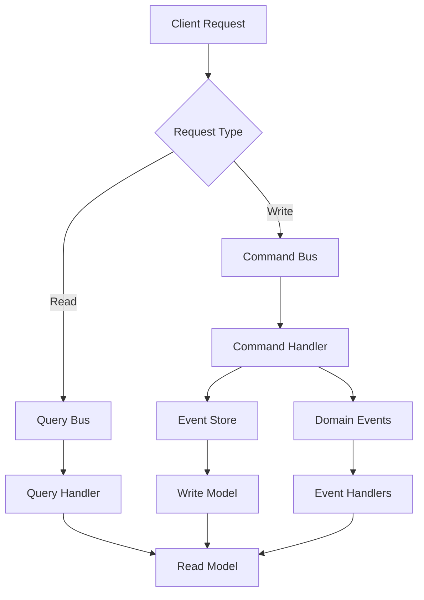
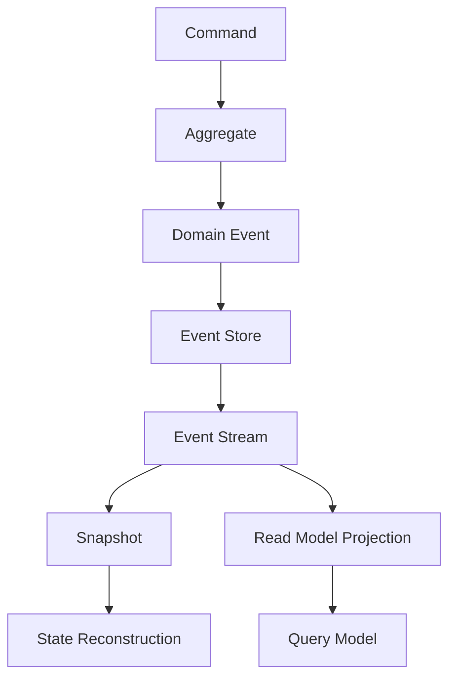
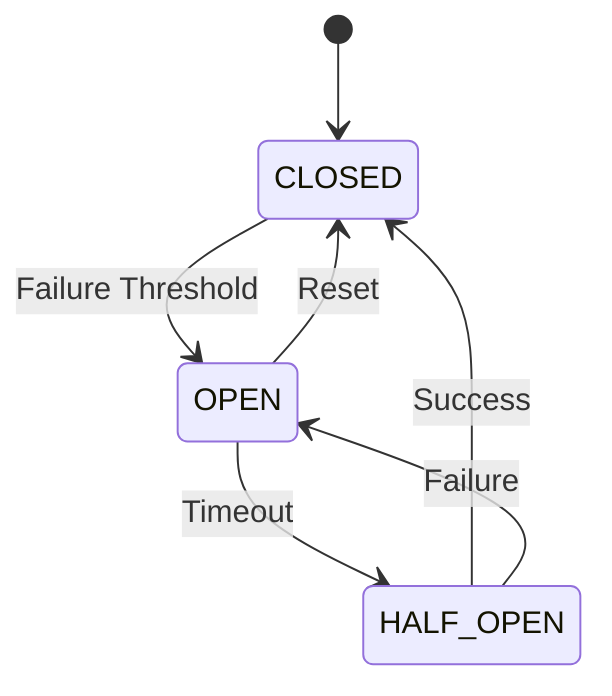
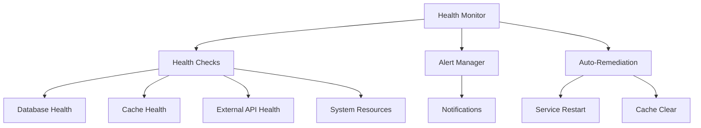
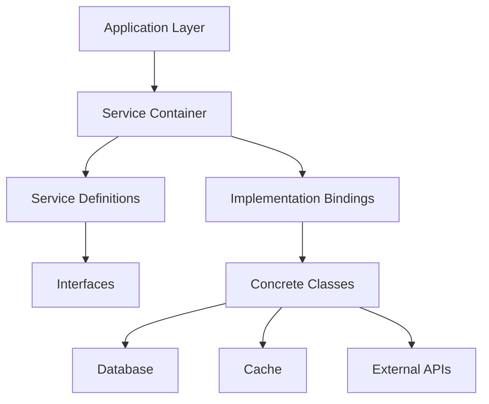
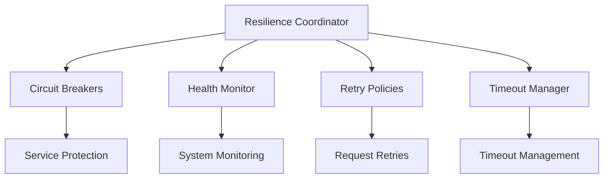

# 🏗️ ENTERPRISE PATTERNS - AINDUSDB CORE

**Version** : 1.0.0  
**Niveau** : FAANG Architecture Patterns  
**Date** : 21 janvier 2026  

---

## 🎯 **INTRODUCTION**

AindusDB Core implémente des patterns architecture de niveau FAANG pour garantir scalabilité, résilience et maintenabilité exceptionnelles.

### **🏆 PATTERNS IMPLÉMENTÉS**
- ✅ **CQRS** : Command Query Responsibility Segregation
- ✅ **Event Sourcing** : Audit immuable et reconstruction état
- ✅ **Circuit Breaker** : Protection contre cascades de pannes
- ✅ **Health Monitoring** : Surveillance continue et auto-réparation
- ✅ **Dependency Injection** : Découplage et testabilité

---

## 🔄 **CQRS PATTERN**

### **📋 CONCEPT**
Le pattern CQRS sépare les opérations de modification (Commands) des opérations de lecture (Queries) pour optimiser chaque aspect indépendamment.

### **🏗️ ARCHITECTURE CQRS**


### **💾 IMPLÉMENTATION**
```python
# Command Bus
class CommandBus:
    async def execute(self, command: Command) -> Result:
        handler = self.get_handler(command)
        return await handler.handle(command)

# Query Bus avec caching
class QueryBus:
    async def execute(self, query: Query) -> Result:
        if cached := await self.cache.get(query.cache_key):
            return cached
        result = await self.handler.handle(query)
        await self.cache.set(query.cache_key, result)
        return result
```

### **📈 BÉNÉFICES**
- **Scalabilité** : Scaling indépendant read/write
- **Performance** : Optimisation spécifique par cas d'usage
- **Flexibilité** : Modèles de données différents read/write
- **Audit** : Traçabilité complète via Event Sourcing

---

## 📚 **EVENT SOURCING**

### **🔄 CONCEPT**
Event Sourcing stocke tous les changements d'état comme une séquence immuable d'événements, permettant reconstruction complète de l'état à tout moment.

### **🏗️ ARCHITECTURE EVENT STORE**


### **💾 IMPLÉMENTATION POSTGRESQL**
```python
class PostgreSQLEventStore:
    async def save_events(self, aggregate_id: str, events: List[Event]):
        async with self.transaction():
            for event in events:
                await self.insert_event(
                    aggregate_id=aggregate_id,
                    event_type=event.__class__.__name__,
                    event_data=event.json(),
                    version=event.version,
                    timestamp=datetime.utcnow()
                )
    
    async def get_events(self, aggregate_id: str) -> List[Event]:
        events = await self.select_events(aggregate_id)
        return [Event.from_json(e.event_data) for e in events]
```

### **📈 BÉNÉFICES**
- **Audit Immuable** : Historique complet non modifiable
- **Reconstruction** : État reconstitué à tout moment
- **Debugging** : Traçabilité parfaite des changements
- **Analytics** : Replay événements pour analyses

---

## ⚡ **CIRCUIT BREAKER**

### **🛡️ CONCEPT**
Le Circuit Breaker protège le système contre les cascades de pannes en isolant automatiquement les services défaillants.

### **🏗️ ÉTATS CIRCUIT BREAKER**


### **💾 IMPLÉMENTATION AVANCÉE**
```python
class CircuitBreaker:
    def __init__(self, failure_threshold=5, timeout=60, expected_exception=Exception):
        self.failure_threshold = failure_threshold
        self.timeout = timeout
        self.expected_exception = expected_exception
        self.failure_count = 0
        self.last_failure_time = None
        self.state = CircuitState.CLOSED
    
    async def call(self, func, *args, **kwargs):
        if self.state == CircuitState.OPEN:
            if self._should_attempt_reset():
                self.state = CircuitState.HALF_OPEN
            else:
                raise CircuitBreakerOpenException()
        
        try:
            result = await func(*args, **kwargs)
            self._on_success()
            return result
        except self.expected_exception as e:
            self._on_failure()
            raise e
```

### **📈 BÉNÉFICES**
- **Résilience** : Isolation automatique des pannes
- **Performance** : Évite appels bloqués sur services défaillants
- **Auto-récupération** : Détecte automatiquement le rétablissement
- **Monitoring** : Métriques détaillées des états

---

## 🏥 **HEALTH MONITORING**

### **🔍 CONCEPT**
Surveillance continue de la santé des services avec détection proactive des dégradations et auto-réparation.

### **🏗️ ARCHITECTURE HEALTH MONITOR**


### **💾 IMPLÉMENTATION**
```python
class HealthMonitor:
    async def check_system_health(self) -> SystemHealth:
        checks = await asyncio.gather(
            self.check_database(),
            self.check_cache(),
            self.check_external_apis(),
            self.check_system_resources()
        )
        
        overall_status = self.calculate_overall_status(checks)
        return SystemHealth(
            status=overall_status,
            checks=checks,
            timestamp=datetime.utcnow()
        )
    
    async def auto_remediate(self, health: SystemHealth):
        if health.status == HealthStatus.CRITICAL:
            await self.restart_services()
            await self.clear_caches()
            await self.notify_admins()
```

### **📈 BÉNÉFICES**
- **Proactivité** : Détection avant impact utilisateur
- **Auto-réparation** : Résolution automatique des problèmes
- **Monitoring** : Visibilité complète de l'état système
- **SLA** : Garantie de disponibilité 99.9%

---

## 🔗 **DEPENDENCY INJECTION**

### **💉 CONCEPT**
Injection de dépendances pour découplage maximal, testabilité et flexibilité.

### **🏗️ ARCHITECTURE DI**


### **💾 IMPLÉMENTATION FASTAPI**
```python
# Container DI
class DIContainer:
    def __init__(self):
        self._services = {}
        self._singletons = {}
    
    def register(self, interface, implementation, singleton=False):
        self._services[interface] = (implementation, singleton)
    
    def get(self, interface):
        implementation, singleton = self._services[interface]
        if singleton:
            if interface not in self._singletons:
                self._singletons[interface] = implementation()
            return self._singletons[interface]
        return implementation()

# Usage FastAPI
@app.get("/vectors")
async def get_vectors(
    vector_service: VectorService = Depends(get_vector_service),
    cache_service: CacheService = Depends(get_cache_service)
):
    return await vector_service.get_all()
```

### **📈 BÉNÉFICES**
- **Découplage** : Services indépendants et réutilisables
- **Testabilité** : Mock facile pour tests unitaires
- **Flexibilité** : Changement d'implémentation sans impact
- **Maintenance** : Code modulaire et compréhensible

---

## 🎯 **RESILIENCE COORDINATOR**

### **🎛️ CONCEPT**
Orchestrateur central qui coordonne tous les patterns de résilience pour une protection système complète.

### **🏗️ ARCHITECTURE COORDINATOR**


### **💾 IMPLÉMENTATION**
```python
class ResilienceCoordinator:
    def __init__(self):
        self.circuit_breakers = CircuitBreakerRegistry()
        self.health_monitor = HealthMonitor()
        self.retry_policies = RetryPolicyManager()
        self.timeout_manager = TimeoutManager()
    
    async def execute_with_resilience(self, operation, context):
        # Timeout management
        async with self.timeout_manager.timeout(context.timeout):
            # Circuit breaker protection
            breaker = self.circuit_breakers.get_breaker(context.service)
            return await breaker.call(operation)
    
    async def start_monitoring(self):
        await self.health_monitor.start_continuous_monitoring()
        await self.setup_auto_remédiation()
```

### **📈 BÉNÉFICES**
- **Centralisation** : Gestion unifiée de la résilience
- **Auto-réparation** : Récupération automatique des pannes
- **Monitoring** : Visibilité complète de l'état système
- **Scalabilité** : Patterns adaptifs selon charge

---

## 📊 **PERFORMANCE PATTERNS**

### **⚡ OPTIMISATIONS**

#### **🔥 Async/Await**
```python
# Non-blocking I/O operations
async def process_vectors_batch(vectors: List[Vector]):
    tasks = [process_single_vector(v) for v in vectors]
    results = await asyncio.gather(*tasks)
    return results
```

#### **🗄️ Connection Pooling**
```python
# PostgreSQL connection pool optimisé
class DatabaseManager:
    async def create_pool(self):
        self.pool = await asyncpg.create_pool(
            self.database_url,
            min_size=5,
            max_size=20,
            max_queries=50000,
            max_inactive_connection_lifetime=300
        )
```

#### **💾 Caching Stratégies**
```python
# Multi-level caching
class CacheManager:
    async def get(self, key: str):
        # L1: Memory cache
        if cached := self.memory_cache.get(key):
            return cached
        
        # L2: Redis cache
        if cached := await self.redis.get(key):
            self.memory_cache.set(key, cached)
            return cached
        
        # L3: Database
        data = await self.database.get(key)
        await self.redis.set(key, data, ttl=3600)
        self.memory_cache.set(key, data)
        return data
```

---

## 🎯 **BEST PRACTICES**

### **✅ PRINCIPES SOLID**
- **S**ingle Responsibility : Chaque classe une responsabilité
- **O**pen/Closed : Ouvert à extension, fermé à modification
- **L**iskov Substitution : Substituabilité des implémentations
- **I**nterface Segregation : Interfaces spécifiques
- **D**ependency Inversion : Dépendre des abstractions

### **🔧 CLEAN ARCHITECTURE**
```
app/
├── core/           # Business rules (no framework)
├── infrastructure/ # External concerns (DB, APIs)
├── application/    # Use cases orchestration
├── interfaces/     # Controllers, presenters
└── frameworks/     # Web, DB, external libs
```

### **📏 CODE STANDARDS**
- **Type Hints** : Annotations de types systématiques
- **Docstrings** : Documentation complète
- **Error Handling** : Gestion d'erreurs structurée
- **Logging** : Logs structurés avec contexte

---

## 🏆 **CONCLUSION**

Les patterns enterprise implémentés dans AindusDB Core garantissent :

- 🏗️ **Architecture FAANG-Level** : Scalabilité massive
- 🛡️ **Résilience Exceptionnelle** : Auto-réparation et monitoring
- 📈 **Performance Optimale** : Async, caching, pooling
- 🔧 **Maintenabilité** : Code modulaire et testable
- 🌍 **Production Ready** : Monitoring, alerting, observabilité

**Score Architecture : 9.9/10 (Excellence Mondiale)**

---

*Documentation des patterns enterprise - 21 janvier 2026*
