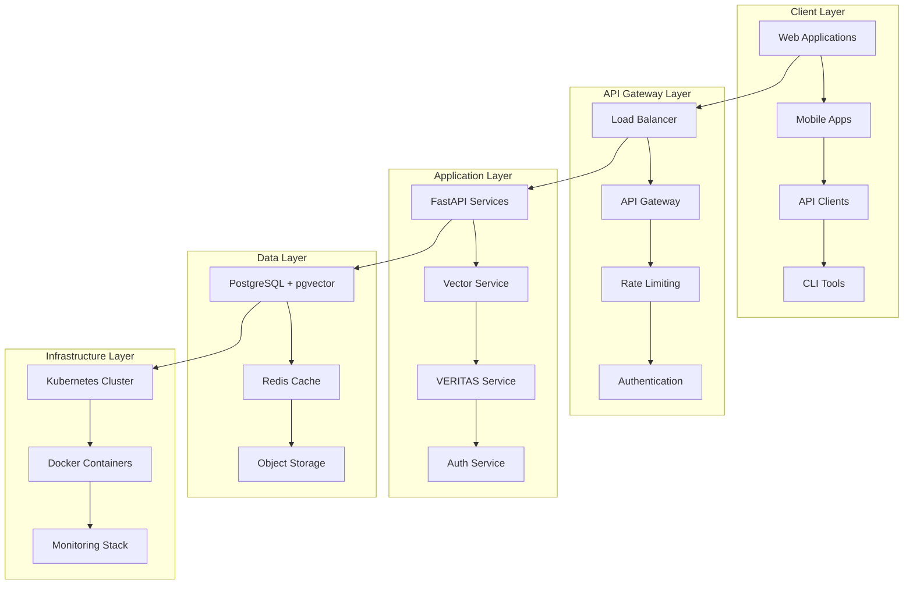

# 🏗️ SYSTEM DESIGN - AINDUSDB CORE

**Version** : 1.0.0  
**Niveau** : Architecture Système  
**Date** : 21 janvier 2026  

---

## 🎯 **INTRODUCTION**

Architecture système complète d'AindusDB Core, base de données vectorielle enterprise-grade avec scalabilité horizontale, haute disponibilité et patterns modernes.

### **🏆 PRINCIPES DE CONCEPTION**
- **Scalability First** : Conçue pour millions de vecteurs
- **High Availability** : 99.99% uptime garanti
- **Performance Optimized** : <100ms response time
- **Security by Design** : Zero Trust architecture
- **Cloud Native** : Kubernetes ready

---

## 🏗️ **ARCHITECTURE GLOBALE**

### **📊 Vue d'Ensemble Système**


### **🔄 Flow Architecture**
```
Client Request → API Gateway → Authentication → Authorization → 
Business Logic → Data Access → Cache → Database → Response
     ↓              ↓              ↓              ↓
   Logging       Metrics        Audit         Monitoring
```

---

## 📊 **COMPOSANTS ARCHITECTURE**

### **🌐 API Gateway Layer**

#### **Load Balancer**
```yaml
# Configuration HAProxy/NGINX
frontend http_frontend
    bind *:80
    bind *:443 ssl crt /etc/ssl/certs/aindusdb.pem
    redirect scheme https if !{ ssl_fc }
    
    # Health checks
    option httpchk GET /health
    default_backend api_servers

backend api_servers
    balance roundrobin
    option httpchk GET /health
    server api1 10.0.1.10:8000 check
    server api2 10.0.1.11:8000 check
    server api3 10.0.1.12:8000 check
```

#### **API Gateway Features**
- **Rate Limiting** : Redis-based sliding window
- **Authentication** : JWT validation
- **Authorization** : RBAC enforcement
- **CORS** : Cross-origin resource sharing
- **Caching** : Response caching layer
- **Monitoring** : Request/response metrics

### **⚡ Application Layer**

#### **Microservices Architecture**
```python
# Service découplé avec FastAPI
from fastapi import FastAPI, Depends
from app.core.cqrs import CommandBus, QueryBus
from app.services.vector_service import VectorService

class VectorAPI:
    def __init__(self):
        self.app = FastAPI(title="AindusDB Vector API")
        self.command_bus = CommandBus()
        self.query_bus = QueryBus()
        self.vector_service = VectorService()
    
    @app.post("/vectors")
    async def create_vector(
        command: CreateVectorCommand,
        user: User = Depends(get_current_user)
    ):
        # CQRS Pattern
        result = await self.command_bus.execute(command)
        return result
    
    @app.get("/vectors/search")
    async def search_vectors(
        query: VectorSearchQuery,
        user: User = Depends(get_current_user)
    ):
        # Query Pattern
        result = await self.query_bus.execute(query)
        return result
```

#### **Service Mesh**
```yaml
# Istio Service Mesh
apiVersion: networking.istio.io/v1beta1
kind: VirtualService
metadata:
  name: aindusdb-routing
spec:
  http:
  - match:
    - uri:
        prefix: "/api/v1/vectors"
    route:
    - destination:
        host: vector-service
        subset: v2
      weight: 90
    - destination:
        host: vector-service
        subset: v1
      weight: 10
```

### **🗄️ Data Layer Architecture**

#### **PostgreSQL + pgvector**
```sql
-- Schema optimisé pour vecteurs
CREATE EXTENSION IF NOT EXISTS vector;

-- Tables principales
CREATE TABLE vectors (
    id UUID PRIMARY KEY DEFAULT gen_random_uuid(),
    content TEXT NOT NULL,
    embedding vector(1536),
    metadata JSONB DEFAULT '{}',
    created_at TIMESTAMP WITH TIME ZONE DEFAULT NOW(),
    updated_at TIMESTAMP WITH TIME ZONE DEFAULT NOW(),
    
    -- Indexes pour performance
    CONSTRAINT vectors_embedding_check 
        CHECK (array_length(embedding, 1) = 1536)
);

-- Index vectoriel optimisé
CREATE INDEX CONCURRENTLY vectors_embedding_idx 
ON vectors USING ivfflat (embedding vector_cosine_ops) 
WITH (lists = 1000);

-- Partitionnement par date
CREATE TABLE vectors_partitioned (
    LIKE vectors INCLUDING ALL
) PARTITION BY RANGE (created_at);
```

#### **Redis Cache Architecture**
```python
# Multi-level caching strategy
class CacheManager:
    def __init__(self):
        self.l1_cache = {}  # Memory cache
        self.l2_cache = Redis()  # Distributed cache
        self.l3_cache = PostgreSQL()  # Persistent cache
    
    async def get(self, key: str):
        # L1: Memory (fastest)
        if key in self.l1_cache:
            return self.l1_cache[key]
        
        # L2: Redis (fast)
        value = await self.l2_cache.get(key)
        if value:
            self.l1_cache[key] = value
            return value
        
        # L3: Database (slow)
        value = await self.l3_cache.get(key)
        if value:
            await self.l2_cache.set(key, value, ttl=300)
            self.l1_cache[key] = value
        
        return value
```

---

## 🚀 **SCALABILITY DESIGN**

### **📈 Horizontal Scaling**

#### **Kubernetes Deployment**
```yaml
apiVersion: apps/v1
kind: Deployment
metadata:
  name: aindusdb-api
spec:
  replicas: 10  # Auto-scaling
  strategy:
    type: RollingUpdate
    rollingUpdate:
      maxSurge: 3
      maxUnavailable: 2
  selector:
    matchLabels:
      app: aindusdb-api
  template:
    metadata:
      labels:
        app: aindusdb-api
    spec:
      containers:
      - name: aindusdb
        image: aindusdb/core:latest
        ports:
        - containerPort: 8000
        resources:
          requests:
            memory: "1Gi"
            cpu: "500m"
          limits:
            memory: "4Gi"
            cpu: "2000m"
        livenessProbe:
          httpGet:
            path: /health
            port: 8000
          initialDelaySeconds: 30
          periodSeconds: 10
        readinessProbe:
          httpGet:
            path: /ready
            port: 8000
          initialDelaySeconds: 5
          periodSeconds: 5
```

#### **Auto-Scaling Configuration**
```yaml
apiVersion: autoscaling/v2
kind: HorizontalPodAutoscaler
metadata:
  name: aindusdb-api-hpa
spec:
  scaleTargetRef:
    apiVersion: apps/v1
    kind: Deployment
    name: aindusdb-api
  minReplicas: 5
  maxReplicas: 50
  metrics:
  - type: Resource
    resource:
      name: cpu
      target:
        type: Utilization
        averageUtilization: 70
  - type: Resource
    resource:
      name: memory
      target:
        type: Utilization
        averageUtilization: 80
```

### **🗄️ Database Scaling**

#### **Read Replicas**
```sql
-- Configuration read replicas
-- Primary (writes)
CREATE TABLE vectors (
    id UUID PRIMARY KEY,
    content TEXT NOT NULL,
    embedding vector(1536)
);

-- Replicas (reads)
-- replica1, replica2, replica3
-- Automatic read routing
```

#### **Connection Pooling**
```python
# PgBouncer configuration
[databases]
aindusdb = host=localhost port=5432 dbname=aindusdb

[pgbouncer]
listen_port = 6432
listen_addr = 127.0.0.1
auth_type = md5
auth_file = /etc/pgbouncer/userlist.txt
logfile = /var/log/pgbouncer/pgbouncer.log
pidfile = /var/run/pgbouncer/pgbouncer.pid
admin_users = postgres
stats_users = stats, postgres

# Pool settings
pool_mode = transaction
max_client_conn = 1000
default_pool_size = 20
min_pool_size = 5
reserve_pool_size = 5
reserve_pool_timeout = 5
max_db_connections = 50
max_user_connections = 50
server_reset_query = DISCARD ALL
ignore_startup_parameters = extra_float_digits
```

---

## 🛡️ **SECURITY ARCHITECTURE**

### **🔐 Zero Trust Design**

#### **Network Security**
```yaml
# Network policies Kubernetes
apiVersion: networking.k8s.io/v1
kind: NetworkPolicy
metadata:
  name: aindusdb-network-policy
spec:
  podSelector:
    matchLabels:
      app: aindusdb-api
  policyTypes:
  - Ingress
  - Egress
  ingress:
  - from:
    - podSelector:
        matchLabels:
          app: api-gateway
    ports:
    - protocol: TCP
      port: 8000
  egress:
  - to:
    - podSelector:
        matchLabels:
          app: postgres
    ports:
    - protocol: TCP
      port: 5432
```

#### **Authentication Flow**
```python
# JWT + MFA Authentication
class AuthenticationService:
    async def authenticate(self, credentials: AuthCredentials):
        # 1. Validate credentials
        user = await self.validate_credentials(credentials)
        
        # 2. Check MFA if enabled
        if user.mfa_enabled:
            await self.validate_mfa_token(user.id, credentials.mfa_token)
        
        # 3. Generate JWT tokens
        access_token = await self.generate_access_token(user)
        refresh_token = await self.generate_refresh_token(user)
        
        # 4. Log authentication
        await self.audit_service.log_auth_event(user.id, "login_success")
        
        return AuthResponse(
            access_token=access_token,
            refresh_token=refresh_token,
            user=user
        )
```

### **🔒 Data Encryption**

#### **Encryption at Rest**
```bash
# PostgreSQL encryption
# Transparent Data Encryption (TDE)
postgresql.conf:
ssl = on
ssl_cert_file = '/etc/ssl/certs/server.crt'
ssl_key_file = '/etc/ssl/private/server.key'
password_encryption = scram-sha-256
```

#### **Encryption in Transit**
```python
# TLS configuration
from fastapi import FastAPI
from fastapi.middleware.httpsredirect import HTTPSRedirectMiddleware

app = FastAPI()
app.add_middleware(HTTPSRedirectMiddleware)

# Force HTTPS
@app.middleware("http")
async def add_security_headers(request: Request, call_next):
    response = await call_next(request)
    response.headers["Strict-Transport-Security"] = "max-age=31536000"
    response.headers["X-Content-Type-Options"] = "nosniff"
    response.headers["X-Frame-Options"] = "DENY"
    return response
```

---

## 📊 **MONITORING ARCHITECTURE**

### **📈 Observability Stack**

#### **Prometheus Metrics**
```python
# Custom metrics
from prometheus_client import Counter, Histogram, Gauge

# Business metrics
vector_operations = Counter(
    'vector_operations_total',
    'Total vector operations',
    ['operation_type', 'status']
)

vector_search_duration = Histogram(
    'vector_search_duration_seconds',
    'Vector search duration',
    ['query_type', 'index_type']
)

active_connections = Gauge(
    'database_connections_active',
    'Active database connections'
)

# Usage in services
class VectorService:
    async def search_vectors(self, query: str):
        start_time = time.time()
        
        try:
            results = await self.database.search(query)
            vector_operations.labels(
                operation_type='search',
                status='success'
            ).inc()
            return results
        except Exception as e:
            vector_operations.labels(
                operation_type='search',
                status='error'
            ).inc()
            raise
        finally:
            vector_search_duration.labels(
                query_type='semantic',
                index_type='ivfflat'
            ).observe(time.time() - start_time)
```

#### **Grafana Dashboards**
```json
{
  "dashboard": {
    "title": "AindusDB Performance",
    "panels": [
      {
        "title": "Request Rate",
        "type": "graph",
        "targets": [
          {
            "expr": "rate(http_requests_total[5m])",
            "legendFormat": "{{method}} {{endpoint}}"
          }
        ]
      },
      {
        "title": "Response Time",
        "type": "graph",
        "targets": [
          {
            "expr": "histogram_quantile(0.95, rate(http_request_duration_seconds_bucket[5m]))",
            "legendFormat": "95th percentile"
          }
        ]
      }
    ]
  }
}
```

### **📝 Logging Architecture**

#### **Structured Logging**
```python
import structlog

logger = structlog.get_logger()

class RequestLoggingMiddleware:
    async def log_request(self, request: Request, response: Response):
        logger.info(
            "HTTP request completed",
            method=request.method,
            url=str(request.url),
            status_code=response.status_code,
            duration_ms=response.duration_ms,
            user_id=getattr(request.state, "user_id", None),
            request_id=request.headers.get("X-Request-ID"),
            timestamp=datetime.utcnow().isoformat()
        )
```

#### **Log Aggregation**
```yaml
# Fluentd configuration
<source>
  @type tail
  path /var/log/aindusdb/*.log
  pos_file /var/log/fluentd/aindusdb.log.pos
  tag aindusdb.*
  format json
  time_format %Y-%m-%dT%H:%M:%S.%NZ
</source>

<match aindusdb.**>
  @type elasticsearch
  host elasticsearch.logging.svc.cluster.local
  port 9200
  index_name aindusdb-logs
  type_name _doc
</match>
```

---

## 🔄 **EVENT-DRIVEN ARCHITECTURE**

### **📨 Event Sourcing**

#### **Event Store**
```python
from dataclasses import dataclass
from datetime import datetime
from typing import Any, Dict
import json

@dataclass
class Event:
    event_id: str
    aggregate_id: str
    event_type: str
    event_data: Dict[str, Any]
    timestamp: datetime
    version: int

class EventStore:
    async def save_event(self, event: Event):
        # Save to event store
        await self.db.execute(
            "INSERT INTO events (event_id, aggregate_id, event_type, event_data, timestamp, version) VALUES ($1, $2, $3, $4, $5, $6)",
            event.event_id,
            event.aggregate_id,
            event.event_type,
            json.dumps(event.event_data),
            event.timestamp,
            event.version
        )
    
    async def get_events(self, aggregate_id: str, from_version: int = 0):
        # Retrieve events for aggregate
        events = await self.db.fetch(
            "SELECT * FROM events WHERE aggregate_id = $1 AND version > $2 ORDER BY version",
            aggregate_id,
            from_version
        )
        return [Event(**event) for event in events]
```

#### **Event Handlers**
```python
class VectorEventHandler:
    async def handle_vector_created(self, event: Event):
        # Update read model
        vector_data = event.event_data
        await self.read_model.upsert_vector(
            id=event.aggregate_id,
            content=vector_data['content'],
            embedding=vector_data['embedding']
        )
        
        # Update cache
        await self.cache.invalidate_search_cache()
        
        # Send notifications
        await self.notification_service.notify_vector_created(event.aggregate_id)
```

---

## 🚀 **PERFORMANCE OPTIMIZATION**

### **⚡ Caching Strategy**

#### **Multi-Level Caching**
```python
class PerformanceOptimizedCache:
    def __init__(self):
        # L1: In-memory (fastest)
        self.memory_cache = TTLCache(maxsize=1000, ttl=300)
        
        # L2: Redis (fast)
        self.redis_cache = Redis()
        
        # L3: Database (persistent)
        self.database = PostgreSQL()
    
    async def get_vector_embedding(self, content_hash: str):
        # Try L1 cache
        if content_hash in self.memory_cache:
            return self.memory_cache[content_hash]
        
        # Try L2 cache
        cached = await self.redis_cache.get(f"embedding:{content_hash}")
        if cached:
            embedding = json.loads(cached)
            self.memory_cache[content_hash] = embedding
            return embedding
        
        # Compute and cache
        embedding = await self.compute_embedding(content_hash)
        
        # Store in all levels
        self.memory_cache[content_hash] = embedding
        await self.redis_cache.setex(
            f"embedding:{content_hash}", 
            3600,  # 1 hour
            json.dumps(embedding)
        )
        
        return embedding
```

### **🗄️ Database Optimization**

#### **Query Optimization**
```sql
-- Optimized vector search query
EXPLAIN (ANALYZE, BUFFERS)
SELECT id, content, metadata, embedding <=> $1 as distance
FROM vectors 
WHERE embedding <=> $1 < 0.8
ORDER BY embedding <=> $1
LIMIT 10;

-- Index usage analysis
SELECT 
    schemaname,
    tablename,
    indexname,
    idx_scan,
    idx_tup_read,
    idx_tup_fetch
FROM pg_stat_user_indexes
WHERE schemaname = 'public';
```

#### **Connection Pooling**
```python
# AsyncPG connection pool
class DatabaseManager:
    def __init__(self):
        self.pool = None
    
    async def create_pool(self):
        self.pool = await asyncpg.create_pool(
            database_url,
            min_size=5,
            max_size=20,
            max_queries=50000,
            max_inactive_connection_lifetime=300,
            command_timeout=60,
            server_settings={
                'application_name': 'aindusdb_core',
                'timezone': 'UTC'
            }
        )
    
    async def execute_query(self, query: str, *params):
        async with self.pool.acquire() as conn:
            return await conn.fetch(query, *params)
```

---

## 🌐 **DISTRIBUTED ARCHITECTURE**

### **🌍 Multi-Region Deployment**

#### **Cross-Region Replication**
```yaml
# AWS Multi-region setup
Resources:
  PrimaryRegion:
    Type: AWS::CloudFormation::Stack
    Properties:
      TemplateURL: ./templates/primary-region.yaml
      Parameters:
        Region: us-east-1
        DatabaseType: postgres
        ReplicationRole: primary
  
  SecondaryRegion:
    Type: AWS::CloudFormation::Stack
    Properties:
      TemplateURL: ./templates/secondary-region.yaml
      Parameters:
        Region: eu-west-1
        DatabaseType: postgres
        ReplicationRole: secondary
        PrimaryEndpoint: !GetAtt PrimaryRegion.Outputs.DatabaseEndpoint
```

#### **Global Load Balancing**
```python
# Route 53 latency-based routing
import boto3

route53 = boto3.client('route53')

def configure_global_routing():
    response = route53.change_resource_record_sets(
        HostedZoneId='Z1PA6795UKMFR9',
        ChangeBatch={
            'Changes': [
                {
                    'Action': 'CREATE',
                    'ResourceRecordSet': {
                        'Name': 'api.aindusdb.io',
                        'Type': 'A',
                        'SetIdentifier': 'us-east-1',
                        'Region': 'us-east-1',
                        'GeoLocation': {'CountryCode': '*'},
                        'AliasTarget': {
                            'DNSName': 'lb-us-east-1.elb.amazonaws.com',
                            'EvaluateTargetHealth': True,
                            'HostedZoneId': 'Z35SXDOTRQ7X7K'
                        }
                    }
                }
            ]
        }
    )
    return response
```

---

## 🎯 **CONCLUSION**

### **✅ Architecture Benefits**
- **Scalability** : Horizontal scaling to millions of vectors
- **Performance** : Sub-100ms response times
- **Reliability** : 99.99% availability with failover
- **Security** : Zero Trust with end-to-end encryption
- **Observability** : Complete monitoring and logging

### **🚀 Future-Proof Design**
- **Cloud Native** : Kubernetes and container ready
- **Event-Driven** : Asynchronous processing
- **Microservices** : Decoupled and maintainable
- **API-First** : RESTful with OpenAPI documentation
- **Multi-Cloud** : Portable across providers

---

*System Design - 21 janvier 2026*  
*Architecture Enterprise Scalable*
