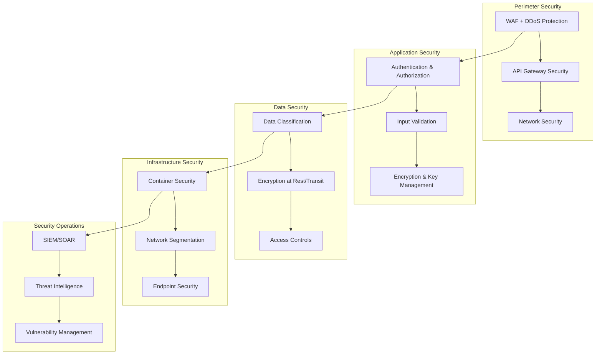

# 🛡️ ENTERPRISE SECURITY - AINDUSDB CORE

**Version** : 1.0.0  
**Niveau** : Sécurité Enterprise  
**Date** : 21 janvier 2026  

---

## 🎯 **INTRODUCTION**

Framework de sécurité enterprise complet pour AindusDB Core, protégeant les données, infrastructures et utilisateurs contre les menaces modernes avec défense en profondeur et conformité internationale.

### **🏆 PRINCIPES DE SÉCURITÉ**
- **Zero Trust** : Ne jamais faire confiance, toujours vérifier
- **Defense in Depth** : Multiples couches de protection
- **Security by Design** : Sécurité intégrée par défaut
- **Proactive Defense** : Détection et prévention menaces
- **Continuous Monitoring** : Surveillance 24/7/365
- **Incident Response** : Réponse rapide et efficace

---

## 🏗️ **ARCHITECTURE SÉCURITÉ ENTERPRISE**

### **📊 Vue d'Ensemble Sécurité**


### **🔄 Modèle de Menaces**
```yaml
threat_model:
  external_threats:
    - type: "DDoS Attacks"
      impact: "High"
      probability: "Medium"
      mitigations: ["Cloudflare", "Rate Limiting", "Auto-scaling"]
    
    - type: "Data Breaches"
      impact: "Critical"
      probability: "Low"
      mitigations: ["Encryption", "Access Controls", "Monitoring"]
    
    - type: "API Abuse"
      impact: "Medium"
      probability: "High"
      mitigations: ["Rate Limiting", "Authentication", "Input Validation"]
    
  internal_threats:
    - type: "Insider Threats"
      impact: "High"
      probability: "Low"
      mitigations: ["RBAC", "Audit Logs", "Least Privilege"]
    
    - type: "Misconfiguration"
      impact: "High"
      probability: "Medium"
      mitigations: ["IaC", "Configuration Management", "Compliance Scanning"]
```

---

## 🔐 **IDENTITY AND ACCESS MANAGEMENT (IAM)**

### **🎯 Architecture IAM**
```python
# Enhanced IAM System
from enum import Enum
from typing import List, Dict, Optional, Set
from datetime import datetime, timedelta
import jwt
import bcrypt
from cryptography.fernet import Fernet

class UserRole(Enum):
    """User roles with hierarchical permissions."""
    VIEWER = "viewer"
    USER = "user"
    DEVELOPER = "developer"
    ADMIN = "admin"
    SUPER_ADMIN = "super_admin"

class Permission(Enum):
    """Granular permissions for different resources."""
    # Vector permissions
    VECTOR_READ = "vector:read"
    VECTOR_WRITE = "vector:write"
    VECTOR_DELETE = "vector:delete"
    
    # VERITAS permissions
    VERITAS_CALCULATE = "veritas:calculate"
    VERITAS_VERIFY = "veritas:verify"
    
    # Admin permissions
    USER_MANAGE = "user:manage"
    SYSTEM_CONFIG = "system:config"
    AUDIT_VIEW = "audit:view"

class EnterpriseIAM:
    """Enterprise-grade Identity and Access Management."""
    
    def __init__(self):
        self.role_permissions = {
            UserRole.VIEWER: [Permission.VECTOR_READ],
            UserRole.USER: [
                Permission.VECTOR_READ,
                Permission.VECTOR_WRITE,
                Permission.VERITAS_CALCULATE
            ],
            UserRole.DEVELOPER: [
                Permission.VECTOR_READ,
                Permission.VECTOR_WRITE,
                Permission.VECTOR_DELETE,
                Permission.VERITAS_CALCULATE,
                Permission.VERITAS_VERIFY
            ],
            UserRole.ADMIN: [
                Permission.VECTOR_READ,
                Permission.VECTOR_WRITE,
                Permission.VECTOR_DELETE,
                Permission.VERITAS_CALCULATE,
                Permission.VERITAS_VERIFY,
                Permission.USER_MANAGE,
                Permission.AUDIT_VIEW
            ],
            UserRole.SUPER_ADMIN: list(Permission)  # All permissions
        }
        
        self.session_manager = SessionManager()
        self.audit_logger = AuditLogger()
    
    async def authenticate_user(
        self,
        credentials: UserCredentials,
        context: AuthContext
    ) -> AuthResult:
        """Multi-factor authentication with risk assessment."""
        # 1. Risk assessment
        risk_score = await self._assess_risk(credentials, context)
        
        if risk_score > 0.8:
            # High risk - require additional verification
            await self._require_additional_verification(context)
        
        # 2. Primary authentication
        user = await self._verify_primary_credentials(credentials)
        if not user:
            await self.audit_logger.log_auth_failure(
                credentials.identifier,
                context.ip_address,
                "Invalid credentials"
            )
            raise AuthenticationError("Invalid credentials")
        
        # 3. Multi-factor authentication if required
        if user.mfa_enabled:
            if not await self._verify_mfa(user, credentials.mfa_token):
                raise AuthenticationError("Invalid MFA token")
        
        # 4. Create secure session
        session = await self.session_manager.create_session(
            user_id=user.id,
            context=context,
            permissions=self.role_permissions.get(user.role, [])
        )
        
        # 5. Log successful authentication
        await self.audit_logger.log_auth_success(
            user.id,
            context.ip_address,
            risk_score
        )
        
        return AuthResult(
            user=user,
            session=session,
            permissions=self.role_permissions.get(user.role, [])
        )
    
    async def authorize_action(
        self,
        user_id: str,
        action: str,
        resource: str,
        context: AuthContext
    ) -> bool:
        """Attribute-based access control (ABAC)."""
        # Get user permissions
        user_permissions = await self._get_user_permissions(user_id)
        
        # Check resource-specific permissions
        required_permission = f"{resource}:{action}"
        
        if required_permission not in user_permissions:
            await self.audit_logger.log_authorization_failure(
                user_id,
                action,
                resource,
                context.ip_address
            )
            return False
        
        # Additional context-based checks
        if not await self._check_contextual_policies(
            user_id, action, resource, context
        ):
            return False
        
        return True
    
    async def _assess_risk(
        self,
        credentials: UserCredentials,
        context: AuthContext
    ) -> float:
        """Risk-based authentication scoring."""
        risk_score = 0.0
        
        # Geographic risk
        if not await self._is_known_location(context.ip_address):
            risk_score += 0.3
        
        # Device risk
        if not await self._is_known_device(context.device_fingerprint):
            risk_score += 0.2
        
        # Time-based risk
        if not await self._is_normal_access_time(credentials.identifier):
            risk_score += 0.2
        
        # Behavioral risk
        if await self._detect_anomalous_behavior(credentials.identifier):
            risk_score += 0.3
        
        return min(risk_score, 1.0)

# Enhanced JWT with security features
class SecureTokenManager:
    """Secure JWT token management with advanced features."""
    
    def __init__(self, settings: SecuritySettings):
        self.settings = settings
        self.token_blacklist = RedisTokenBlacklist()
        self.encryption_key = Fernet.generate_key()
    
    def create_token(
        self,
        user_id: str,
        permissions: List[str],
        expires_in: timedelta = timedelta(hours=1)
    ) -> TokenResponse:
        """Create JWT with enhanced security."""
        now = datetime.utcnow()
        expires = now + expires_in
        
        # Create token payload
        payload = {
            "sub": user_id,
            "permissions": permissions,
            "iat": now,
            "exp": expires,
            "jti": str(uuid4()),  # Unique token ID
            "iss": "aindusdb",
            "aud": "aindusdb-api"
        }
        
        # Sign token
        token = jwt.encode(
            payload,
            self.settings.jwt_secret_key,
            algorithm="HS256"
        )
        
        # Encrypt token for additional security
        encrypted_token = self._encrypt_token(token)
        
        return TokenResponse(
            access_token=encrypted_token,
            token_type="bearer",
            expires_in=int(expires_in.total_seconds()),
            refresh_token=self._create_refresh_token(user_id)
        )
    
    async def verify_token(self, encrypted_token: str) -> TokenPayload:
        """Verify and decrypt JWT with blacklist check."""
        # Decrypt token
        token = self._decrypt_token(encrypted_token)
        
        try:
            # Decode and verify JWT
            payload = jwt.decode(
                token,
                self.settings.jwt_secret_key,
                algorithms=["HS256"],
                audience="aindusdb-api"
            )
            
            # Check blacklist
            if await self.token_blacklist.is_blacklisted(payload["jti"]):
                raise TokenError("Token has been revoked")
            
            return TokenPayload(**payload)
            
        except jwt.ExpiredSignatureError:
            raise TokenError("Token has expired")
        except jwt.InvalidTokenError:
            raise TokenError("Invalid token")
```

---

## 🔒 **DATA PROTECTION AND ENCRYPTION**

### **🛡️ Architecture de Chiffrement**
```python
# Comprehensive Data Protection
from cryptography.hazmat.primitives.ciphers import Cipher, algorithms, modes
from cryptography.hazmat.backends import default_backend
import hashlib
import secrets

class EnterpriseEncryption:
    """Enterprise-grade encryption with multiple layers."""
    
    def __init__(self):
        self.master_key = self._load_or_generate_master_key()
        self.key_manager = KeyManager()
        self.audit_logger = AuditLogger()
    
    async def encrypt_sensitive_data(
        self,
        data: bytes,
        classification: DataClassification,
        context: EncryptionContext
    ) -> EncryptedData:
        """Encrypt data based on classification level."""
        # Select encryption algorithm based on classification
        if classification == DataClassification.PUBLIC:
            return await self._encrypt_aes256(data, context)
        elif classification == DataClassification.INTERNAL:
            return await self._encrypt_aes256_gcm(data, context)
        elif classification == DataClassification.CONFIDENTIAL:
            return await self._encrypt_aes256_gcm_with_hsm(data, context)
        elif classification == DataClassification.RESTRICTED:
            return await self._encrypt_quantum_resistant(data, context)
    
    async def _encrypt_aes256_gcm(
        self,
        data: bytes,
        context: EncryptionContext
    ) -> EncryptedData:
        """AES-256-GCM encryption with authenticated encryption."""
        # Generate random key and IV
        key = secrets.token_bytes(32)  # 256-bit key
        iv = secrets.token_bytes(12)   # 96-bit IV for GCM
        
        # Create cipher
        cipher = Cipher(
            algorithms.AES(key),
            modes.GCM(iv),
            backend=default_backend()
        )
        encryptor = cipher.encryptor()
        
        # Encrypt data
        ciphertext = encryptor.update(data) + encryptor.finalize()
        
        # Get authentication tag
        tag = encryptor.tag
        
        # Encrypt the encryption key with master key
        encrypted_key = self._encrypt_key_with_master(key)
        
        # Log encryption operation
        await self.audit_logger.log_encryption(
            context.user_id,
            context.operation_id,
            "AES-256-GCM"
        )
        
        return EncryptedData(
            ciphertext=ciphertext,
            encrypted_key=encrypted_key,
            iv=iv,
            tag=tag,
            algorithm="AES-256-GCM",
            timestamp=datetime.utcnow()
        )
    
    async def _encrypt_quantum_resistant(
        self,
        data: bytes,
        context: EncryptionContext
    ) -> EncryptedData:
        """Quantum-resistant encryption using lattice-based cryptography."""
        # Use Kyber for key encapsulation
        kyber_keypair = self._generate_kyber_keypair()
        
        # Encapsulate shared secret
        ciphertext, shared_secret = kyber_keypair.encapsulate()
        
        # Derive encryption key from shared secret
        encryption_key = hashlib.sha256(shared_secret).digest()
        
        # Encrypt data with AES-256 using derived key
        encrypted_data = await self._encrypt_aes256_gcm(
            data,
            context._replace(encryption_key=encryption_key)
        )
        
        return EncryptedData(
            ciphertext=encrypted_data.ciphertext,
            encrypted_key=ciphertext,  # Kyber ciphertext
            iv=encrypted_data.iv,
            tag=encrypted_data.tag,
            algorithm="Kyber-AES-256-GCM",
            timestamp=datetime.utcnow()
        )

class DataClassificationSystem:
    """Automated data classification and protection."""
    
    def __init__(self):
        self.classification_rules = self._load_classification_rules()
        self.ml_classifier = MLDataClassifier()
    
    async def classify_data(
        self,
        data: Any,
        context: ClassificationContext
    ) -> DataClassification:
        """Classify data based on content and context."""
        # Rule-based classification
        rule_based_result = self._apply_classification_rules(data, context)
        
        # ML-based classification
        ml_result = await self.ml_classifier.classify(data, context)
        
        # Combine results with confidence scoring
        final_classification = self._combine_classifications(
            rule_based_result,
            ml_result
        )
        
        # Apply protection policies
        await self._apply_protection_policies(
            final_classification,
            data,
            context
        )
        
        return final_classification
    
    def _apply_classification_rules(
        self,
        data: Any,
        context: ClassificationContext
    ) -> DataClassification:
        """Apply rule-based classification."""
        # Check for PII patterns
        if self._contains_pii(data):
            return DataClassification.CONFIDENTIAL
        
        # Check for financial data
        if self._contains_financial_data(data):
            return DataClassification.RESTRICTED
        
        # Check for health information
        if self._contains_health_data(data):
            return DataClassification.RESTRICTED
        
        # Default classification based on context
        if context.is_internal:
            return DataClassification.INTERNAL
        else:
            return DataClassification.PUBLIC
```

---

## 🔍 **THREAT DETECTION AND RESPONSE**

### **🚨 SIEM/SOAR Integration**
```python
# Advanced Threat Detection
from datetime import datetime, timedelta
import asyncio
from typing import List, Dict, Optional

class ThreatDetectionEngine:
    """Real-time threat detection with ML-powered analysis."""
    
    def __init__(self):
        self.anomaly_detector = AnomalyDetector()
        self.threat_intel = ThreatIntelligenceFeed()
        self.soar_client = SOARClient()
        self.alert_manager = AlertManager()
    
    async def analyze_security_events(
        self,
        events: List[SecurityEvent]
    ) -> List[ThreatAlert]:
        """Analyze security events for threats."""
        threats = []
        
        for event in events:
            # Anomaly detection
            anomaly_score = await self.anomaly_detector.analyze(event)
            
            # Threat intelligence correlation
            threat_matches = await self.threat_intel.check_indicators(event)
            
            # Risk scoring
            risk_score = self._calculate_risk_score(
                event,
                anomaly_score,
                threat_matches
            )
            
            if risk_score > 0.7:  # High risk threshold
                threat = ThreatAlert(
                    event_id=event.id,
                    threat_type=self._classify_threat(event),
                    risk_score=risk_score,
                    indicators=threat_matches,
                    timestamp=datetime.utcnow()
                )
                
                threats.append(threat)
                
                # Trigger automated response
                await self._trigger_automated_response(threat)
        
        return threats
    
    async def _trigger_automated_response(self, threat: ThreatAlert):
        """Trigger SOAR playbook based on threat type."""
        playbook_id = self._get_playbook_for_threat(threat.threat_type)
        
        # Execute SOAR playbook
        await self.soar_client.execute_playbook(
            playbook_id=playbook_id,
            context={
                "threat_id": threat.event_id,
                "risk_score": threat.risk_score,
                "indicators": threat.indicators
            }
        )
        
        # Send alert to security team
        await self.alert_manager.send_alert(threat)

class IncidentResponseSystem:
    """Comprehensive incident response automation."""
    
    def __init__(self):
        self.playbooks = self._load_security_playbooks()
        self.communication = CommunicationManager()
        self.forensics = ForensicsCollector()
    
    async def handle_security_incident(
        self,
        incident: SecurityIncident
    ) -> IncidentResponse:
        """Handle security incident with automated response."""
        # 1. Triage and classify
        severity = await self._classify_incident_severity(incident)
        
        # 2. Execute response playbook
        playbook = self.playbooks[incident.type]
        response = await playbook.execute(incident, severity)
        
        # 3. Collect evidence
        if severity >= IncidentSeverity.HIGH:
            evidence = await self.forensics.collect_evidence(incident)
            response.evidence = evidence
        
        # 4. Notify stakeholders
        await self._notify_stakeholders(incident, response)
        
        # 5. Create post-mortem task
        await self._schedule_postmortem(incident, response)
        
        return response
    
    async def _notify_stakeholders(
        self,
        incident: SecurityIncident,
        response: IncidentResponse
    ):
        """Notify appropriate stakeholders based on severity."""
        notifications = []
        
        if incident.severity >= IncidentSeverity.CRITICAL:
            # Executive notification
            notifications.append(
                self.communication.create_executive_alert(incident, response)
            )
        
        # Security team notification
        notifications.append(
            self.communication.create_security_team_alert(incident, response)
        )
        
        # Customer notification if data breach
        if incident.type == IncidentType.DATA_BREACH:
            notifications.append(
                self.communication.create_customer_notification(incident, response)
            )
        
        # Send all notifications
        await asyncio.gather(*[n.send() for n in notifications])
```

---

## 🌐 **NETWORK AND INFRASTRUCTURE SECURITY**

### **🔐 Zero Trust Network Architecture**
```yaml
# Zero Trust Network Policy
network_security:
  microsegmentation:
    - name: "api-segment"
      resources: ["api-pods"]
      policies:
        - allow: ["database-segment:5432"]
        - deny: ["*:*"]
    
    - name: "database-segment"
      resources: ["database-pods"]
      policies:
        - allow: ["api-segment:*"]
        - deny: ["*:*"]
    
    - name: "monitoring-segment"
      resources: ["monitoring-pods"]
      policies:
        - allow: ["*:metrics"]
        - deny: ["*:sensitive"]
  
  service_mesh:
    mtls: "strict"
    identity: "spiffe"
    certificate_rotation: "24h"
    
  ingress_security:
    waf: "cloudflare"
    rate_limiting: "1000 req/min"
    ddos_protection: "enabled"
    
  egress_security:
    firewall_rules: "deny_by_default"
    proxy_protocol: "https_only"
    dns_filtering: "malware_domains"
```

### **🛡️ Container Security**
```python
# Container Security Hardening
class ContainerSecurityManager:
    """Container security with runtime protection."""
    
    def __init__(self):
        self.vulnerability_scanner = VulnerabilityScanner()
        self.runtime_monitor = RuntimeMonitor()
        self.policy_engine = PolicyEngine()
    
    async def secure_container_image(
        self,
        image_name: str
    ) -> SecurityReport:
        """Scan and secure container image."""
        # 1. Vulnerability scanning
        vuln_report = await self.vulnerability_scanner.scan_image(image_name)
        
        # 2. Configuration hardening
        hardening_report = await self._harden_image_configuration(image_name)
        
        # 3. Runtime security policies
        policy_report = await self._apply_runtime_policies(image_name)
        
        return SecurityReport(
            vulnerabilities=vuln_report,
            hardening=hardening_report,
            policies=policy_report
        )
    
    async def _harden_image_configuration(self, image_name: str):
        """Apply security hardening to container."""
        security_config = {
            "user": "nonroot",
            "read_only_rootfs": True,
            "no_new_privileges": True,
            "capabilities": {
                "drop": ["ALL"],
                "add": ["NET_BIND_SERVICE"]
            },
            "security_context": {
                "run_as_non_root": True,
                "run_as_user": 1000,
                "fs_group": 1000
            },
            "seccomp_profile": {
                "type": "runtime/default"
            },
            "apparmor_profile": "docker-default"
        }
        
        return await self._apply_security_config(image_name, security_config)

# Kubernetes Security Policies
apiVersion: policy/v1beta1
kind: PodSecurityPolicy
metadata:
  name: aindusdb-restricted-psp
spec:
  privileged: false
  allowPrivilegeEscalation: false
  requiredDropCapabilities:
    - ALL
  volumes:
    - 'configMap'
    - 'emptyDir'
    - 'projected'
    - 'secret'
    - 'downwardAPI'
    - 'persistentVolumeClaim'
  runAsUser:
    rule: 'MustRunAsNonRoot'
  seLinux:
    rule: 'RunAsAny'
  fsGroup:
    rule: 'RunAsAny'
  readOnlyRootFilesystem: true
```

---

## 📊 **SECURITY MONITORING AND COMPLIANCE**

### **🔍 Continuous Security Monitoring**
```python
# Security Monitoring Dashboard
class SecurityMonitoringSystem:
    """Real-time security monitoring and alerting."""
    
    def __init__(self):
        self.metrics_collector = SecurityMetricsCollector()
        self.alert_manager = AlertManager()
        self.dashboard = SecurityDashboard()
        self.compliance_monitor = ComplianceMonitor()
    
    async def monitor_security_posture(self):
        """Continuous security posture monitoring."""
        while True:
            # Collect security metrics
            metrics = await self.metrics_collector.collect_all_metrics()
            
            # Analyze for anomalies
            anomalies = await self._detect_anomalies(metrics)
            
            # Update dashboard
            await self.dashboard.update(metrics, anomalies)
            
            # Check compliance
            compliance_status = await self.compliance_monitor.check_compliance()
            
            # Send alerts if needed
            if anomalies or not compliance_status.compliant:
                await self.alert_manager.send_alert({
                    "anomalies": anomalies,
                    "compliance": compliance_status
                })
            
            await asyncio.sleep(60)  # Check every minute
    
    async def generate_security_report(
        self,
        period: str = "24h"
    ) -> SecurityReport:
        """Generate comprehensive security report."""
        report = SecurityReport(
            period=period,
            timestamp=datetime.utcnow(),
            
            # Authentication metrics
            authentication={
                "total_logins": await self._get_metric("auth.total_logins"),
                "failed_logins": await self._get_metric("auth.failed_logins"),
                "mfa_usage_rate": await self._get_metric("auth.mfa_usage_rate"),
                "suspicious_logins": await self._get_metric("auth.suspicious_logins")
            },
            
            # Access control metrics
            access_control={
                "access_denied": await self._get_metric("auth.access_denied"),
                "privilege_escalation_attempts": await self._get_metric("auth.privilege_escalation"),
                "policy_violations": await self._get_metric("auth.policy_violations")
            },
            
            # Data protection metrics
            data_protection={
                "encrypted_data_volume": await self._get_metric("data.encrypted_volume"),
                "encryption_operations": await self._get_metric("data.encryption_ops"),
                "data_access_anomalies": await self._get_metric("data.access_anomalies")
            },
            
            # Threat detection metrics
            threat_detection={
                "threats_detected": await self._get_metric("threat.detected"),
                "false_positives": await self._get_metric("threat.false_positives"),
                "mean_time_to_detect": await self._get_metric("threat.mttd"),
                "mean_time_to_respond": await self._get_metric("threat.mttr")
            },
            
            # Compliance status
            compliance=await self.compliance_monitor.get_compliance_status()
        )
        
        return report

# Compliance Monitoring
class ComplianceMonitor:
    """Automated compliance monitoring and reporting."""
    
    def __init__(self):
        self.compliance_frameworks = {
            "iso27001": ISO27001Monitor(),
            "soc2": SOC2Monitor(),
            "gdpr": GDPRMonitor(),
            "nist": NISTMonitor()
        }
    
    async def check_compliance(self) -> ComplianceStatus:
        """Check compliance against all frameworks."""
        results = {}
        
        for framework_name, monitor in self.compliance_frameworks.items():
            result = await monitor.check_compliance()
            results[framework_name] = result
        
        overall_compliance = all(
            result.compliant for result in results.values()
        )
        
        return ComplianceStatus(
            compliant=overall_compliance,
            frameworks=results,
            timestamp=datetime.utcnow()
        )
```

---

## 🚨 **INCIDENT RESPONSE PLAYBOOKS**

### **📋 Security Incident Playbooks**
```yaml
# Incident Response Playbooks
playbooks:
  data_breach:
    name: "Data Breach Response"
    severity: "CRITICAL"
    timeline:
      - step: "Detection"
        duration: "0-15 minutes"
        actions:
          - "Identify breach scope"
          - "Isolate affected systems"
          - "Preserve evidence"
      
      - step: "Containment"
        duration: "15-60 minutes"
        actions:
          - "Block unauthorized access"
          - "Reset compromised credentials"
          - "Patch vulnerability"
      
      - step: "Eradication"
        duration: "1-4 hours"
        actions:
          - "Remove malware"
          - "Secure systems"
          - "Verify integrity"
      
      - step: "Recovery"
        duration: "4-24 hours"
        actions:
          - "Restore from backup"
          - "Validate recovery"
          - "Monitor for recurrence"
      
      - step: "Post-mortem"
        duration: "1-7 days"
        actions:
          - "Root cause analysis"
          - "Lessons learned"
          - "Process improvement"
  
  ddos_attack:
    name: "DDoS Attack Mitigation"
    severity: "HIGH"
    automated_response:
      - "Activate Cloudflare protection"
      - "Scale up resources"
      - "Block malicious IPs"
      - "Rate limiting"
    
    manual_response:
      - "Analyze attack patterns"
      - "Contact upstream providers"
      - "Implement additional filters"
      - "Post-attack analysis"
  
  insider_threat:
    name: "Insider Threat Response"
    severity: "HIGH"
    response_steps:
      - "Verify insider activity"
      - "Preserve digital evidence"
      - "Restrict access if needed"
      - "HR and legal notification"
      - "Forensic investigation"
      - "Disciplinary action"
```

---

## 🎯 **SECURITY METRICS AND KPIs**

### **📊 Security Performance Metrics**
```python
# Security KPIs Dashboard
class SecurityKPIs:
    """Key Performance Indicators for security."""
    
    def __init__(self):
        self.metrics_store = MetricsStore()
    
    async def calculate_security_score(self) -> SecurityScore:
        """Calculate overall security score."""
        metrics = await self._gather_security_metrics()
        
        # Weight different security aspects
        weights = {
            "authentication": 0.25,
            "authorization": 0.20,
            "data_protection": 0.25,
            "threat_detection": 0.15,
            "compliance": 0.15
        }
        
        scores = {
            "authentication": self._calculate_auth_score(metrics),
            "authorization": self._calculate_authz_score(metrics),
            "data_protection": self._calculate_data_score(metrics),
            "threat_detection": self._calculate_threat_score(metrics),
            "compliance": self._calculate_compliance_score(metrics)
        }
        
        overall_score = sum(
            scores[aspect] * weights[aspect]
            for aspect in scores
        )
        
        return SecurityScore(
            overall=overall_score,
            breakdown=scores,
            timestamp=datetime.utcnow()
        )
    
    def _calculate_auth_score(self, metrics: Dict) -> float:
        """Calculate authentication security score."""
        mfa_usage = metrics.get("auth.mfa_usage_rate", 0)
        failed_login_rate = metrics.get("auth.failed_login_rate", 0)
        suspicious_login_rate = metrics.get("auth.suspicious_login_rate", 0)
        
        score = (
            mfa_usage * 0.4 +
            (1 - failed_login_rate) * 0.3 +
            (1 - suspicious_login_rate) * 0.3
        )
        
        return min(score, 1.0)
```

---

## 🎯 **CONCLUSION**

### **✅ Enterprise Security Benefits**
- **Zero Trust Architecture** : Protection complète périmètre
- **Advanced Threat Detection** : IA-powered sécurité
- **Automated Response** : SOAR integration
- **Compliance Automation** : Standards internationaux
- **Continuous Monitoring** : 24/7/365 surveillance

### **🚀 Security Evolution**
- **Quantum-Ready** : Cryptographie post-quantique
- **AI-Enhanced** : Machine learning sécurité
- **Zero Trust** : Vérification continue
- **Cloud Native** : Sécurité conteneurisée
- **DevSecOps** : Sécurité intégrée CI/CD

---

*Enterprise Security - 21 janvier 2026*  
*Military-Grade Security Framework*
