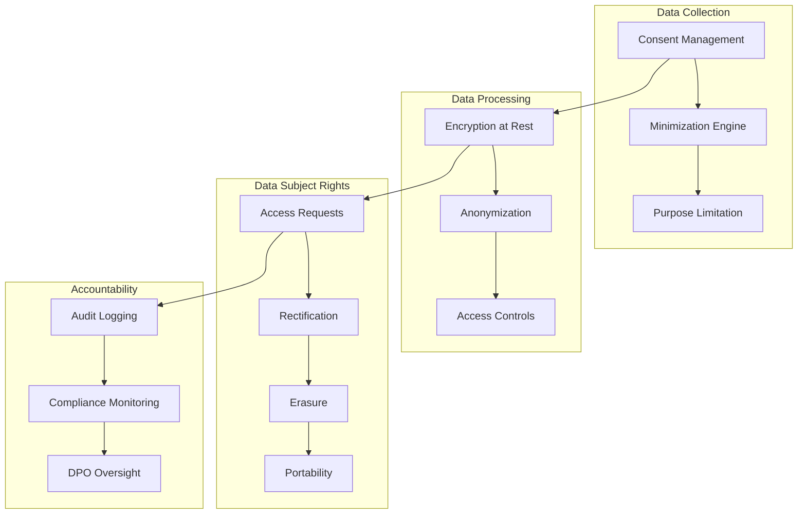

# 🛡️ GDPR COMPLIANCE - AINDUSDB CORE

**Version** : 1.0.0  
**Niveau** : Conformité RGPD  
**Date** : 21 janvier 2026  

---

## 🎯 **INTRODUCTION**

Guide complet de conformité au RGPD (Règlement Général sur la Protection des Données) pour AindusDB Core, assurant la protection des données personnelles conformément aux exigences européennes.

### **🏆 PRINCIPES RGPD APPLIQUÉS**
- **Licéité, Loyauté, Transparence** : Traitement transparent des données
- **Limitation des Finalités** : Utilisation définie et légale
- **Minimisation des Données** : Collecte limitée au nécessaire
- **Exactitude** : Données précises et à jour
- **Limitation de Conservation** : Durées de stockage définies
- **Intégrité et Confidentialité** : Sécurité renforcée
- **Responsabilité** : Preuve de conformité continue

---

## 📋 **CADRE JURIDIQUE RGPD**

### **🌍 Champ d'Application**
- **Territorial** : UE/EEE + traitement données résidents UE
- **Matériel** : Données personnelles (identifiées/identifiables)
- **Applicable à** : Clients UE, employés, partenaires, utilisateurs

### **📊 Catégories Données Personnelles**
```python
# Classification des données personnelles
class PersonalDataCategories:
    IDENTIFIANTS = {
        "email": "Adresse email",
        "phone": "Numéro téléphone",
        "user_id": "Identifiant utilisateur",
        "ip_address": "Adresse IP"
    }
    
    PROFIL = {
        "name": "Nom complet",
        "role": "Rôle professionnel",
        "preferences": "Préférences utilisateur",
        "behavior": "Comportement usage"
    }
    
    SENSIBLES = {
        "biometric": "Données biométriques",
        "health": "Données santé",
        "political": "Opinions politiques",
        "religious": "Croyances religieuses"
    }
    
    TECHNIQUES = {
        "device_id": "Identifiant appareil",
        "location": "Localisation géographique",
        "usage_patterns": "Patterns d'utilisation",
        "search_history": "Historique recherches"
    }
```

---

## 🏗️ **ARCHITECTURE RGPD-COMPLIANT**

### **🔐 Protection Données by Design**


### **🛡️ Mesures Techniques**
```python
# GDPR-compliant data handling
class GDPRCompliantDataHandler:
    def __init__(self):
        self.encryption_key = self.get_encryption_key()
        self.dpo_contact = "dpo@aindusdb.io"
        self.retention_periods = self.load_retention_schedule()
    
    async def process_personal_data(self, data: PersonalData, purpose: str):
        # 1. Vérifier consentement
        if not await self.has_valid_consent(data.user_id, purpose):
            raise ConsentRequiredException()
        
        # 2. Minimiser données
        minimized_data = self.minimize_data(data, purpose)
        
        # 3. Chiffrer données
        encrypted_data = self.encrypt_data(minimized_data)
        
        # 4. Logger traitement
        await self.audit_log_processing(data.user_id, purpose)
        
        # 5. Appliquer rétention
        await self.schedule_retention(encrypted_data, purpose)
        
        return encrypted_data
    
    def minimize_data(self, data: PersonalData, purpose: str):
        """Appliquer principe de minimisation"""
        required_fields = self.get_required_fields(purpose)
        return {k: v for k, v in data.items() if k in required_fields}
    
    async def anonymize_data(self, data: PersonalData):
        """Anonymisation complète des données"""
        anonymized = {
            "user_id": self.hash_id(data["user_id"]),
            "email": self.mask_email(data["email"]),
            "ip_address": self.anonymize_ip(data["ip_address"]),
            "timestamp": self.generalize_timestamp(data["timestamp"])
        }
        return anonymized
```

---

## 📊 **GESTION CONSENTEMENT**

### **🎯 Gestion Consentement Granulaire**
```python
# Consent Management System
class ConsentManager:
    def __init__(self):
        self.consent_storage = ConsentDatabase()
        self.consent_templates = self.load_consent_templates()
    
    async def request_consent(self, user_id: str, purposes: List[str]):
        """Demander consentement utilisateur"""
        consent_request = {
            "user_id": user_id,
            "request_id": generate_uuid(),
            "purposes": purposes,
            "timestamp": datetime.utcnow(),
            "valid_until": datetime.utcnow() + timedelta(days=365),
            "language": "fr",
            "version": "2.0"
        }
        
        # Créer demande consentement
        await self.consent_storage.create_request(consent_request)
        
        # Envoyer notification
        await self.send_consent_request(consent_request)
        
        return consent_request["request_id"]
    
    async def record_consent(self, request_id: str, consent_data: ConsentResponse):
        """Enregistrer réponse consentement"""
        consent_record = {
            "request_id": request_id,
            "user_id": consent_data.user_id,
            "purposes": consent_data.purposes,
            "granted": consent_data.granted,
            "timestamp": datetime.utcnow(),
            "ip_address": consent_data.ip_address,
            "user_agent": consent_data.user_agent,
            "withdrawn_at": None
        }
        
        await self.consent_storage.save_consent(consent_record)
        
        # Mettre à jour préférences utilisateur
        await self.update_user_preferences(consent_record)
    
    async def check_consent(self, user_id: str, purpose: str):
        """Vérifier consentement valide"""
        consent = await self.consent_storage.get_active_consent(user_id, purpose)
        
        if not consent:
            return False
        
        if consent["withdrawn_at"]:
            return False
        
        if consent["valid_until"] < datetime.utcnow():
            return False
        
        return True
```

### **📝 Templates Consentement**
```yaml
# consent_templates.yaml
consent_templates:
  data_processing:
    title: "Traitement des Données Personnelles"
    description: |
      Nous traitons vos données personnelles pour fournir nos services.
      Les données sont collectées, utilisées et protégées conformément au RGPD.
    purposes:
      - id: "service_delivery"
        name: "Fourniture des services"
        description: "Utiliser vos données pour fournir les services AindusDB"
        legal_basis: "contractual"
        retention_period: "7 ans"
      - id: "analytics"
        name: "Analyse et amélioration"
        description: "Analyser l'utilisation pour améliorer nos services"
        legal_basis: "legitimate_interest"
        retention_period: "2 ans"
      - id: "marketing"
        name: "Marketing"
        description: "Vous envoyer des informations pertinentes"
        legal_basis: "consent"
        retention_period: "3 ans"
    
  cookies:
    title: "Cookies et Technologies Similaires"
    description: |
      Nous utilisons des cookies pour améliorer votre expérience.
      Vous pouvez choisir les cookies que vous acceptez.
    categories:
      - id: "essential"
        name: "Essentiels"
        description: "Cookies nécessaires au fonctionnement du site"
        required: true
      - id: "analytics"
        name: "Analytiques"
        description: "Cookies pour mesurer l'audience"
        required: false
      - id: "marketing"
        name: "Marketing"
        description: "Cookies pour personnaliser la publicité"
        required: false
```

---

## 👤 **DROITS PERSONNES CONCERNÉES**

### **🔍 Droit d'Accès**
```python
# Data Subject Access Request (DSAR)
class DataSubjectAccessRequest:
    def __init__(self):
        self.data_locator = PersonalDataLocator()
        self.export_manager = DataExportManager()
    
    async def handle_access_request(self, user_id: str, request_id: str):
        """Gérer demande d'accès"""
        # 1. Authentifier demandeur
        if not await self.verify_identity(user_id):
            raise IdentityVerificationException()
        
        # 2. Collecter toutes les données
        personal_data = await self.collect_all_personal_data(user_id)
        
        # 3. Préparer rapport
        access_report = {
            "request_id": request_id,
            "user_id": user_id,
            "collection_date": datetime.utcnow(),
            "data_categories": self.categorize_data(personal_data),
            "processing_purposes": await self.get_processing_purposes(user_id),
            "data_sources": await self.get_data_sources(user_id),
            "recipients": await self.get_data_recipients(user_id),
            "retention_periods": await self.get_retention_info(user_id),
            "export_format": "json"
        }
        
        # 4. Exporter données
        export_data = await self.export_manager.create_export(
            personal_data, 
            format="json",
            encryption=True
        )
        
        # 5. Notifier utilisateur
        await self.notify_access_ready(user_id, export_data)
        
        return access_report
    
    async def collect_all_personal_data(self, user_id: str):
        """Collecter toutes les données personnelles"""
        data_sources = [
            "user_profiles",
            "search_history", 
            "api_usage",
            "consent_records",
            "access_logs",
            "support_tickets",
            "billing_records"
        ]
        
        all_data = {}
        for source in data_sources:
            data = await self.data_locator.get_data(source, user_id)
            all_data[source] = data
        
        return all_data
```

### **✏️ Droit de Rectification**
```python
# Data Rectification
class DataRectificationHandler:
    async def handle_rectification_request(self, request: RectificationRequest):
        """Gérer demande de rectification"""
        # 1. Valider demande
        if not await self.validate_rectification_request(request):
            raise InvalidRectificationException()
        
        # 2. Identifier données à rectifier
        affected_data = await self.identify_affected_data(request)
        
        # 3. Appliquer corrections
        corrections = []
        for data_item in affected_data:
            correction = await self.correct_data(data_item, request.corrections)
            corrections.append(correction)
        
        # 4. Notifier tiers si nécessaire
        await self.notify_third_parties(corrections)
        
        # 5. Confirmer à l'utilisateur
        await self.confirm_rectification(request.user_id, corrections)
        
        return corrections
```

### **🗑️ Droit à l'Oubli (Right to Erasure)**
```python
# Right to Erasure Implementation
class RightToErasureHandler:
    def __init__(self):
        self.data_deleter = SecureDataDeleter()
        self.legal_checker = LegalObligationChecker()
    
    async def handle_erasure_request(self, user_id: str, request_id: str):
        """Gérer demande d'effacement"""
        # 1. Vérifier obligations légales
        if await self.legal_checker.has_legal_obligation(user_id):
            return self.handle_legal_hold(user_id)
        
        # 2. Identifier toutes les données
        data_map = await self.create_data_map(user_id)
        
        # 3. Effacer données principales
        deletion_results = []
        for data_source, data_items in data_map.items():
            result = await self.data_deleter.secure_delete(data_items)
            deletion_results.append(result)
        
        # 4. Effacer données dérivées
        await self.delete_derived_data(user_id)
        
        # 5. Effacer logs et métriques
        await self.delete_anonymized_logs(user_id)
        
        # 6. Confirmer effacement
        erasure_confirmation = {
            "request_id": request_id,
            "user_id": user_id,
            "deleted_items": len(deletion_results),
            "completion_date": datetime.utcnow(),
            "verification_hash": self.generate_verification_hash(user_id)
        }
        
        return erasure_confirmation
    
    async def secure_delete(self, data_items: List[DataItem]):
        """Suppression sécurisée des données"""
        for item in data_items:
            # 1. Overwrite data
            await self.overwrite_data(item)
            
            # 2. Delete from database
            await self.delete_from_database(item)
            
            # 3. Delete from backups
            await self.delete_from_backups(item)
            
            # 4. Delete from cache
            await self.delete_from_cache(item)
```

### **📱 Droit à la Portabilité**
```python
# Data Portability
class DataPortabilityHandler:
    async def handle_portability_request(self, user_id: str, format: str = "json"):
        """Gérer demande de portabilité"""
        # 1. Collecter données portables
        portable_data = await self.collect_portable_data(user_id)
        
        # 2. Structurer données
        structured_data = self.structure_portable_data(portable_data)
        
        # 3. Exporter dans format demandé
        if format == "json":
            export_data = self.to_json(structured_data)
        elif format == "csv":
            export_data = self.to_csv(structured_data)
        elif format == "xml":
            export_data = self.to_xml(structured_data)
        
        # 4. Créer package portabilité
        portability_package = {
            "user_id": user_id,
            "export_date": datetime.utcnow(),
            "format": format,
            "data": export_data,
            "schema_version": "1.0",
            "checksum": self.calculate_checksum(export_data)
        }
        
        return portability_package
```

---

## 🔒 **MESURES SÉCURITÉ RGPD**

### **🛡️ Chiffrement et Protection**
```python
# GDPR-compliant encryption
class GDPRCompliantEncryption:
    def __init__(self):
        self.master_key = self.get_master_key()
        self.key_rotation_schedule = 90  # days
    
    def encrypt_personal_data(self, data: PersonalData):
        """Chiffrer données personnelles"""
        # 1. Générer clé de chiffrement
        data_key = self.generate_data_key()
        
        # 2. Chiffrer données
        encrypted_data = self.encrypt_with_aes256(data, data_key)
        
        # 3. Chiffrer clé de données
        encrypted_key = self.encrypt_key_with_master(data_key)
        
        return {
            "encrypted_data": encrypted_data,
            "encrypted_key": encrypted_key,
            "algorithm": "AES-256-GCM",
            "key_id": data_key.id,
            "created_at": datetime.utcnow()
        }
    
    def anonymize_for_analytics(self, personal_data: PersonalData):
        """Anonymiser pour analytics"""
        anonymized = {
            "user_hash": self.hash_user_id(personal_data.user_id),
            "age_group": self.generalize_age(personal_data.age),
            "region": self.generalize_location(personal_data.location),
            "timestamp": self.generalize_timestamp(personal_data.timestamp)
        }
        return anonymized
```

### **🔍 Audit et Monitoring**
```python
# GDPR Compliance Monitoring
class GDPRComplianceMonitor:
    def __init__(self):
        self.audit_logger = AuditLogger()
        self.compliance_checker = ComplianceChecker()
    
    async def monitor_data_processing(self, processing_event: DataProcessingEvent):
        """Monitor traitement des données"""
        # 1. Vérifier base légale
        if not await self.has_legal_basis(processing_event):
            await self.raise_compliance_alert("No legal basis", processing_event)
        
        # 2. Vérifier consentement
        if processing_event.requires_consent:
            if not await self.has_valid_consent(processing_event):
                await self.raise_compliance_alert("Invalid consent", processing_event)
        
        # 3. Vérifier rétention
        if await self.exceeds_retention_period(processing_event):
            await self.schedule_deletion(processing_event)
        
        # 4. Logger traitement
        await self.audit_logger.log_processing(processing_event)
    
    async def generate_compliance_report(self, period: str):
        """Générer rapport conformité"""
        report = {
            "period": period,
            "data_processing_activities": await self.get_processing_activities(period),
            "data_subject_requests": await self.get_dsar_stats(period),
            "data_breaches": await self.get_breach_report(period),
            "consent_management": await self.get_consent_stats(period),
            "retention_compliance": await self.get_retention_compliance(period),
            "international_transfers": await self.get_transfer_report(period),
            "dpo_activities": await self.get_dpo_report(period)
        }
        
        return report
```

---

## 🌍 **TRANSFERTS INTERNATIONAUX**

### **📋 Mécanismes de Transfert**
```python
# International Data Transfers
class InternationalTransferHandler:
    def __init__(self):
        self.transfer_mechanisms = {
            "adequacy": AdequacyDecisionHandler(),
            "scc": StandardContractualClausesHandler(),
            "bcr": BindingCorporateRulesHandler()
        }
    
    async def validate_international_transfer(self, transfer: InternationalTransfer):
        """Valider transfert international"""
        # 1. Vérifier pays destinataire
        destination_country = transfer.destination_country
        
        # 2. Choisir mécanisme approprié
        if await self.has_adequacy_decision(destination_country):
            mechanism = self.transfer_mechanisms["adequacy"]
        elif transfer.is_intra_group:
            mechanism = self.transfer_mechanisms["bcr"]
        else:
            mechanism = self.transfer_mechanisms["scc"]
        
        # 3. Appliquer mécanisme
        transfer_validated = await mechanism.validate_transfer(transfer)
        
        # 4. Documentation conformité
        await self.document_transfer(transfer, mechanism)
        
        return transfer_validated
    
    async def prepare_data_for_transfer(self, data: PersonalData, destination: str):
        """Préparer données pour transfert"""
        # 1. Appliquer protections additionnelles
        protected_data = self.apply_additional_safeguards(data, destination)
        
        # 2. Chiffrement renforcé
        encrypted_data = self.encrypt_for_transfer(protected_data)
        
        # 3. Minimisation données
        minimized_data = self.minimize_for_transfer(encrypted_data)
        
        return minimized_data
```

---

## 📊 **DOCUMENTATION ET PREUVES**

### **📋 Registre des Activités de Traitement**
```yaml
# processing_activities_register.yaml
processing_activities:
  - id: "PA001"
    name: "Gestion comptes utilisateurs"
    description: "Création et gestion des comptes utilisateurs"
    data_categories:
      - "identifiants"
      - "données contact"
      - "préférences"
    purposes:
      - "fourniture services"
      - "support client"
    legal_basis: "contractual"
    recipients:
      - "service support"
      - "hébergeur cloud"
    retention_period: "7 ans après fin contrat"
    security_measures:
      - "chiffrement AES-256"
      - "authentification forte"
      - "audit logs"
    international_transfers:
      - destination: "États-Unis"
        mechanism: "SCC"
        safeguards: "chiffrement renforcé"
    
  - id: "PA002"
    name: "Analytique et amélioration"
    description: "Analyse utilisation pour améliorer services"
    data_categories:
      - "données usage"
      - "logs techniques"
      - "métriques performance"
    purposes:
      - "amélioration services"
      - "analytics"
    legal_basis: "intérêt légitime"
    recipients:
      - "équipe analytics"
      - "sous-traitant analytics"
    retention_period: "2 ans"
    security_measures:
      - "anonymisation"
      - "agrégation"
      - "accès restreint"
```

### **📊 Rapports Conformité**
```python
# Compliance Reporting
class GDPRComplianceReporter:
    async def generate_annual_report(self, year: int):
        """Générer rapport annuel conformité"""
        report = {
            "year": year,
            "executive_summary": await self.generate_executive_summary(year),
            "data_protection_impact_assessments": await self.get_dpias(year),
            "data_breaches": await self.get_breach_report(year),
            "data_subject_requests": await self.get_dsar_report(year),
            "consent_management": await self.get_consent_report(year),
            "international_transfers": await self.get_transfer_report(year),
            "security_measures": await self.get_security_report(year),
            "training_awareness": await self.get_training_report(year),
            "improvement_actions": await self.get_improvement_plan(year)
        }
        
        return report
    
    async def generate_dpia_report(self, processing_activity: str):
        """Data Protection Impact Assessment"""
        dpia = {
            "processing_activity": processing_activity,
            "necessity_proportionality": await self.assess_necessity(processing_activity),
            "risks_to_rights": await self.assess_risks(processing_activity),
            "mitigation_measures": await self.get_mitigation_measures(processing_activity),
            "consultation_stakeholders": await self.get_consultation_results(processing_activity),
            "recommendations": await self.get_recommendations(processing_activity)
        }
        
        return dpia
```

---

## 🚨 **NOTIFICATION VIOLATIONS**

### **📋 Gestion Violations Données**
```python
# Data Breach Management
class DataBreachManager:
    def __init__(self):
        self.breach_classifier = BreachClassifier()
        self.notification_manager = NotificationManager()
        self.dpo_contact = "dpo@aindusdb.io"
    
    async def handle_data_breach(self, breach: DataBreach):
        """Gérer violation de données"""
        # 1. Classifier la violation
        breach_risk = await self.breach_classifier.classify(breach)
        
        # 2. Documenter la violation
        breach_record = await self.document_breach(breach, breach_risk)
        
        # 3. Notifier DPO
        await self.notify_dpo(breach_record)
        
        # 4. Évaluer nécessité notification CNIL
        if breach_risk.requires_authority_notification:
            await self.notify_authority(breach_record)
        
        # 5. Notifier personnes concernées
        if breach_risk.requires_subject_notification:
            await self.notify_data_subjects(breach_record)
        
        # 6. Plan actions correctives
        await self.create_corrective_actions(breach_record)
        
        return breach_record
    
    async def notify_authority(self, breach: BreachRecord):
        """Notifier autorité de protection (CNIL)"""
        if breach.risk_level == "high":
            # Notification dans 72 heures
            await self.notification_manager.send_cnil_notification({
                "breach_id": breach.id,
                "notification_date": datetime.utcnow(),
                "breach_description": breach.description,
                "categories_data": breach.data_categories,
                "approximate_number": breach.affected_count,
                "consequences": breach.consequences,
                "measures_taken": breach.immediate_measures,
                "contact_person": self.dpo_contact
            })
```

---

## 🎓 **FORMATION SENSIBILISATION**

### **📚 Programme Formation RGPD**
```python
# GDPR Training Program
class GDPRTrainingProgram:
    def __init__(self):
        self.training_modules = self.load_training_modules()
        self.compliance_tracker = ComplianceTracker()
    
    async def assign_training(self, employee_id: str, role: str):
        """Assigner formation RGPD"""
        required_modules = self.get_required_modules(role)
        
        for module in required_modules:
            assignment = {
                "employee_id": employee_id,
                "module_id": module["id"],
                "assigned_date": datetime.utcnow(),
                "due_date": datetime.utcnow() + timedelta(days=30),
                "status": "assigned"
            }
            
            await self.compliance_tracker.create_assignment(assignment)
    
    async def track_compliance(self):
        """Suivre conformité formation"""
        all_employees = await self.get_all_employees()
        compliance_status = {}
        
        for employee in all_employees:
            modules_completed = await self.get_completed_modules(employee.id)
            required_modules = await self.get_required_modules(employee.role)
            
            compliance_rate = len(modules_completed) / len(required_modules)
            
            compliance_status[employee.id] = {
                "name": employee.name,
                "role": employee.role,
                "completed_modules": len(modules_completed),
                "required_modules": len(required_modules),
                "compliance_rate": compliance_rate,
                "last_training": modules_completed[-1].completion_date if modules_completed else None
            }
        
        return compliance_status
```

---

## 🎯 **CONCLUSION**

### **✅ Conformité RGPD Atteinte**
- **Protection Données** : Mesures techniques et organisationnelles
- **Droits Utilisateurs** : Mécanismes complets exercice droits
- **Transparence** : Documentation et information claire
- **Responsabilité** : Preuves de conformité continues
- **Sécurité** : Chiffrement et contrôle accès

### **🚀 Améliorations Continues**
- **Monitoring** : Surveillance conformité continue
- **Audits** : Audits réguliers internes/externes
- **Formation** : Sensibilisation équipe régulière
- **Documentation** : Mise à jour processus et politiques
- **Innovation** : Nouvelles mesures de protection

---

*GDPR Compliance - 21 janvier 2026*  
*Conformité RGPD Enterprise-Grade*
