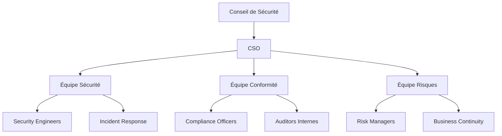
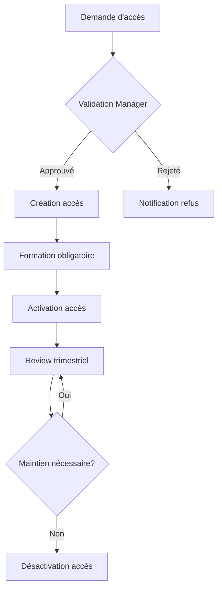
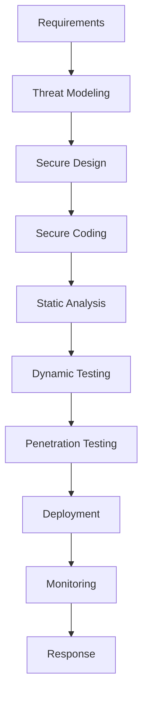
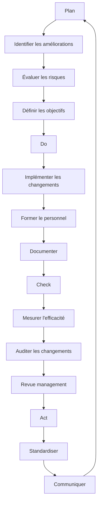

# Conformité ISO 27001 - AindusDB Core

**Version:** 1.0  
**Date:** 21/01/2026  
**Auteur:** Équipe AindusDB  
**Statut:** En rédaction  

---

## 📋 Vue d'ensemble

Ce document présente la mise en œuvre de la norme ISO 27001 pour AindusDB Core, assurant une gestion systématique de la sécurité de l'information.

---

## 🎯 Objectifs de Sécurité

### Domaine A.5 : Politiques de Sécurité

#### A.5.1 Politiques de sécurité de l'information

**Politique principale de sécurité :**
```yaml
politique_securite:
  titre: "Politique de Sécurité de l'Information - AindusDB Core"
  approbation: "Direction Générale"
  date_revision: "2024-01-21"
  objectifs:
    - "Protéger la confidentialité des données clients"
    - "Assurer l'intégrité des calculs VERITAS"
    - "Garantir la disponibilité 24/7 des services"
    - "Se conformer aux régulations applicables"
  
  principes:
    - "Sécurité par design"
    - "Moindre privilège"
    - "Responsabilité partagée"
    - "Amélioration continue"
```

#### A.5.2 Examen des politiques

**Fréquence de révision :**
- Trimestriel : Revue des métriques et incidents
- Annuel : Révision complète de la politique
- Ad hoc : En cas de changement majeur

**Métriques de suivi :**
- Nombre d'incidents de sécurité
- Taux de conformité aux contrôles
- Résultats des audits internes
- Feedback des parties intéressées

---

## 🏢 Organisation et Gestion

### Domaine A.6 : Organisation de la sécurité

#### A.6.1 Organisation interne

**Structure de gouvernance :**


**Rôles et responsabilités :**
```yaml
roles:
  cso:
    nom: "Chief Security Officer"
    responsabilites:
      - "Définir la stratégie de sécurité"
      - "Approuver les politiques"
      - "Rapporter au conseil"
  
  security_engineer:
    responsabilites:
      - "Implémenter les contrôles techniques"
      - "Gérer les outils de sécurité"
      - "Répondre aux incidents"
  
  compliance_officer:
    responsabilites:
      - "Vérifier la conformité"
      - "Préparer les audits"
      - "Maintenir la documentation"
```

#### A.6.2 Mobile et télétravail

**Politique de télétravail :**
- VPN obligatoire avec authentification MFA
- Chiffrement des postes de travail (BitLocker/FileVault)
- Accès limité aux ressources essentielles
- Audit des connexions distantes

**Contrôles techniques :**
```python
# app/security/remote_access.py
from fastapi import Depends, HTTPException
from app.security.vpn import verify_vpn_connection
from app.security.device import verify_device_compliance

async def verify_remote_access(request: Request):
    """Vérifie l'accès distant"""
    # 1. Vérification VPN
    if not await verify_vpn_connection(request.client.host):
        raise HTTPException(403, "VPN connection required")
    
    # 2. Vérification conformité appareil
    device_id = request.headers.get("X-Device-ID")
    if not await verify_device_compliance(device_id):
        raise HTTPException(403, "Device not compliant")
    
    # 3. Journalisation
    await log_remote_access(request.user.id, request.client.host)
```

---

## 👥 Ressources Humaines

### Domaine A.7 : Ressources humaines

#### A.7.1 Avant l'embauche

**Vérification des antécédents :**
- Identité et diplômes
- Casier judiciaire (position sensible)
- Références professionnelles
- Vérification des certifications

**Clause de confidentialité :**
```yaml
clause_confidentialite:
  portee: "Toutes les informations de AindusDB"
  duree: "Pendant et après le contrat"
  obligations:
    - "Non-divulgation"
    - "Non-utilisation"
    - "Retour des informations"
  sanctions: "Poursuites judiciaires possibles"
```

#### A.7.2 Pendant l'emploi

**Formation obligatoire :**
```yaml
programme_formation:
  nouvelle_embauche:
    - "Sécurité de base (4h)"
    - "Politiques internes (2h)"
    - "Gestion des mots de passe (1h)"
  
  annuel:
    - "Mises à jour sécurité (2h)"
    - "Phishing awareness (1h)"
    - "Protection des données (1h)"
  
  role_specifique:
    developpeur: "Secure coding (8h)"
    administrateur: "Hardening systèmes (8h)"
    manager: "Gestion des incidents (4h)"
```

#### A.7.3 Fin de contrat et changement de poste

**Checklist de départ :**
1. Révocation de tous les accès
2. Récupération des équipements
3. Transfert des connaissances
4. Accord de fin de contrat signé
5. Audit des accès post-départ

---

## 💽 Gestion des Actifs

### Domaine A.8 : Gestion des actifs

#### A.8.1 Responsabilité des actifs

**Inventaire des actifs :**
```yaml
actifs_information:
  categories:
    hardware:
      - serveurs_production
      - serveurs_developpement
      - postes_travail
      - equipements_reseau
    
    software:
      - systemes_exploitation
      - applications_metier
      - bases_donnees
      - middleware
    
    data:
      - donnees_clients
      - donnees_operationnelles
      - logs_et_audit
      - sauvegardes
    
    infrastructure:
      - reseaux
      - cloud_resources
      - systemes_stockage
      - equipements_securite
```

**Classification des informations :**
```python
# app/data/classification.py
from enum import Enum
from typing import Dict, List

class DataClassification(Enum):
    PUBLIC = "public"
    INTERNAL = "internal"
    CONFIDENTIAL = "confidential"
    RESTRICTED = "restricted"

class ClassificationHandler:
    def __init__(self):
        self.rules = {
            "customer_data": DataClassification.RESTRICTED,
            "financial_data": DataClassification.CONFIDENTIAL,
            "employee_data": DataClassification.CONFIDENTIAL,
            "operational_data": DataClassification.INTERNAL,
            "marketing_data": DataClassification.PUBLIC
        }
    
    def classify_data(self, data_type: str) -> DataClassification:
        return self.rules.get(data_type, DataClassification.INTERNAL)
    
    def get_requirements(self, classification: DataClassification) -> Dict:
        requirements = {
            DataClassification.RESTRICTED: {
                "encryption": True,
                "access_control": "RBAC + MFA",
                "audit": True,
                "retention": "7 years"
            },
            DataClassification.CONFIDENTIAL: {
                "encryption": True,
                "access_control": "RBAC",
                "audit": True,
                "retention": "5 years"
            },
            DataClassification.INTERNAL: {
                "encryption": False,
                "access_control": "RBAC",
                "audit": False,
                "retention": "3 years"
            },
            DataClassification.PUBLIC: {
                "encryption": False,
                "access_control": "None",
                "audit": False,
                "retention": "1 year"
            }
        }
        return requirements.get(classification, {})
```

#### A.8.2 Classification des informations

**Étiquetage automatique :**
```python
# app/data/labeling.py
class DataLabeler:
    def __init__(self):
        self.patterns = {
            "ssn": r"\d{3}-\d{2}-\d{4}",
            "credit_card": r"\d{4}[-\s]?\d{4}[-\s]?\d{4}[-\s]?\d{4}",
            "email": r"[a-zA-Z0-9._%+-]+@[a-zA-Z0-9.-]+\.[a-zA-Z]{2,}",
            "api_key": r"[a-zA-Z0-9]{32,}"
        }
    
    def scan_and_label(self, content: str) -> Dict:
        labels = []
        for pattern_name, pattern in self.patterns.items():
            if re.search(pattern, content):
                labels.append(pattern_name)
        
        classification = self.determine_classification(labels)
        return {
            "labels": labels,
            "classification": classification,
            "requires_protection": classification in ["CONFIDENTIAL", "RESTRICTED"]
        }
```

---

## 🔐 Contrôle d'Accès

### Domaine A.9 : Contrôle d'accès

#### A.9.1 Exigences métier pour le contrôle d'accès

**Matrice de permissions :**
```yaml
matrice_acces:
  roles:
    admin:
      vector_store: ["create", "read", "update", "delete", "admin"]
      veritas: ["calculate", "verify", "admin"]
      users: ["create", "read", "update", "delete", "admin"]
      monitoring: ["read", "admin"]
    
    developer:
      vector_store: ["create", "read", "update"]
      veritas: ["calculate", "verify"]
      users: ["read"]
      monitoring: ["read"]
    
    analyst:
      vector_store: ["read"]
      veritas: ["calculate", "verify"]
      users: ["read"]
      monitoring: ["read"]
    
    readonly:
      vector_store: ["read"]
      veritas: ["read"]
      users: ["read"]
      monitoring: ["read"]
```

#### A.9.2 Gestion du cycle de vie des accès

**Workflow d'approbation :**


**Script de gestion des accès :**
```python
# app/access/lifecycle.py
import asyncio
from datetime import datetime, timedelta

class AccessLifecycleManager:
    def __init__(self):
        self.approval_workflow = ApprovalWorkflow()
        self.notification_service = NotificationService()
    
    async def request_access(self, user_id: str, role: str, justification: str):
        """Traite une demande d'accès"""
        # 1. Créer la demande
        request = await self.create_access_request(
            user_id, role, justification
        )
        
        # 2. Notifier le manager
        await self.notification_service.notify_manager(request)
        
        # 3. Attendre l'approbation
        approval = await self.approval_workflow.wait_for_approval(
            request.id, timeout=72*3600  # 72 heures
        )
        
        if approval.approved:
            await self.grant_access(user_id, role, approval.conditions)
        else:
            await self.notify_rejection(user_id, approval.reason)
    
    async def review_access(self):
        """Examen périodique des accès"""
        # Récupérer tous les accès actifs
        active_accesses = await self.get_active_accesses()
        
        for access in active_accesses:
            # Vérifier l'utilisation
            last_used = await self.get_last_usage(access.user_id, access.role)
            
            if not last_used or last_used < datetime.now() - timedelta(days=90):
                # Pas d'utilisation depuis 90 jours
                await self.schedule_review(access)
            
            # Vérifier la nécessité métier
            if access.created_at < datetime.now() - timedelta(days=365):
                await self.request_business_justification(access)
```

#### A.9.3 Droits d'accès système

**Contrôles techniques :**
```python
# app/access/technical_controls.py
from fastapi import Depends, HTTPException, Request
from app.auth.jwt import verify_token
from app.auth.rbac import check_permission

class TechnicalAccessControl:
    def __init__(self):
        self.failed_attempts = {}
        self.lockout_duration = 900  # 15 minutes
        self.max_attempts = 5
    
    async def check_brute_force(self, identifier: str) -> bool:
        """Vérifie les tentatives de brute force"""
        attempts = self.failed_attempts.get(identifier, 0)
        
        if attempts >= self.max_attempts:
            # Vérifier si le lockout est expiré
            last_attempt = self.failed_attempts.get(f"{identifier}_time", 0)
            if time.time() - last_attempt < self.lockout_duration:
                raise HTTPException(429, "Account locked. Try again later.")
            else:
                # Reset après expiration
                del self.failed_attempts[identifier]
                del self.failed_attempts[f"{identifier}_time"]
        
        return True
    
    async def record_failed_attempt(self, identifier: str):
        """Enregistre une tentative échouée"""
        self.failed_attempts[identifier] = self.failed_attempts.get(identifier, 0) + 1
        self.failed_attempts[f"{identifier}_time"] = time.time()
    
    async def enforce_mfa(self, user_id: str, sensitivity_level: str):
        """Force MFA pour les accès sensibles"""
        if sensitivity_level in ["high", "critical"]:
            mfa_verified = await self.verify_mfa_session(user_id)
            if not mfa_verified:
                raise HTTPException(403, "MFA required for this operation")

# Middleware FastAPI
async def access_control_middleware(
    request: Request,
    user: dict = Depends(verify_token)
):
    """Middleware de contrôle d'accès"""
    # Vérifier la permission
    permission = f"{request.method}_{request.url.path}"
    if not check_permission(user["roles"], permission):
        raise HTTPException(403, "Insufficient permissions")
    
    # Vérifier MFA si nécessaire
    if is_sensitive_operation(request):
        await enforce_mfa(user["id"], get_sensitivity_level(request))
```

---

## 🔐 Cryptographie

### Domaine A.10 : Cryptographie

#### A.10.1 Contrôles cryptographiques

**Politique de chiffrement :**
```yaml
politique_chiffrement:
  donnees_transit:
    protocoles: ["TLS 1.3", "TLS 1.2"]
    suites_cipher:
      - "TLS_AES_256_GCM_SHA384"
      - "TLS_CHACHA20_POLY1305_SHA256"
      - "TLS_AES_128_GCM_SHA256"
  
  donnees_repos:
    bases_donnees: "AES-256-GCM"
    fichiers: "AES-256-XTS"
    backups: "AES-256-GCM + RSA-4096"
  
  gestion_cles:
    rotation: "90 jours"
    stockage: "HSM ou KMS cloud"
    sauvegarde: "Chiffrement hors bande"
```

**Implémentation du chiffrement :**
```python
# app/crypto/encryption.py
from cryptography.fernet import Fernet
from cryptography.hazmat.primitives import hashes, serialization
from cryptography.hazmat.primitives.asymmetric import rsa, padding
from cryptography.hazmat.backends import default_backend
import os

class EncryptionManager:
    def __init__(self):
        self.key_manager = KeyManager()
        self.current_key = None
    
    async def encrypt_data(self, data: bytes, data_type: str) -> dict:
        """Chiffre des données selon leur type"""
        # 1. Obtenir la clé appropriée
        key = await self.key_manager.get_key(data_type)
        
        # 2. Chiffrer selon le type
        if data_type == "sensitive":
            # Chiffrement asymétrique pour les données très sensibles
            encrypted = await self.asymmetric_encrypt(data, key)
        else:
            # Chiffrement symétrique pour les données standard
            encrypted = await self.symmetric_encrypt(data, key)
        
        return {
            "encrypted_data": encrypted["data"],
            "key_id": encrypted["key_id"],
            "algorithm": encrypted["algorithm"],
            "timestamp": datetime.utcnow().isoformat()
        }
    
    async def symmetric_encrypt(self, data: bytes, key: bytes) -> dict:
        """Chiffrement symétrique AES-256-GCM"""
        from cryptography.hazmat.primitives.ciphers.aead import AESGCM
        
        aesgcm = AESGCM(key)
        nonce = os.urandom(12)
        encrypted_data = aesgcm.encrypt(nonce, data, None)
        
        return {
            "data": nonce + encrypted_data,
            "key_id": self.key_manager.current_key_id,
            "algorithm": "AES-256-GCM"
        }
    
    async def asymmetric_encrypt(self, data: bytes, public_key: bytes) -> dict:
        """Chiffrement asymétrique RSA-OAEP"""
        key = serialization.load_pem_public_key(
            public_key,
            backend=default_backend()
        )
        
        encrypted = key.encrypt(
            data,
            padding.OAEP(
                mgf=padding.MGF1(algorithm=hashes.SHA256()),
                algorithm=hashes.SHA256(),
                label=None
            )
        )
        
        return {
            "data": encrypted,
            "key_id": self.key_manager.current_key_id,
            "algorithm": "RSA-4096-OAEP"
        }

class KeyManager:
    def __init__(self):
        self.keys = {}
        self.current_key_id = None
        self.rotation_interval = 90 * 24 * 3600  # 90 jours
    
    async def rotate_keys(self):
        """Rotation automatique des clés"""
        # 1. Générer nouvelle clé
        new_key = Fernet.generate_key()
        new_key_id = str(uuid.uuid4())
        
        # 2. Stocker la nouvelle clé
        await self.store_key(new_key_id, new_key)
        
        # 3. Marquer l'ancienne clé pour décommission
        if self.current_key_id:
            await self.mark_key_decommissioning(self.current_key_id)
        
        # 4. Activer la nouvelle clé
        self.current_key_id = new_key_id
        
        # 5. Re-chiffrer les données critiques avec la nouvelle clé
        await self.reencrypt_critical_data()
```

#### A.10.2 Cycle de vie des clés

**Gestion du cycle de vie :**
```python
# app/crypto/key_lifecycle.py
class KeyLifecycleManager:
    def __init__(self):
        self.hsm_client = HSMClient()
        self.kms_client = KMSClient()
    
    async def create_key_pair(self, key_type: str, key_size: int = 4096):
        """Crée une paire de clés asymétriques"""
        if key_type == "RSA":
            private_key = rsa.generate_private_key(
                public_exponent=65537,
                key_size=key_size,
                backend=default_backend()
            )
            
            # Stocker dans HSM
            key_id = await self.hsm_client.store_key(private_key)
            
            # Exporter la clé publique
            public_key = private_key.public_key()
            public_pem = public_key.public_bytes(
                encoding=serialization.Encoding.PEM,
                format=serialization.PublicFormat.SubjectPublicKeyInfo
            )
            
            return {
                "key_id": key_id,
                "public_key": public_pem.decode(),
                "created_at": datetime.utcnow(),
                "status": "active"
            }
    
    async def schedule_key_rotation(self, key_id: str):
        """Planifie la rotation d'une clé"""
        # Créer une tâche planifiée
        rotation_task = {
            "key_id": key_id,
            "scheduled_date": datetime.utcnow() + timedelta(days=90),
            "status": "scheduled"
        }
        
        await self.task_scheduler.create_task("key_rotation", rotation_task)
    
    async def decommission_key(self, key_id: str, retention_days: int = 2555):
        """Décommissionne une clé après la période de rétention"""
        # 1. Vérifier qu'aucune donnée n'utilise cette clé
        usage_count = await self.check_key_usage(key_id)
        if usage_count > 0:
            raise Exception("Key still in use")
        
        # 2. Archiver la clé pour la rétention
        await self.archive_key(key_id, retention_days)
        
        # 3. Supprimer définitivement après rétention
        await self.schedule_permanent_deletion(key_id, retention_days)
```

---

## 🛡️ Sécurité Physique et Environnementale

### Domaine A.11 : Sécurité physique et environnementale

#### A.11.1 Zones sécurisées

**Contrôles d'accès physique :**
```yaml
zones_securisees:
  datacenter:
    niveau: "Niveau 4 - Maximum"
    controles:
      - "Badges multi-facteurs"
      - "Sas d'entrée"
      - "Détection biométrique"
      - "Gardes 24/7"
      - "Caméras avec enregistrement 90 jours"
  
  server_room:
    niveau: "Niveau 3 - Élevé"
    controles:
      - "Badges RFID"
      - "Portes à codes"
      - "Détection de mouvement"
      - "Contrôle température/humidité"
  
  office_space:
    niveau: "Niveau 2 - Standard"
    controles:
      - "Badges d'accès"
      - "Caméras points stratégiques"
      - "Visitors register"
```

**Monitoring environnemental :**
```python
# app/physical/monitoring.py
class EnvironmentalMonitor:
    def __init__(self):
        self.sensors = {
            "temperature": SensorClient("temp-001"),
            "humidity": SensorClient("hum-001"),
            "power": SensorClient("power-001"),
            "fire": SensorClient("fire-001"),
            "water": SensorClient("water-001")
        }
        self.alert_thresholds = {
            "temperature": {"min": 18, "max": 27},
            "humidity": {"min": 40, "max": 60},
            "power": {"min_voltage": 220, "max_voltage": 240}
        }
    
    async def monitor_environment(self):
        """Surveillance continue de l'environnement"""
        while True:
            readings = {}
            
            # Lire tous les capteurs
            for sensor_type, sensor in self.sensors.items():
                reading = await sensor.read()
                readings[sensor_type] = reading
                
                # Vérifier les seuils
                if sensor_type in self.alert_thresholds:
                    await self.check_thresholds(sensor_type, reading)
            
            # Enregistrer les lectures
            await self.store_environmental_data(readings)
            
            # Attendre la prochaine lecture
            await asyncio.sleep(60)  # Lecture chaque minute
    
    async def check_thresholds(self, sensor_type: str, reading: dict):
        """Vérifie si les lectures sont dans les seuils"""
        thresholds = self.alert_thresholds[sensor_type]
        value = reading["value"]
        
        if value < thresholds.get("min", float('-inf')) or \
           value > thresholds.get("max", float('inf')):
            await self.trigger_environmental_alert(
                sensor_type, value, thresholds
            )
```

#### A.11.2 Sécurité des équipements

**Politique de sécurité des équipements :**
- Inventaire complet de tous les équipements
- Marquage des actifs de l'entreprise
- Maintenance préventive régulière
- Destruction sécurisée des disques durs
- Contrôle des équipements sortants

---

## 📡 Sécurité des Opérations

### Domaine A.12 : Sécurité des opérations

#### A.12.1 Procédures et responsabilités opérationnelles

**Change Management :**
```python
# app/ops/change_management.py
class ChangeManagement:
    def __init__(self):
        self.approval_levels = {
            "low": ["team_lead"],
            "medium": ["team_lead", "manager"],
            "high": ["team_lead", "manager", "director"],
            "critical": ["team_lead", "manager", "director", "ciso"]
        }
    
    async def submit_change(self, change_request: dict):
        """Soumet une demande de changement"""
        # 1. Valider la demande
        validation = await self.validate_change_request(change_request)
        if not validation.valid:
            raise Exception(validation.errors)
        
        # 2. Évaluer le risque
        risk_level = await self.assess_risk(change_request)
        
        # 3. Déterminer le niveau d'approbation
        approvers = self.approval_levels[risk_level]
        
        # 4. Créer le workflow d'approbation
        workflow = await self.create_approval_workflow(
            change_request, approvers
        )
        
        # 5. Notifier les approbateurs
        await self.notify_approvers(workflow)
        
        return workflow
    
    async def implement_change(self, change_id: str):
        """Implémente un changement approuvé"""
        change = await self.get_change(change_id)
        
        # 1. Créer un point de restauration
        checkpoint = await self.create_checkpoint(change)
        
        try:
            # 2. Implémenter le changement
            result = await self.execute_change(change)
            
            # 3. Vérifier le résultat
            verification = await self.verify_implementation(change, result)
            
            if verification.success:
                # 4. Documenter le changement
                await self.document_change(change, result)
                
                # 5. Notifier les parties intéressées
                await self.notify_completion(change)
            else:
                # Rollback si échec
                await self.rollback_to_checkpoint(checkpoint)
                raise Exception("Change verification failed")
                
        except Exception as e:
            # Rollback en cas d'erreur
            await self.rollback_to_checkpoint(checkpoint)
            await self.notify_failure(change, str(e))
            raise
```

#### A.12.2 Protection contre les logiciels malveillants

**Stratégie anti-malware :**
```yaml
anti_malware_strategy:
  prevention:
    - "Antivirus sur tous les postes"
    - "Scanning des fichiers uploadés"
    - "Sandboxing des exécutables"
    - "Blocklist des domaines malveillants"
  
  detection:
    - "EDR sur les serveurs critiques"
    - "Monitoring comportemental"
    - "Analyse heuristique"
    - "Threat intelligence feeds"
  
  response:
    - "Isolation automatique"
    - "Alerting immédiat"
    - "Analyse forensique"
    - "Remédiation automatisée"
```

---

## 📡 Communications Sécurisées

### Domaine A.13 : Sécurité des communications

#### A.13.1 Transfert d'informations

**Politique de transfert sécurisé :**
```python
# app/communications/secure_transfer.py
class SecureTransferManager:
    def __init__(self):
        self.allowed_protocols = ["HTTPS", "SFTP", "FTPS"]
        self.encryption_requirements = {
            "internal": "TLS 1.2+",
            "external": "TLS 1.3",
            "highly_sensitive": "TLS 1.3 + PFS"
        }
    
    async def validate_transfer(self, transfer_request: dict):
        """Valide une demande de transfert"""
        # 1. Vérifier le protocole
        if transfer_request["protocol"] not in self.allowed_protocols:
            raise Exception("Protocol not allowed")
        
        # 2. Vérifier le niveau de chiffrement
        data_sensitivity = await self.classify_data(
            transfer_request["data"]
        )
        required_encryption = self.encryption_requirements[
            data_sensitivity
        ]
        
        if transfer_request["encryption"] < required_encryption:
            raise Exception("Encryption level insufficient")
        
        # 3. Vérifier les destinations autorisées
        if not await self.is_destination_allowed(
            transfer_request["destination"]
        ):
            raise Exception("Destination not authorized")
        
        return True
    
    async def secure_file_transfer(self, file_path: str, destination: str):
        """Transfert sécurisé de fichier"""
        # 1. Calculer le hash
        file_hash = await self.calculate_hash(file_path)
        
        # 2. Chiffrer si nécessaire
        encrypted_path = await self.encrypt_if_needed(file_path)
        
        # 3. Transférer avec SFTP
        transfer_result = await self.sftp_transfer(
            encrypted_path, destination
        )
        
        # 4. Vérifier l'intégrité
        remote_hash = await self.verify_remote_hash(
            destination, file_hash
        )
        
        if remote_hash != file_hash:
            raise Exception("File integrity check failed")
        
        # 5. Nettoyer les fichiers temporaires
        await self.cleanup_temp_files(encrypted_path)
        
        return {
            "status": "success",
            "hash": file_hash,
            "transferred_at": datetime.utcnow()
        }
```

---

## 📊 Acquisition, Développement et Maintenance

### Domaine A.14 : Sécurité des systèmes

#### A.14.1 Exigences de sécurité

**Secure Development Lifecycle (SDL) :**


**Checklist de sécurité pour le développement :**
```python
# app/development/security_checklist.py
class SecurityChecklist:
    def __init__(self):
        self.checks = {
            "authentication": [
                "MFA implemented",
                "Password complexity enforced",
                "Session timeout configured",
                "Brute force protection"
            ],
            "authorization": [
                "Principle of least privilege",
                "RBAC implemented",
                "Authorization checks on all endpoints",
                "Role separation"
            ],
            "data_protection": [
                "Encryption at rest",
                "Encryption in transit",
                "Data classification implemented",
                "PII masking"
            ],
            "input_validation": [
                "SQL injection protection",
                "XSS protection",
                "CSRF protection",
                "Input sanitization"
            ],
            "logging": [
                "Security events logged",
                "Log integrity protected",
                "Sensitive data not logged",
                "Centralized logging"
            ]
        }
    
    async def validate_component(self, component_name: str):
        """Valide un composant contre la checklist"""
        results = {}
        
        for category, checks in self.checks.items():
            results[category] = {}
            for check in checks:
                result = await self.run_check(component_name, check)
                results[category][check] = result
        
        # Calculer le score de sécurité
        score = self.calculate_security_score(results)
        
        return {
            "component": component_name,
            "checks": results,
            "security_score": score,
            "recommendations": self.get_recommendations(results)
        }
```

#### A.14.2 Sécurité dans les cycles de développement

**Outils de sécurité dans le CI/CD :**
```yaml
# .github/workflows/security.yml
name: Security Checks

on: [push, pull_request]

jobs:
  security:
    runs-on: ubuntu-latest
    steps:
      - uses: actions/checkout@v3
      
      - name: Run Bandit Security Linter
        run: |
          pip install bandit
          bandit -r app/ -f json -o bandit-report.json
      
      - name: Run Snyk Security Scan
        uses: snyk/actions/python@master
        env:
          SNYK_TOKEN: ${{ secrets.SNYK_TOKEN }}
      
      - name: Run OWASP ZAP Baseline Scan
        uses: zaproxy/action-baseline@v0.7.0
        with:
          target: 'http://localhost:8000'
      
      - name: Container Security Scan
        uses: aquasecurity/trivy-action@master
        with:
          image-ref: 'aindusdb/core:latest'
          format: 'sarif'
          output: 'trivy-results.sarif'
```

---

## 📈 Gestion des Incidents

### Domaine A.16 : Gestion des incidents

#### A.16.1 Gestion des incidents de sécurité

**Plan de réponse aux incidents :**
```yaml
incident_response_plan:
  phases:
    preparation:
      - "Équipe de réponse formée"
      - "Outils et procédures prêts"
      - "Contacts externes identifiés"
      - "Formation régulière"
    
    detection:
      - "Monitoring 24/7"
      - "SIEM configuré"
      - "Alertes automatiques"
      - "Corrélation d'événements"
    
    analysis:
      - "Isoler les systèmes affectés"
      - "Collecter les preuves"
      - "Déterminer l'impact"
      - "Identifier la cause"
    
    containment:
      - "Isoler les systèmes"
      - "Bloquer les accès compromis"
      - "Appliquer les patchs"
      - "Sauvegarder les données"
    
    eradication:
      - "Éliminer la menace"
      - "Nettoyer les systèmes"
      - "Appliquer les correctifs permanents"
      - "Renforcer les contrôles"
    
    recovery:
      - "Restaurer les services"
      - "Valider la sécurité"
      - "Surveiller les activités"
      - "Documenter les leçons apprises"
```

**Workflow de gestion des incidents :**
```python
# app/incident/response.py
class IncidentResponseManager:
    def __init__(self):
        self.incident_queue = IncidentQueue()
        self.notification_service = NotificationService()
        self.evidence_collector = EvidenceCollector()
    
    async def handle_incident(self, incident_report: dict):
        """Gère un incident de sécurité"""
        # 1. Créer l'incident
        incident = await self.create_incident(incident_report)
        
        # 2. Classifier la sévérité
        severity = await self.classify_incident(incident)
        incident.severity = severity
        
        # 3. Notifier l'équipe appropriée
        await self.notify_incident_team(incident)
        
        # 4. Démarrer la collecte de preuves
        await self.evidence_collector.start_collection(incident)
        
        # 5. Exécuter le playbook approprié
        playbook = await self.get_playbook(incident.type)
        await self.execute_playbook(playbook, incident)
        
        return incident
    
    async def execute_playbook(self, playbook: dict, incident: dict):
        """Exécute un playbook de réponse"""
        for step in playbook["steps"]:
            try:
                # Exécuter l'action
                result = await self.execute_step(step, incident)
                
                # Documenter le résultat
                await self.document_step_result(
                    incident.id, step.id, result
                )
                
                # Vérifier si l'étape a réussi
                if not result.success and step.required:
                    raise Exception(f"Required step {step.id} failed")
                    
            except Exception as e:
                await self.handle_step_failure(incident, step, e)
                
                if step.critical:
                    await self.escalate_incident(incident, str(e))
                    break
    
    async def post_incident_review(self, incident_id: str):
        """Analyse post-incident"""
        incident = await self.get_incident(incident_id)
        
        # 1. Collecter les métriques
        metrics = await self.collect_incident_metrics(incident)
        
        # 2. Analyser la chronologie
        timeline = await self.build_incident_timeline(incident)
        
        # 3. Identifier les leçons apprises
        lessons = await self.identify_lessons_learned(incident)
        
        # 4. Créer le plan d'action
        action_items = await self.create_action_plan(lessons)
        
        # 5. Documenter et partager
        report = await self.create_post_mortem_report({
            "incident": incident,
            "metrics": metrics,
            "timeline": timeline,
            "lessons": lessons,
            "action_items": action_items
        })
        
        return report
```

---

## 📊 Continuité Métier

### Domaine A.17 : Continuité métier

#### A.17.1 Continuité de la sécurité de l'information

**Plan de continuité :**
```yaml
business_continuity_plan:
  rto_rpo:
    api_services:
      rto: "15 minutes"
      rpo: "5 minutes"
    
    database:
      rto: "30 minutes"
      rpo: "1 minute"
    
    veritas_engine:
      rto: "15 minutes"
      rpo: "5 minutes"
  
  recovery_strategies:
    primary:
      - "Active-passive clustering"
      - "Real-time replication"
      - "Automated failover"
    
    secondary:
      - "Geo-redundant backup"
      - "Cross-region replication"
      - "Manual failover"
    
    tertiary:
      - "Cold site recovery"
      - "Tape backups"
      - "Manual restoration"
  
  testing_schedule:
    desktop_exercises: "quarterly"
    partial_failover: "semi-annually"
    full_disaster_recovery: "annually"
```

---

## 📏 Conformité

### Domaine A.18 : Conformité

#### A.18.1 Conformité aux exigences

**Matrice de conformité :**
```yaml
compliance_matrix:
  iso_27001:
    status: "certified"
    last_audit: "2023-12-15"
    next_audit: "2024-12-15"
    controls_implemented: 114
    controls_exceptions: 2
  
  gdpr:
    status: "compliant"
    dpo_appointed: true
    data_protection_impact_assessments: 12
    data_breaches_24_months: 0
  
  soc2:
    status: "type II certified"
    trust_services: ["security", "availability", "confidentiality"]
    last_report: "2023-11-30"
  
  hipaa:
    status: "not applicable"
  
  pci_dss:
    status: "compliant"
    level: 1
    last_roc: "2023-10-15"
```

**Automatisation de la conformité :**
```python
# app/compliance/automation.py
class ComplianceAutomation:
    def __init__(self):
        self.controls = self.load_controls()
        self.audit_trail = AuditTrail()
    
    async def continuous_compliance_monitoring(self):
        """Surveillance continue de la conformité"""
        while True:
            for control in self.controls:
                # Évaluer le contrôle
                result = await self.evaluate_control(control)
                
                # Documenter le résultat
                await self.audit_trail.log_control_evaluation(
                    control.id, result
                )
                
                # Alert si non-conformité
                if not result.compliant:
                    await self.alert_non_compliance(control, result)
            
            # Attendre le prochain cycle
            await asyncio.sleep(3600)  # Évaluation chaque heure
    
    async def generate_compliance_report(self, framework: str):
        """Génère un rapport de conformité"""
        # 1. Collecter les preuves
        evidence = await self.collect_evidence(framework)
        
        # 2. Évaluer chaque contrôle
        control_results = []
        for control in self.get_framework_controls(framework):
            result = await self.evaluate_control(control)
            control_results.append(result)
        
        # 3. Calculer le score de conformité
        compliance_score = self.calculate_compliance_score(control_results)
        
        # 4. Générer le rapport
        report = {
            "framework": framework,
            "evaluation_date": datetime.utcnow(),
            "compliance_score": compliance_score,
            "controls": control_results,
            "recommendations": self.get_recommendations(control_results)
        }
        
        return report
```

---

## 📊 Audit Interne

### Programme d'audit interne

**Plan d'audit annuel :**
```yaml
audit_plan_2024:
  q1:
    - "Audit des accès critiques"
    - "Revue des changements système"
    - "Évaluation des fournisseurs"
  
  q2:
    - "Audit de la cryptographie"
    - "Test d'intrusion"
    - "Revue des logs de sécurité"
  
  q3:
    - "Audit de la continuité métier"
    - "Évaluation de la formation sécurité"
    - "Test des procédures d'incident"
  
  q4:
    - "Audit complet ISO 27001"
    - "Évaluation de la conformité RGPD"
    - "Préparation audit externe"
```

---

## 🎯 Amélioration Continue

### Programme d'amélioration continue

**Cycle PDCA (Plan-Do-Check-Act) :**


**Métriques d'amélioration :**
- Nombre de contrôles améliorés par trimestre
- Réduction du temps de détection des incidents
- Amélioration du score de conformité
- Satisfaction des parties intéressées

---

**Document maintenu par l'équipe AindusDB Core**  
**Dernière mise à jour:** 21/01/2026
