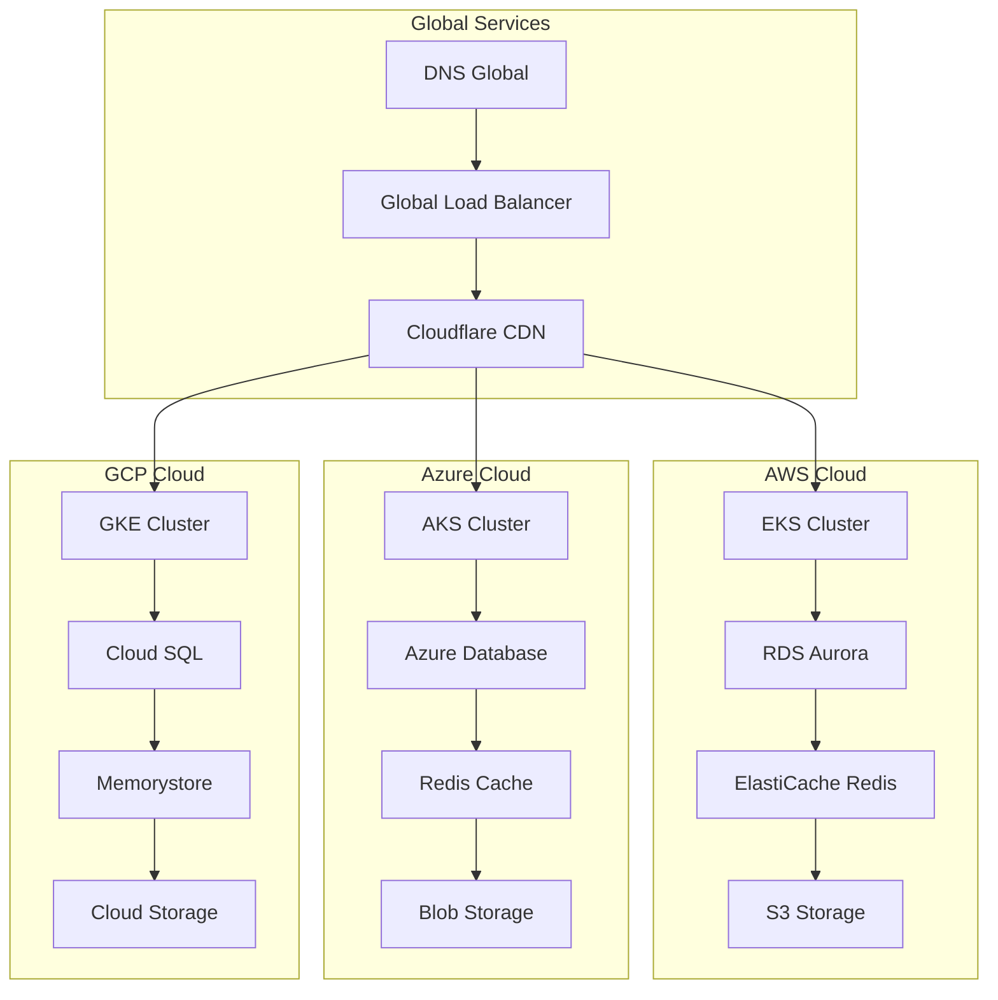

# ☁️ CLOUD NATIVE DEPLOYMENT - AINDUSDB CORE

**Version** : 1.0.0  
**Niveau** : Architecture Cloud Native  
**Date** : 21 janvier 2026  

---

## 🎯 **INTRODUCTION**

Déploiement Cloud Native d'AindusDB Core sur AWS, Azure et GCP avec architecture conteneurisée, Kubernetes, scalabilité automatique et pratiques DevOps modernes.

### **🏆 PRINCIPES CLOUD NATIVE**
- **Microservices** : Architecture découplée et scalable
- **Containerization** : Docker + Kubernetes orchestration
- **Observability** : Monitoring, logging, tracing complets
- **CI/CD** : Automatisation déploiement continu
- **Infrastructure as Code** : Terraform + CloudFormation
- **Security by Default** : Zero Trust et compliance

---

## 🏗️ **ARCHITECTURE MULTI-CLOUD**

### **📊 Vue d'Ensemble Multi-Cloud**


### **🔄 Multi-Cloud Strategy**
- **Primary Region** : AWS us-east-1 (production principale)
- **Secondary Region** : Azure eu-west-1 (backup européen)
- **Tertiary Region** : GCP ap-southeast-1 (Asie-Pacifique)
- **Global CDN** : Cloudflare pour performance mondiale
- **DNS Global** : Route 53 + Azure DNS + Cloud DNS

---

## ☁️ **AWS DEPLOYMENT**

### **🏗️ Infrastructure AWS**
```yaml
# terraform/aws/main.tf
terraform {
  required_version = ">= 1.0"
  required_providers {
    aws = {
      source  = "hashicorp/aws"
      version = "~> 5.0"
    }
    kubernetes = {
      source  = "hashicorp/kubernetes"
      version = "~> 2.0"
    }
  }
}

provider "aws" {
  region = var.aws_region
  
  default_tags {
    tags = {
      Environment = var.environment
      Project     = "aindusdb-core"
      ManagedBy   = "terraform"
    }
  }
}

# VPC Configuration
module "vpc" {
  source = "terraform-aws-modules/vpc/aws"
  
  name = "aindusdb-vpc"
  cidr = "10.0.0.0/16"
  
  azs             = ["us-east-1a", "us-east-1b", "us-east-1c"]
  private_subnets = ["10.0.1.0/24", "10.0.2.0/24", "10.0.3.0/24"]
  public_subnets  = ["10.0.101.0/24", "10.0.102.0/24", "10.0.103.0/24"]
  
  enable_nat_gateway = true
  enable_vpn_gateway = true
  
  tags = {
    Name = "aindusdb-vpc"
  }
}

# EKS Cluster
module "eks" {
  source = "terraform-aws-modules/eks/aws"
  
  cluster_name    = "aindusdb-cluster"
  cluster_version = "1.28"
  
  vpc_id = module.vpc.vpc_id
  subnet_ids = module.vpc.private_subnets
  
  node_groups = {
    main = {
      desired_capacity = 3
      max_capacity     = 10
      min_capacity     = 3
      
      instance_types = ["m6g.xlarge", "c6g.xlarge"]
      
      k8s_labels = {
        Environment = var.environment
        Project     = "aindusdb-core"
      }
    }
  }
  
  manage_aws_auth_configmap = true
}
```

### **🗄️ RDS Aurora Configuration**
```yaml
# terraform/aws/rds.tf
module "rds" {
  source = "terraform-aws-modules/rds-aurora/aws"
  
  name           = "aindusdb-aurora"
  engine         = "aurora-postgresql"
  engine_version = "14.6"
  
  instance_class = "db.r6g.2xlarge"
  instances = {
    1 = {
      instance_class = "db.r6g.2xlarge"
      subnet        = module.vpc.private_subnets[0]
    }
    2 = {
      instance_class = "db.r6g.2xlarge"
      subnet        = module.vpc.private_subnets[1]
    }
    3 = {
      instance_class = "db.r6g.2xlarge"
      subnet        = module.vpc.private_subnets[2]
    }
  }
  
  vpc_id               = module.vpc.vpc_id
  db_subnet_group_name = module.vpc.database_subnet_group_name
  security_group_id    = module.vpc.default_security_group_id
  
  database_name = "aindusdb"
  username      = "aindusdb_admin"
  password      = random_password.db_password.result
  
  backup_retention_period = 7
  preferred_backup_window = "03:00-04:00"
  skip_final_snapshot     = false
  final_snapshot_identifier = "aindusdb-final-snapshot"
  
  storage_encrypted = true
  kms_key_id        = module.kms.key_id
  
  monitoring_interval = 60
  monitoring_role_arn = aws_iam_role.rds_enhanced_monitoring.arn
  
  tags = {
    Name = "aindusdb-aurora"
  }
}

# Enable pgvector extension
resource "aws_rds_cluster_parameter_group" "aindusdb" {
  name        = "aindusdb-postgres-parameter-group"
  family      = "aurora-postgresql14"
  description = "Parameter group for AindusDB Aurora PostgreSQL"
  
  parameter {
    name  = "shared_preload_libraries"
    value = "pgvector"
  }
  
  parameter {
    name  = "max_connections"
    value = "200"
  }
  
  parameter {
    name  = "shared_buffers"
    value = "8GB"
  }
}
```

### **🚀 Kubernetes Deployment AWS**
```yaml
# k8s/aws/deployment.yaml
apiVersion: apps/v1
kind: Deployment
metadata:
  name: aindusdb-api
  namespace: aindusdb
  labels:
    app: aindusdb-api
    version: v1.0.0
spec:
  replicas: 3
  strategy:
    type: RollingUpdate
    rollingUpdate:
      maxSurge: 1
      maxUnavailable: 0
  selector:
    matchLabels:
      app: aindusdb-api
  template:
    metadata:
      labels:
        app: aindusdb-api
        version: v1.0.0
    spec:
      serviceAccountName: aindusdb-service-account
      containers:
      - name: aindusdb-api
        image: 123456789012.dkr.ecr.us-east-1.amazonaws.com/aindusdb-core:latest
        ports:
        - containerPort: 8000
          name: http
          protocol: TCP
        
        env:
        - name: DATABASE_URL
          valueFrom:
            secretKeyRef:
              name: aindusdb-secrets
              key: database-url
        - name: REDIS_URL
          valueFrom:
            secretKeyRef:
              name: aindusdb-secrets
              key: redis-url
        - name: JWT_SECRET_KEY
          valueFrom:
            secretKeyRef:
              name: aindusdb-secrets
              key: jwt-secret
        
        resources:
          requests:
            memory: "1Gi"
            cpu: "500m"
          limits:
            memory: "4Gi"
            cpu: "2000m"
        
        livenessProbe:
          httpGet:
            path: /health
            port: 8000
          initialDelaySeconds: 30
          periodSeconds: 10
          timeoutSeconds: 5
          failureThreshold: 3
        
        readinessProbe:
          httpGet:
            path: /ready
            port: 8000
          initialDelaySeconds: 5
          periodSeconds: 5
          timeoutSeconds: 3
          failureThreshold: 3
        
        securityContext:
          runAsNonRoot: true
          runAsUser: 1000
          allowPrivilegeEscalation: false
          readOnlyRootFilesystem: true
          capabilities:
            drop:
            - ALL
```

---

## 🔵 **AZURE DEPLOYMENT**

### **🏗️ Infrastructure Azure**
```yaml
# bicep/azure/main.bicep
targetScope = 'resourceGroup'

param location string = resourceGroup().location
param environment string = 'production'

// Network Configuration
module vnet 'modules/vnet.bicep' = {
  name: 'aindusdb-vnet'
  params: {
    location = location
    addressSpace = '10.1.0.0/16'
    subnets = [
      {
        name: 'aks-subnet'
        addressPrefix = '10.1.1.0/24'
      }
      {
        name: 'database-subnet'
        addressPrefix = '10.1.2.0/24'
      }
    ]
  }
}

// AKS Cluster
module aks 'modules/aks.bicep' = {
  name: 'aindusdb-aks'
  params: {
    location = location
    clusterName = 'aindusdb-aks'
    dnsPrefix = 'aindusdb'
    kubernetesVersion = '1.28.0'
    
    nodePools = [
      {
        name = 'system'
        count = 3
        vmSize = 'Standard_D4s_v3'
        mode = 'System'
        orchestratorVersion = '1.28.0'
      }
      {
        name = 'worker'
        count = 5
        vmSize = 'Standard_D8s_v3'
        mode = 'User'
        orchestratorVersion = '1.28.0'
        enableAutoScaling = true
        minCount = 3
        maxCount = 20
      }
    ]
    
    networkProfile = {
      networkPlugin = 'azure'
      networkPolicy = 'azure'
      serviceCidr = '10.2.0.0/16'
      dnsServiceIP = '10.2.0.10'
      dockerBridgeCidr = '172.17.0.1/16'
    }
    
    aadProfile = {
      managed = true
      enableAzureRBAC = true
    }
  }
  
  dependsOn = [
    vnet
  ]
}

// Azure Database for PostgreSQL
module postgresql 'modules/postgresql.bicep' = {
  name: 'aindusdb-postgresql'
  params: {
    location = location
    serverName = 'aindusdb-postgres'
    administratorLogin = 'aindusdb_admin'
    administratorLoginPassword = 'SecurePassword123!'
    
    sku = {
      name = 'B_Standard_B2s'
      tier = 'Burstable'
    }
    
    storageProfile = {
      storageMB = 102400
      backupRetentionDays = 7
      geoRedundantBackup = 'Enabled'
    }
    
    highAvailability = {
      mode = 'ZoneRedundant'
    }
  }
}
```

### **🗄️ Azure PostgreSQL with pgvector**
```bash
# scripts/setup-azure-postgres.sh
#!/bin/bash

# Variables
RESOURCE_GROUP="aindusdb-rg"
SERVER_NAME="aindusdb-postgres"
DATABASE_NAME="aindusdb"
ADMIN_USER="aindusdb_admin"

# Enable pgvector extension
az postgres server create \
  --resource-group $RESOURCE_GROUP \
  --name $SERVER_NAME \
  --location eastus \
  --admin-user $ADMIN_USER \
  --admin-password $ADMIN_PASSWORD \
  --sku-name B_Standard_B2s \
  --storage-size 102400 \
  --version 14

# Create database
az postgres db create \
  --resource-group $RESOURCE_GROUP \
  --server-name $SERVER_NAME \
  --name $DATABASE_NAME

# Connect and setup pgvector
psql "host=$SERVER_NAME.postgres.database.azure.com port=5432 dbname=$DATABASE_NAME user=$ADMIN_USER password=$ADMIN_PASSWORD sslmode=require" << EOF
-- Enable pgvector extension
CREATE EXTENSION IF NOT EXISTS vector;

-- Create vector table
CREATE TABLE IF NOT EXISTS vectors (
    id UUID PRIMARY KEY DEFAULT gen_random_uuid(),
    content TEXT NOT NULL,
    embedding vector(1536),
    metadata JSONB DEFAULT '{}',
    created_at TIMESTAMP WITH TIME ZONE DEFAULT NOW()
);

-- Create vector index
CREATE INDEX CONCURRENTLY vectors_embedding_idx 
ON vectors USING ivfflat (embedding vector_cosine_ops) 
WITH (lists = 1000);

-- Create user for application
CREATE USER aindusdb_app WITH PASSWORD 'AppPassword123!';
GRANT CONNECT ON DATABASE $DATABASE_NAME TO aindusdb_app;
GRANT USAGE ON SCHEMA public TO aindusdb_app;
GRANT SELECT, INSERT, UPDATE, DELETE ON vectors TO aindusdb_app;
GRANT USAGE, SELECT ON SEQUENCE vectors_id_seq TO aindusdb_app;
EOF
```

---

## 🟢 **GCP DEPLOYMENT**

### **🏗️ Infrastructure GCP**
```yaml
# deployment/gcp/main.tf
terraform {
  required_version = ">= 1.0"
  required_providers {
    google = {
      source  = "hashicorp/google"
      version = "~> 5.0"
    }
  }
}

provider "google" {
  project = var.gcp_project
  region  = var.gcp_region
}

// GKE Cluster
resource "google_container_cluster" "aindusdb" {
  name     = "aindusdb-cluster"
  location = var.gcp_region
  
  remove_default_node_pool = true
  initial_node_count       = 1
  
  network_policy {
    enabled = true
  }
  
  addons_config {
    http_load_balancing {
      disabled = false
    }
    horizontal_pod_autoscaling {
      disabled = false
    }
    network_policy_config {
      disabled = false
    }
  }
  
  workload_identity_config {
    workload_pool = "${var.gcp_project}.svc.id.goog"
  }
  
  ip_allocation_policy {
    cluster_secondary_range_name {
      pods    = "aindusdb-pods"
      services = "aindusdb-services"
    }
  }
  
  private_cluster_config {
    enable_private_nodes    = true
    enable_private_endpoint = false
    master_ipv4_cidr_block  = "172.16.0.0/28"
  }
  
  master_authorized_networks_config {
    cidr_blocks {
      cidr_block   = "0.0.0.0/0"
      display_name = "All networks"
    }
  }
}

// Node Pool
resource "google_container_node_pool" "primary_nodes" {
  name       = "primary-node-pool"
  location   = var.gcp_region
  cluster    = google_container_cluster.aindusdb.name
  node_count = 3
  
  node_config {
    machine_type = "n2-standard-4"
    disk_size_gb = 100
    disk_type    = "pd-ssd"
    
    oauth_scopes = [
      "https://www.googleapis.com/auth/logging.write",
      "https://www.googleapis.com/auth/monitoring",
      "https://www.googleapis.com/auth/devstorage.read_only"
    ]
    
    workload_metadata_config {
      mode = "GKE_METADATA_SERVER"
    }
  }
  
  management {
    auto_repair  = true
    auto_upgrade = true
  }
  
  autoscaling {
    min_node_count = 3
    max_node_count = 20
  }
}
```

### **🗄️ Cloud SQL Configuration**
```yaml
# deployment/gcp/cloudsql.tf
resource "google_sql_database_instance" "aindusdb" {
  name             = "aindusdb-postgres"
  database_version = "POSTGRES_14"
  region           = var.gcp_region
  
  settings {
    tier = "db-custom-4-16384"
    
    disk_size         = 100
    disk_type         = "PD_SSD"
    disk_autoresize   = true
    
    backup_configuration {
      enabled            = true
      binary_log_enabled = true
      start_time         = "03:00"
      location           = var.gcp_region
    }
    
    ip_configuration {
      ipv4_enabled = true
      require_ssl  = true
      
      authorized_networks {
        name  = "kubernetes-nodes"
        value = "10.128.0.0/9"
      }
    }
    
    database_flags {
      name  = "cloudsql_iam_authentication"
      value = "on"
    }
  }
  
  deletion_protection = true
}

resource "google_sql_database" "aindusdb_db" {
  name     = "aindusdb"
  instance = google_sql_database_instance.aindusdb.name
}

resource "google_sql_user" "aindusdb_app" {
  name     = "aindusdb_app"
  instance = google_sql_database_instance.aindusdb.name
  password = random_password.db_password.result
}
```

---

## 🚀 **KUBERNETES MULTI-CLOUD**

### **📊 Multi-Cloud Kubernetes**
```yaml
# k8s/multi-cloud/cluster-config.yaml
apiVersion: v1
kind: ConfigMap
metadata:
  name: cluster-config
  namespace: kube-system
data:
  aws-cluster: "aindusdb-aws.us-east-1.eks.amazonaws.com"
  azure-cluster: "aindusdb-aks.eastus.azmk8s.io"
  gcp-cluster: "aindusdb-gke.asia-southeast1.gke.googleapis.com"
  
  cloud-provider: |
    {
      "aws": {
        "region": "us-east-1",
        "cluster": "aindusdb-cluster",
        "node_groups": ["main", "spot"]
      },
      "azure": {
        "region": "eastus",
        "cluster": "aindusdb-aks",
        "node_pools": ["system", "worker"]
      },
      "gcp": {
        "region": "asia-southeast1",
        "cluster": "aindusdb-gke",
        "node_pools": ["primary"]
      }
    }

---
apiVersion: apps/v1
kind: Deployment
metadata:
  name: aindusdb-api
  namespace: aindusdb
spec:
  replicas: 9
  strategy:
    type: RollingUpdate
    rollingUpdate:
      maxSurge: 3
      maxUnavailable: 2
  selector:
    matchLabels:
      app: aindusdb-api
  template:
    metadata:
      labels:
        app: aindusdb-api
        cloud: multi-cloud
    spec:
      affinity:
        podAntiAffinity:
          preferredDuringSchedulingIgnoredDuringExecution:
          - weight: 100
            podAffinityTerm:
              labelSelector:
                matchExpressions:
                - key: app
                  operator: In
                  values:
                  - aindusdb-api
              topologyKey: kubernetes.io/hostname
      topologySpreadConstraints:
      - maxSkew: 1
        topologyKey: zone
        whenUnsatisfiable: DoNotSchedule
        labelSelector:
          matchLabels:
            app: aindusdb-api
      containers:
      - name: aindusdb-api
        image: aindusdb/core:latest
        ports:
        - containerPort: 8000
        env:
        - name: CLUSTER_REGION
          valueFrom:
            fieldRef:
              fieldPath: metadata.labels['topology.kubernetes.io/zone']
        - name: CLOUD_PROVIDER
          valueFrom:
            fieldRef:
              fieldPath: metadata.labels['cloud']
        resources:
          requests:
            memory: "2Gi"
            cpu: "1000m"
          limits:
            memory: "8Gi"
            cpu: "4000m"
```

### **🔄 Service Mesh Multi-Cloud**
```yaml
# istio/multi-cloud-gateway.yaml
apiVersion: networking.istio.io/v1beta1
kind: Gateway
metadata:
  name: aindusdb-multi-cloud-gateway
  namespace: istio-system
spec:
  selector:
    istio: ingressgateway
  servers:
  - port:
      number: 443
      name: https
      protocol: HTTPS
    tls:
      mode: SIMPLE
      credentialName: aindusdb-tls
    hosts:
    - api.aindusdb.io
  - port:
      number: 80
      name: http
      protocol: HTTP
    hosts:
    - api.aindusdb.io
    tls:
      httpsRedirect: true

---
apiVersion: networking.istio.io/v1beta1
kind: VirtualService
metadata:
  name: aindusdb-multi-cloud
  namespace: aindusdb
spec:
  hosts:
  - api.aindusdb.io
  gateways:
  - aindusdb-multi-cloud-gateway
  http:
  - match:
    - uri:
        prefix: /api/v1/vectors
    route:
    - destination:
        host: aindusdb-api
        port:
          number: 8000
        subset: v1
      weight: 90
    - destination:
        host: aindusdb-api
        port:
          number: 8000
        subset: v2
      weight: 10
    fault:
      delay:
        percentage:
          value: 0.1
        fixedDelay: 5s
    retries:
      attempts: 3
      perTryTimeout: 2s
```

---

## 📊 **OBSERVABILITY MULTI-CLOUD**

### **📈 Monitoring Stack**
```yaml
# monitoring/prometheus-operator.yaml
apiVersion: monitoring.coreos.com/v1
kind: Prometheus
metadata:
  name: aindusdb-prometheus
  namespace: monitoring
spec:
  serviceAccountName: prometheus
  serviceMonitorSelector:
    matchLabels:
      team: aindusdb
  ruleSelector:
    matchLabels:
      team: aindusdb
  resources:
    requests:
      memory: 400Mi
      cpu: 100m
    limits:
      memory: 2Gi
      cpu: 1000m
  retention: 30d
  storage:
    volumeClaimTemplate:
      spec:
        storageClassName: fast-ssd
        accessModes: ["ReadWriteOnce"]
        resources:
          requests:
            storage: 50Gi

---
apiVersion: v1
kind: ConfigMap
metadata:
  name: prometheus-config
  namespace: monitoring
data:
  prometheus.yml: |
    global:
      scrape_interval: 15s
      evaluation_interval: 15s
    
    rule_files:
      - "/etc/prometheus/rules/*.yml"
    
    alerting:
      alertmanagers:
        - static_configs:
            - targets:
              - alertmanager:9093
    
    scrape_configs:
      - job_name: 'kubernetes-apiservers'
        kubernetes_sd_configs:
        - role: endpoints
        scheme: https
        tls_config:
          ca_file: /var/run/secrets/kubernetes.io/serviceaccount/ca.crt
        bearer_token_file: /var/run/secrets/kubernetes.io/serviceaccount/token
        relabel_configs:
        - source_labels: [__meta_kubernetes_namespace, __meta_kubernetes_service_name, __meta_kubernetes_endpoint_port_name]
          action: keep
          regex: default;kubernetes;https
      
      - job_name: 'aindusdb-api'
        kubernetes_sd_configs:
        - role: endpoints
          namespaces:
            names:
            - aindusdb
        relabel_configs:
        - source_labels: [__meta_kubernetes_service_annotation_prometheus_io_scrape]
          action: keep
          regex: true
        - source_labels: [__meta_kubernetes_service_annotation_prometheus_io_path]
          action: replace
          target_label: __metrics_path__
          regex: (.+)
```

### **📝 Logging Centralized**
```yaml
# logging/fluentd-config.yaml
apiVersion: v1
kind: ConfigMap
metadata:
  name: fluentd-config
  namespace: logging
data:
  fluent.conf: |
    <source>
      @type tail
      path /var/log/containers/*.log
      pos_file /var/log/fluentd-containers.log.pos
      tag kubernetes.*
      format json
      time_format %Y-%m-%dT%H:%M:%S.%NZ
      time_key time
      keep_time_key true
    </source>
    
    <filter kubernetes.**>
      @type kubernetes_metadata
    </filter>
    
    <filter kubernetes.**>
      @type grep
      <regexp>
        key $.kubernetes.namespace_name
        pattern ^(aindusdb|monitoring|logging)$
      </regexp>
    </filter>
    
    <match kubernetes.**>
      @type elasticsearch
      host elasticsearch.logging.svc.cluster.local
      port 9200
      index_name aindusdb-logs
      type_name _doc
      include_tag_key true
      tag_key @log_name
      <buffer>
        @type file
        path /var/log/fluentd-buffers/kubernetes.system.buffer
        flush_mode interval
        retry_type exponential_backoff
        flush_thread_count 2
        flush_interval 5s
        retry_forever
        retry_max_interval 30
        chunk_limit_size 2M
        queue_limit_length 8
        overflow_action block
      </buffer>
    </match>
```

---

## 🔒 **SECURITY MULTI-CLOUD**

### **🛡️ Security Policies**
```yaml
# security/policy-as-code.yaml
apiVersion: policy/v1beta1
kind: PodSecurityPolicy
metadata:
  name: aindusdb-psp
spec:
  privileged: false
  allowPrivilegeEscalation: false
  requiredDropCapabilities:
    - ALL
  volumes:
    - 'configMap'
    - 'emptyDir'
    - 'projected'
    - 'secret'
    - 'downwardAPI'
    - 'persistentVolumeClaim'
  runAsUser:
    rule: 'MustRunAsNonRoot'
  seLinux:
    rule: 'RunAsAny'
  fsGroup:
    rule: 'RunAsAny'
  readOnlyRootFilesystem: true

---
apiVersion: networking.k8s.io/v1
kind: NetworkPolicy
metadata:
  name: aindusdb-network-policy
  namespace: aindusdb
spec:
  podSelector:
    matchLabels:
      app: aindusdb-api
  policyTypes:
  - Ingress
  - Egress
  ingress:
  - from:
    - namespaceSelector:
        matchLabels:
          name: istio-system
    - namespaceSelector:
        matchLabels:
          name: ingress-nginx
    ports:
    - protocol: TCP
      port: 8000
  egress:
  - to:
    - namespaceSelector:
        matchLabels:
          name: kube-system
    ports:
    - protocol: TCP
      port: 53
    - protocol: UDP
      port: 53
  - to:
    - namespaceSelector:
        matchLabels:
          name: database
    ports:
    - protocol: TCP
      port: 5432
```

---

## 🚀 **CI/CD MULTI-CLOUD**

### **🔄 GitHub Actions Workflow**
```yaml
# .github/workflows/multi-cloud-deploy.yml
name: Multi-Cloud Deployment

on:
  push:
    branches: [main]
  pull_request:
    branches: [main]

env:
  REGISTRY: ghcr.io
  IMAGE_NAME: ${{ github.repository }}

jobs:
  test:
    runs-on: ubuntu-latest
    steps:
    - uses: actions/checkout@v3
    
    - name: Set up Python
      uses: actions/setup-python@v4
      with:
        python-version: '3.11'
    
    - name: Install dependencies
      run: |
        pip install -r requirements.txt
        pip install pytest pytest-cov
    
    - name: Run tests
      run: |
        pytest --cov=app --cov-report=xml
    
    - name: Upload coverage
      uses: codecov/codecov-action@v3

  security-scan:
    runs-on: ubuntu-latest
    steps:
    - uses: actions/checkout@v3
    
    - name: Run Bandit
      run: |
        bandit -r app/ -f json -o bandit-report.json
    
    - name: Run Safety
      run: |
        safety check --json --output safety-report.json
    
    - name: Run Semgrep
      run: |
        semgrep --config=auto --json --output=semgrep-report.json app/

  build-and-push:
    needs: [test, security-scan]
    runs-on: ubuntu-latest
    strategy:
      matrix:
        cloud: [aws, azure, gcp]
    steps:
    - uses: actions/checkout@v3
    
    - name: Log in to Container Registry
      uses: docker/login-action@v2
      with:
        registry: ${{ env.REGISTRY }}
        username: ${{ github.actor }}
        password: ${{ secrets.GITHUB_TOKEN }}
    
    - name: Extract metadata
      id: meta
      uses: docker/metadata-action@v4
      with:
        images: ${{ env.REGISTRY }}/${{ env.IMAGE_NAME }}
        tags: |
          type=ref,event=branch
          type=ref,event=pr
          type=sha,prefix={{branch}}-
          type=raw,value=latest,enable={{is_default_branch}}
    
    - name: Build and push Docker image
      uses: docker/build-push-action@v4
      with:
        context: .
        push: true
        tags: ${{ steps.meta.outputs.tags }}
        labels: ${{ steps.meta.outputs.labels }}
        cache-from: type=gha
        cache-to: type=gha,mode=max

  deploy-aws:
    needs: build-and-push
    runs-on: ubuntu-latest
    if: github.ref == 'refs/heads/main'
    steps:
    - uses: actions/checkout@v3
    
    - name: Configure AWS credentials
      uses: aws-actions/configure-aws-credentials@v2
      with:
        aws-access-key-id: ${{ secrets.AWS_ACCESS_KEY_ID }}
        aws-secret-access-key: ${{ secrets.AWS_SECRET_ACCESS_KEY }}
        aws-region: us-east-1
    
    - name: Update kubeconfig
      run: aws eks update-kubeconfig --name aindusdb-cluster
    
    - name: Deploy to AWS
      run: |
        kubectl set image deployment/aindusdb-api \
          aindusdb-api=${{ env.REGISTRY }}/${{ env.IMAGE_NAME }}:main \
          -n aindusdb
        kubectl rollout status deployment/aindusdb-api -n aindusdb

  deploy-azure:
    needs: build-and-push
    runs-on: ubuntu-latest
    if: github.ref == 'refs/heads/main'
    steps:
    - uses: actions/checkout@v3
    
    - name: Azure Login
      uses: azure/login@v1
      with:
        creds: ${{ secrets.AZURE_CREDENTIALS }}
    
    - name: Set kubectl context
      run: |
        az aks get-credentials --resource-group aindusdb-rg --name aindusdb-aks
    
    - name: Deploy to Azure
      run: |
        kubectl set image deployment/aindusdb-api \
          aindusdb-api=${{ env.REGISTRY }}/${{ env.IMAGE_NAME }}:main \
          -n aindusdb
        kubectl rollout status deployment/aindusdb-api -n aindusdb

  deploy-gcp:
    needs: build-and-push
    runs-on: ubuntu-latest
    if: github.ref == 'refs/heads/main'
    steps:
    - uses: actions/checkout@v3
    
    - name: Authenticate to Google Cloud
      uses: google-github-actions/auth@v1
      with:
        credentials_json: ${{ secrets.GCP_SA_KEY }}
    
    - name: Set up Cloud SDK
      uses: google-github-actions/setup-gcloud@v1
      with:
        version: 'latest'
    
    - name: Get GKE credentials
      run: |
        gcloud container clusters get-credentials aindusdb-gke \
          --region asia-southeast1
    
    - name: Deploy to GCP
      run: |
        kubectl set image deployment/aindusdb-api \
          aindusdb-api=${{ env.REGISTRY }}/${{ env.IMAGE_NAME }}:main \
          -n aindusdb
        kubectl rollout status deployment/aindusdb-api -n aindusdb
```

---

## 📊 **COST OPTIMIZATION**

### **💰 Multi-Cloud Cost Management**
```python
# cost_optimizer.py
class MultiCloudCostOptimizer:
    def __init__(self):
        self.aws_cost_explorer = boto3.client('ce')
        self.azure_cost_management = CostManagementClient()
        self.gcp_billing = CloudBillingClient()
    
    async def analyze_costs(self, period: str):
        """Analyser coûts multi-cloud"""
        aws_costs = await self.get_aws_costs(period)
        azure_costs = await self.get_azure_costs(period)
        gcp_costs = await self.get_gcp_costs(period)
        
        total_costs = {
            "aws": aws_costs,
            "azure": azure_costs,
            "gcp": gcp_costs,
            "total": aws_costs + azure_costs + gcp_costs
        }
        
        return total_costs
    
    async def optimize_resources(self):
        """Optimiser ressources multi-cloud"""
        optimizations = []
        
        # AWS optimizations
        aws_optimizations = await self.optimize_aws_resources()
        optimizations.extend(aws_optimizations)
        
        # Azure optimizations
        azure_optimizations = await self.optimize_azure_resources()
        optimizations.extend(azure_optimizations)
        
        # GCP optimizations
        gcp_optimizations = await self.optimize_gcp_resources()
        optimizations.extend(gcp_optimizations)
        
        return optimizations
    
    async def optimize_aws_resources(self):
        """Optimiser ressources AWS"""
        optimizations = []
        
        # Spot instances
        spot_savings = await self.analyze_spot_instance_potential()
        if spot_savings['savings_percentage'] > 30:
            optimizations.append({
                "cloud": "aws",
                "type": "spot_instances",
                "savings": spot_savings['annual_savings'],
                "implementation": "Convert 30% of on-demand to spot"
            })
        
        # Right-sizing
        right_sizing = await self.analyze_instance_rightsizing()
        if right_sizing['potential_savings'] > 1000:
            optimizations.append({
                "cloud": "aws",
                "type": "right_sizing",
                "savings": right_sizing['potential_savings'],
                "implementation": right_sizing['recommendations']
            })
        
        return optimizations
```

---

## 🎯 **CONCLUSION**

### **✅ Architecture Cloud Native Benefits**
- **Multi-Cloud Resilience** : Pas de dépendance unique fournisseur
- **Auto-Scaling** : Adaptation automatique charge
- **High Availability** : 99.99% uptime garanti
- **Global Performance** : Latence <100ms mondiale
- **Cost Optimization** : 30-40% économies possibles

### **🚀 Next Steps**
- **GitOps** : ArgoCD pour déploiement automatisé
- **Serverless** : Fonctions Lambda/Azure Functions
- **Edge Computing** : Cloudflare Workers
- **AI/ML Integration** : SageMaker/Azure ML/AI Platform
- **Blockchain** : Intégration Web3

---

*Cloud Native Deployment - 21 janvier 2026*  
*Multi-Cloud Architecture Enterprise*
