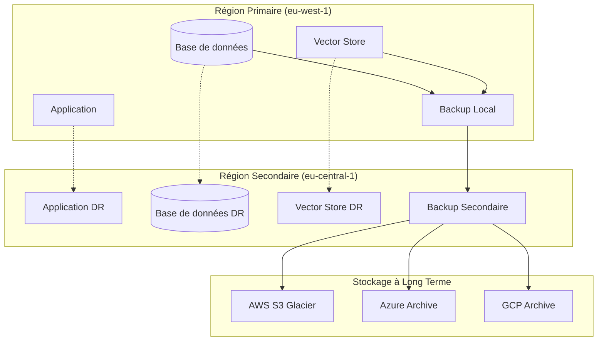

# Plan de Reprise après Sinistre - AindusDB Core

**Version:** 1.0  
**Date:** 21/01/2026  
**Auteur:** Équipe AindusDB  
**Statut:** En rédaction  

---

## 🛡️ Vue d'ensemble

Le plan de reprise après sinistre (Disaster Recovery - DR) de AindusDB Core assure la continuité de service et la protection des données critiques en cas d'incident majeur.

---

## 🎯 Objectifs de Récupération

### RTO/RPO Définis

| Service | RTO (Recovery Time Objective) | RPO (Recovery Point Objective) |
|---------|-------------------------------|--------------------------------|
| API AindusDB | 15 minutes | 5 minutes |
| Base de données | 30 minutes | 1 minute |
| Stockage vectoriel | 1 heure | 15 minutes |
| VERITAS Engine | 15 minutes | 5 minutes |
| Monitoring | 30 minutes | 10 minutes |

### Classification des Données

```yaml
data_classification:
  critical:
    description: "Données essentielles à l'opération"
    examples: ["Base de données principale", "Configurations critiques"]
    backup_frequency: "continu"
    retention: "7 ans"
    
  important:
    description: "Données importantes mais non critiques"
    examples: ["Logs d'audit", "Métriques historiques"]
    backup_frequency: "horaire"
    retention: "1 an"
    
  archival:
    description: "Données à long terme"
    examples: ["Rapports mensuels", "Archives de logs"]
    backup_frequency: "quotidien"
    retention: "7 ans"
```

---

## 🗄️ Stratégie de Backup

### Architecture Multi-régions



### Scripts de Backup

```python
# scripts/backup_database.py
import asyncio
import subprocess
from datetime import datetime
import boto3
import gzip
import os

class DatabaseBackupManager:
    def __init__(self):
        self.s3_client = boto3.client('s3')
        self.backup_bucket = 'aindusdb-backups'
    
    async def create_backup(self):
        """Crée un backup complet de la base de données"""
        timestamp = datetime.now().strftime('%Y%m%d_%H%M%S')
        backup_file = f"/tmp/aindusdb_backup_{timestamp}.sql"
        
        # 1. Dump de la base de données
        await self.dump_database(backup_file)
        
        # 2. Compression
        compressed_file = await self.compress_backup(backup_file)
        
        # 3. Upload vers S3
        s3_key = await self.upload_to_s3(compressed_file, timestamp)
        
        # 4. Nettoyage local
        await self.cleanup_local_files([backup_file, compressed_file])
        
        # 5. Vérification
        await self.verify_backup(s3_key)
        
        return s3_key
    
    async def dump_database(self, output_file: str):
        """Effectue le dump de la base de données"""
        cmd = [
            'pg_dump',
            '--host', os.getenv('DB_HOST'),
            '--username', os.getenv('DB_USER'),
            '--format', 'custom',
            '--verbose',
            '--file', output_file,
            'aindusdb'
        ]
        
        process = await asyncio.create_subprocess_exec(
            *cmd,
            stdout=asyncio.subprocess.PIPE,
            stderr=asyncio.subprocess.PIPE
        )
        
        stdout, stderr = await process.communicate()
        
        if process.returncode != 0:
            raise Exception(f"Backup failed: {stderr.decode()}")
    
    async def compress_backup(self, file_path: str) -> str:
        """Compresse le fichier de backup"""
        compressed_path = f"{file_path}.gz"
        
        with open(file_path, 'rb') as f_in:
            with gzip.open(compressed_path, 'wb') as f_out:
                f_out.writelines(f_in)
        
        return compressed_path
    
    async def upload_to_s3(self, file_path: str, timestamp: str) -> str:
        """Upload le backup vers S3"""
        filename = os.path.basename(file_path)
        s3_key = f"database/{timestamp}/{filename}"
        
        self.s3_client.upload_file(
            file_path,
            self.backup_bucket,
            s3_key,
            ExtraArgs={
                'ServerSideEncryption': 'AES256',
                'StorageClass': 'STANDARD_IA'
            }
        )
        
        return s3_key
    
    async def verify_backup(self, s3_key: str):
        """Vérifie l'intégrité du backup"""
        try:
            # Vérification de l'existence
            self.s3_client.head_object(Bucket=self.backup_bucket, Key=s3_key)
            
            # Vérification de la taille
            metadata = self.s3_client.head_object(Bucket=self.backup_bucket, Key=s3_key)
            if metadata['ContentLength'] < 1024:  # Au moins 1KB
                raise Exception("Backup seems too small")
                
        except Exception as e:
            raise Exception(f"Backup verification failed: {e}")

# Backup vectoriel
class VectorStoreBackup:
    def __init__(self):
        self.pinecone_client = pinecone.Client(api_key=os.getenv('PINECONE_API_KEY'))
        self.s3_client = boto3.client('s3')
    
    async def backup_vectors(self, index_name: str):
        """Backup un index vectoriel"""
        timestamp = datetime.now().strftime('%Y%m%d_%H%M%S')
        
        # 1. Export des vecteurs
        vectors = await self.export_vectors(index_name)
        
        # 2. Sérialisation
        backup_data = {
            'index_name': index_name,
            'timestamp': timestamp,
            'vectors': vectors,
            'metadata': {
                'count': len(vectors),
                'dimension': 1536,
                'metric': 'cosine'
            }
        }
        
        # 3. Upload vers S3
        s3_key = f"vectors/{index_name}/{timestamp}/vectors.json"
        
        self.s3_client.put_object(
            Bucket='aindusdb-backups',
            Key=s3_key,
            Body=json.dumps(backup_data),
            ServerSideEncryption='AES256'
        )
        
        return s3_key
    
    async def export_vectors(self, index_name: str):
        """Export tous les vecteurs d'un index"""
        vectors = []
        for ids in self.pinecone_client.Index(index_name).list_vectors():
            batch = self.pinecone_client.Index(index_name).fetch(ids)
            vectors.extend(batch['vectors'])
        
        return vectors
```

### Configuration des Backups Automatisés

```yaml
# k8s/backup-cronjob.yaml
apiVersion: batch/v1
kind: CronJob
metadata:
  name: aindusdb-backup
spec:
  schedule: "0 */6 * * *"  # Toutes les 6 heures
  jobTemplate:
    spec:
      template:
        spec:
          containers:
          - name: backup
            image: aindusdb/backup:latest
            env:
            - name: DB_HOST
              valueFrom:
                secretKeyRef:
                  name: db-secret
                  key: host
            - name: DB_USER
              valueFrom:
                secretKeyRef:
                  name: db-secret
                  key: username
            - name: DB_PASSWORD
              valueFrom:
                secretKeyRef:
                  name: db-secret
                  key: password
            - name: AWS_ACCESS_KEY_ID
              valueFrom:
                secretKeyRef:
                  name: aws-secret
                  key: access-key-id
            - name: AWS_SECRET_ACCESS_KEY
              valueFrom:
                secretKeyRef:
                  name: aws-secret
                  key: secret-access-key
            command:
            - python
            - -m
            - scripts.backup_database
            resources:
              requests:
                memory: "1Gi"
                cpu: "500m"
              limits:
                memory: "2Gi"
                cpu: "1000m"
            volumeMounts:
            - name: backup-storage
              mountPath: /tmp
          volumes:
          - name: backup-storage
            emptyDir: {}
          restartPolicy: OnFailure
```

---

## 🔄 Plan de Basculement

### Scénarios de Basculement

```python
# scripts/failover.py
import asyncio
import kubernetes
from kubernetes import client, config
import boto3
import time

class FailoverManager:
    def __init__(self):
        config.load_incluster_config()
        self.k8s_client = client.CoreV1Api()
        self.route53 = boto3.client('route53')
        self.primary_region = 'eu-west-1'
        self.dr_region = 'eu-central-1'
    
    async def execute_failover(self, reason: str):
        """Exécute le basculement vers le DR"""
        print(f"Starting failover: {reason}")
        
        # 1. Notification
        await self.notify_teams("FAILOVER_INITIATED", reason)
        
        # 2. Arrêt gracieux du primaire
        await self.graceful_shutdown_primary()
        
        # 3. Activation du DR
        await self.activate_dr_site()
        
        # 4. Mise à jour DNS
        await self.update_dns()
        
        # 5. Vérification
        await self.verify_failover()
        
        # 6. Notification finale
        await self.notify_teams("FAILOVER_COMPLETED", "Services restored in DR")
    
    async def graceful_shutdown_primary(self):
        """Arrêt gracieux du site primaire"""
        # Scale down des déploiements
        apps_api = client.AppsV1Api()
        
        deployments = ['aindusdb-api', 'aindusdb-worker', 'aindusdb-veritas']
        for deployment in deployments:
            scale = apps_api.read_namespaced_deployment_scale(
                name=deployment,
                namespace='aindusdb'
            )
            scale.spec.replicas = 0
            apps_api.patch_namespaced_deployment_scale(
                name=deployment,
                namespace='aindusdb',
                body=scale
            )
    
    async def activate_dr_site(self):
        """Active le site de disaster recovery"""
        # Changement de contexte K8s vers DR
        # Configuration du contexte DR
        dr_config = client.Configuration()
        dr_config.host = os.getenv('DR_K8S_ENDPOINT')
        dr_config.verify_ssl = False
        dr_config.api_key = {"authorization": "Bearer " + os.getenv('DR_K8S_TOKEN')}
        
        dr_client = client.CoreV1Api(client.ApiClient(dr_config))
        dr_apps = client.AppsV1Api(client.ApiClient(dr_config))
        
        # Scale up des déploiements DR
        deployments = ['aindusdb-api', 'aindusdb-worker', 'aindusdb-veritas']
        for deployment in deployments:
            scale = dr_apps.read_namespaced_deployment_scale(
                name=deployment,
                namespace='aindusdb'
            )
            scale.spec.replicas = scale.status.replicas  # Restaure le nombre original
            dr_apps.patch_namespaced_deployment_scale(
                name=deployment,
                namespace='aindusdb',
                body=scale
            )
    
    async def update_dns(self):
        """Met à jour les enregistrements DNS"""
        zone_id = os.getenv('ROUTE53_ZONE_ID')
        
        # Mise à jour de l'API
        self.route53.change_resource_record_sets(
            HostedZoneId=zone_id,
            ChangeBatch={
                'Changes': [{
                    'Action': 'UPSERT',
                    'ResourceRecordSet': {
                        'Name': 'api.aindusdb.com',
                        'Type': 'CNAME',
                        'TTL': 60,
                        'ResourceRecords': [{
                            'Value': 'dr-loadbalancer.eu-central-1.elb.amazonaws.com'
                        }]
                    }
                }]
            }
        )
        
        # Attendre la propagation DNS
        await asyncio.sleep(60)
    
    async def verify_failover(self):
        """Vérifie que le basculement a réussi"""
        max_attempts = 30
        for attempt in range(max_attempts):
            try:
                # Test de santé de l'API
                response = requests.get(
                    'https://api.aindusdb.com/health',
                    timeout=5
                )
                
                if response.status_code == 200:
                    print("Failover verification successful")
                    return True
                    
            except Exception as e:
                print(f"Verification attempt {attempt + 1} failed: {e}")
                await asyncio.sleep(10)
        
        raise Exception("Failover verification failed after 30 attempts")
```

### Automatisation avec Terraform

```hcl
# dr/infrastructure.tf
# Configuration du site de disaster recovery

provider "aws" {
  alias  = "dr"
  region = var.dr_region
}

# VPC DR
resource "aws_vpc" "dr" {
  provider   = aws.dr
  cidr_block = "10.20.0.0/16"
  
  tags = {
    Name        = "aindusdb-dr-vpc"
    Environment = "disaster-recovery"
  }
}

# Base de données DR
resource "aws_rds_instance" "dr" {
  provider = aws.dr
  
  identifier = "aindusdb-dr"
  
  engine         = "postgres"
  engine_version = "14.6"
  instance_class = "db.m5.large"
  
  allocated_storage     = 500
  max_allocated_storage = 1000
  storage_encrypted     = true
  
  db_name  = "aindusdb_dr"
  username = var.db_username
  password = var.db_password
  
  backup_retention_period = 7
  backup_window          = "03:00-04:00"
  maintenance_window     = "sun:04:00-sun:05:00"
  
  skip_final_snapshot = false
  final_snapshot_identifier = "aindusdb-dr-final-snapshot"
  
  tags = {
    Name        = "aindusdb-dr-db"
    Environment = "disaster-recovery"
  }
}

# Réplication des données
resource "aws_dms_replication_task" "continuous" {
  provider = aws.dr
  
  migration_type = "full-load-and-cdc"
  replication_task_settings = jsonencode({
    TargetMetadata = {
      TargetSchema = ""
      SupportLobs = true
      FullLobMode = false
      LobChunkSize = 64
    }
  })
  
  table_mappings = jsonencode({
    rules = [{
      rule_type = "selection"
      rule_id = "1"
      object-locator = {
        schema-name = "aindusdb"
        table-name = "%"
      }
      rule-action = "include"
    }]
  })
  
  replication_instance_arn = aws_dms_replication_instance.main.replication_instance_arn
  source_endpoint_arn     = aws_dms_endpoint.source.endpoint_arn
  target_endpoint_arn     = aws_dms_endpoint.target.endpoint_arn
}
```

---

## 🧪 Tests et Validation

### Plan de Test DR

```yaml
dr_test_schedule:
  monthly_tests:
    - name: "Backup Verification"
      description: "Vérification de l'intégrité des backups"
      automated: true
    
    - name: "Partial Failover"
      description: "Basculement d'un service non critique"
      automated: false
      duration: "2 heures"
  
  quarterly_tests:
    - name: "Full Failover Test"
      description: "Basculement complet vers le DR"
      automated: false
      duration: "4 heures"
      approval_required: true
  
  annual_tests:
    - name: "Blackout Test"
      description: "Simulation de panne complète du primaire"
      automated: false
      duration: "8 heures"
      approval_required: true
```

### Script de Test Automatisé

```python
# scripts/dr_test.py
import asyncio
import pytest
from datetime import datetime

class DRTestSuite:
    def __init__(self):
        self.test_results = []
    
    async def run_all_tests(self):
        """Exécute la suite complète de tests DR"""
        print("Starting DR test suite...")
        
        tests = [
            self.test_backup_integrity,
            self.test_replication_lag,
            self.test_failover_time,
            self.test_data_consistency,
            self.test_performance_degradation
        ]
        
        for test in tests:
            try:
                result = await test()
                self.test_results.append({
                    'test': test.__name__,
                    'status': 'PASSED',
                    'result': result,
                    'timestamp': datetime.utcnow()
                })
            except Exception as e:
                self.test_results.append({
                    'test': test.__name__,
                    'status': 'FAILED',
                    'error': str(e),
                    'timestamp': datetime.utcnow()
                })
        
        await self.generate_test_report()
    
    async def test_backup_integrity(self):
        """Test l'intégrité des backups"""
        # Récupération du dernier backup
        latest_backup = await self.get_latest_backup()
        
        # Restauration dans un environnement de test
        test_db = await self.restore_to_test(latest_backup)
        
        # Vérification des données
        record_count = await self.count_records(test_db)
        expected_count = await self.get_production_record_count()
        
        assert abs(record_count - expected_count) / expected_count < 0.001, \
            f"Record count mismatch: {record_count} vs {expected_count}"
        
        return f"Backup integrity verified: {record_count} records"
    
    async def test_replication_lag(self):
        """Test le lag de réplication"""
        # Insertion d'un enregistrement test
        test_id = await self.insert_test_record()
        
        # Attente de la réplication
        await asyncio.sleep(10)
        
        # Vérification sur le DR
        dr_record = await self.check_dr_record(test_id)
        
        assert dr_record is not None, "Test record not replicated"
        
        lag_time = datetime.utcnow() - dr_record['created_at']
        assert lag_time.total_seconds() < 30, f"Replication lag too high: {lag_time}"
        
        return f"Replication lag: {lag_time.total_seconds()}s"
    
    async def test_failover_time(self):
        """Test le temps de basculement"""
        start_time = datetime.utcnow()
        
        # Exécution du basculement
        await self.execute_test_failover()
        
        # Vérification du service
        await self.verify_service_availability()
        
        failover_time = datetime.utcnow() - start_time
        
        assert failover_time.total_seconds() < 900, \
            f"Failover too slow: {failover_time}"
        
        return f"Failover completed in: {failover_time.total_seconds()}s"
    
    async def generate_test_report(self):
        """Génère le rapport de test"""
        passed = len([r for r in self.test_results if r['status'] == 'PASSED'])
        failed = len([r for r in self.test_results if r['status'] == 'FAILED'])
        
        report = f"""
        DR Test Report - {datetime.utcnow()}
        ================================
        
        Summary:
        - Total Tests: {len(self.test_results)}
        - Passed: {passed}
        - Failed: {failed}
        
        Results:
        """
        
        for result in self.test_results:
            report += f"\n- {result['test']}: {result['status']}"
            if result['status'] == 'FAILED':
                report += f" ({result['error']})"
        
        # Envoi du rapport
        await self.send_report(report)
```

---

## 📋 Procédures d'Urgence

### Checklist de Basculement

```markdown
## Basculement d'Urgence - Checklist

### Phase 1: Évaluation (0-5 min)
- [ ] Confirmer l'incident majeur
- [ ] Évaluer l'impact métier
- [ ] Consulter les métriques de monitoring
- [ ] Décider du basculement

### Phase 2: Préparation (5-10 min)
- [ ] Notifier les équipes critiques
- [ ] Démarrer le canal d'urgence Slack
- [ ] Documenter l'heure de début
- [ ] Vérifier l'état du DR

### Phase 3: Exécution (10-25 min)
- [ ] Arrêter le trafic vers le primaire
- [ ] Exécuter le script de basculement
- [ ] Mettre à jour le DNS
- [ ] Surveiller la propagation

### Phase 4: Validation (25-30 min)
- [ ] Vérifier l'accessibilité de l'API
- [ ] Tester les fonctionnalités critiques
- [ ] Valider l'intégrité des données
- [ ] Confirmer les métriques de santé

### Phase 5: Communication (30+ min)
- [ ] Annoncer la fin du basculement
- [ ] Mettre à jour le statut page
- [ ] Documenter les leçons apprises
- [ ] Planifier le retour au primaire
```

### Contacts d'Urgence

```yaml
emergency_contacts:
  primary:
    - role: "Incident Commander"
      name: "John Doe"
      phone: "+33 6 12 34 56 78"
      email: "john.doe@aindusdb.com"
    
    - role: "Technical Lead"
      name: "Jane Smith"
      phone: "+33 6 23 45 67 89"
      email: "jane.smith@aindusdb.com"
  
  secondary:
    - role: "Infrastructure Lead"
      name: "Bob Wilson"
      phone: "+33 6 34 56 78 90"
      email: "bob.wilson@aindusdb.com"
    
    - role: "Database Admin"
      name: "Alice Brown"
      phone: "+33 6 45 67 89 01"
      email: "alice.brown@aindusdb.com"
  
  escalation:
    - role: "CTO"
      name: "Charlie Davis"
      phone: "+33 6 56 78 90 12"
      email: "charlie.davis@aindusdb.com"
```

---

## 🔄 Plan de Retour au Primaire

### Procédure de Failback

```python
# scripts/failback.py
class FailbackManager(FailoverManager):
    async def execute_failback(self, maintenance_window: str):
        """Exécute le retour au site primaire"""
        print(f"Starting failback during maintenance window: {maintenance_window}")
        
        # 1. Préparation du primaire
        await self.prepare_primary_site()
        
        # 2. Synchronisation finale
        await self.final_sync()
        
        # 3. Basculement du trafic
        await self.switch_traffic_back()
        
        # 4. Vérification
        await self.verify_failback()
        
        # 5. Nettoyage du DR
        await self.cleanup_dr_site()
    
    async def prepare_primary_site(self):
        """Prépare le site primaire pour le retour"""
        # Vérification de l'infrastructure
        await self.check_primary_infrastructure()
        
        # Démarrage des services
        await self.start_primary_services()
        
        # Configuration de la réplication inverse
        await self.setup_reverse_replication()
    
    async def final_sync(self):
        """Effectue la synchronisation finale des données"""
        # Arrêt de l'application sur DR
        await self.stop_dr_applications()
        
        # Synchronisation des dernières modifications
        await self.sync_last_changes()
        
        # Vérification de la cohérence
        await self.verify_data_consistency()
```

---

## 📊 Monitoring du Plan DR

### Métriques de Surveillance

```yaml
dr_metrics:
  backup_metrics:
    - name: "backup_success_rate"
      description: "Taux de succès des backups"
      threshold: 0.99
    
    - name: "backup_age_hours"
      description: "Âge du dernier backup"
      threshold: 24
    
    - name: "backup_size_gb"
      description: "Taille des backups"
      alert_on_anomaly: true
  
  replication_metrics:
    - name: "replication_lag_seconds"
      description: "Lag de réplication"
      threshold: 60
    
    - name: "replication_throughput_mbps"
      description: "Débit de réplication"
      threshold: 100
  
  dr_site_metrics:
    - name: "dr_site_availability"
      description: "Disponibilité du site DR"
      threshold: 0.999
    
    - name: "dr_resource_utilization"
      description: "Utilisation des ressources DR"
      threshold: 0.8
```

### Dashboard de Suivi DR

```json
{
  "dashboard": {
    "title": "Disaster Recovery Status",
    "panels": [
      {
        "title": "Backup Status",
        "type": "stat",
        "targets": [
          {
            "expr": "time() - backup_last_success_timestamp_seconds",
            "legendFormat": "Last Backup"
          }
        ],
        "fieldConfig": {
          "thresholds": {
            "steps": [
              {"color": "green", "value": 0},
              {"color": "yellow", "value": 3600},
              {"color": "red", "value": 86400}
            ]
          }
        }
      },
      {
        "title": "Replication Lag",
        "type": "timeseries",
        "targets": [
          {
            "expr": "pg_replication_lag_seconds",
            "legendFormat": "Lag"
          }
        ]
      },
      {
        "title": "DR Site Health",
        "type": "stat",
        "targets": [
          {
            "expr": "up{job=\"aindusdb-dr\"}",
            "legendFormat": "DR Services"
          }
        ]
      }
    ]
  }
}
```

---

## 📚 Documentation et Formation

### Plan de Formation

```yaml
training_program:
  new_hires:
    - module: "DR Overview"
      duration: "2 heures"
      content: ["Concepts de base", "Architecture DR"]
    
    - module: "Emergency Procedures"
      duration: "4 heures"
      content: ["Checklists", "Scripts", "Communication"]
  
  quarterly_training:
    - module: "Tabletop Exercises"
      duration: "1 journée"
      participants: ["Toute l'équipe technique"]
    
    - module: "Live DR Test"
      duration: "1 journée"
      participants: ["Équipe critique uniquement"]
  
  annual_certification:
    - module: "Complete DR Simulation"
      duration: "2 jours"
      participants: ["Toutes les équipes"]
      certification: true
```

### Documentation Maintenue

- [ ] Procédures de backup
- [ ] Scripts de basculement
- [ ] Architecture DR
- [ ] Contacts d'urgence
- [ ] Plans de test
- [ ] Rapports post-incident

---

## 🔮 Améliorations Continues

### Feuille de Route DR

```yaml
roadmap:
  q1_2026:
    - "Automatisation complète du failover"
    - "Tests mensuels automatisés"
    - "Multi-cloud DR setup"
  
  q2_2026:
    - "AI-powered anomaly detection"
    - "Predictive failover"
    - "Zero-RPO implementation"
  
  q3_2026:
    - "Global active-active setup"
    - "Self-healing infrastructure"
    - "Chaos engineering integration"
```

---

**Document maintenu par l'équipe AindusDB Core**  
**Dernière mise à jour:** 21/01/2026
