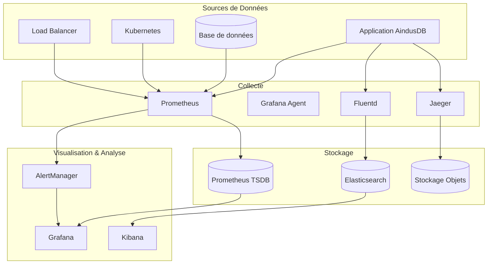

# Stratégie de Monitoring - AindusDB Core

**Version:** 1.0  
**Date:** 21/01/2026  
**Auteur:** Équipe AindusDB  
**Statut:** En rédaction  

---

## 📊 Vue d'ensemble

Le monitoring de AindusDB Core repose sur une approche multi-niveaux combinant métriques, logs et traces pour une observabilité complète de l'infrastructure et des applications.

---

## 🏗️ Architecture de Monitoring



---

## 📈 Métriques avec Prometheus

### Configuration Prometheus

```yaml
# prometheus.yml
global:
  scrape_interval: 15s
  evaluation_interval: 15s

rule_files:
  - "aindusdb_rules.yml"
  - "sla_rules.yml"

alerting:
  alertmanagers:
    - static_configs:
        - targets:
          - alertmanager:9093

scrape_configs:
  # Application AindusDB
  - job_name: 'aindusdb-core'
    static_configs:
      - targets: ['aindusdb-api:8000']
    metrics_path: '/metrics'
    scrape_interval: 10s
    relabel_configs:
      - source_labels: [__address__]
        target_label: instance
        replacement: 'aindusdb-prod'

  # Base de données
  - job_name: 'postgresql'
    static_configs:
      - targets: ['postgres-exporter:9187']

  # Redis
  - job_name: 'redis'
    static_configs:
      - targets: ['redis-exporter:9121']

  # Kubernetes
  - job_name: 'kubernetes-pods'
    kubernetes_sd_configs:
      - role: pod
    relabel_configs:
      - source_labels: [__meta_kubernetes_pod_annotation_prometheus_io_scrape]
        action: keep
        regex: true
```

### Métriques Essentielles

```python
# app/middleware/metrics.py
from prometheus_client import Counter, Histogram, Gauge, generate_latest
import time
from functools import wraps

# Compteurs
REQUEST_COUNT = Counter(
    'aindusdb_requests_total',
    'Total requests',
    ['method', 'endpoint', 'status']
)

VECTOR_OPERATIONS = Counter(
    'aindusdb_vector_operations_total',
    'Vector operations',
    ['operation_type', 'status']
)

VERITAS_CALCULATIONS = Counter(
    'aindusdb_veritas_calculations_total',
    'VERITAS calculations',
    ['verification_level', 'status']
)

# Histogrammes
REQUEST_DURATION = Histogram(
    'aindusdb_request_duration_seconds',
    'Request duration',
    ['method', 'endpoint'],
    buckets=[0.1, 0.5, 1.0, 2.5, 5.0, 10.0]
)

VECTOR_SEARCH_DURATION = Histogram(
    'aindusdb_vector_search_duration_seconds',
    'Vector search duration',
    ['index_name', 'k_value'],
    buckets=[0.01, 0.05, 0.1, 0.5, 1.0, 2.0]
)

# Jauges
ACTIVE_CONNECTIONS = Gauge(
    'aindusdb_active_connections',
    'Active database connections'
)

MEMORY_USAGE = Gauge(
    'aindusdb_memory_usage_bytes',
    'Memory usage in bytes',
    ['component']
)

def track_metrics(func):
    @wraps(func)
    async def wrapper(*args, **kwargs):
        start_time = time.time()
        try:
            result = await func(*args, **kwargs)
            REQUEST_COUNT.labels(
                method='POST',
                endpoint=func.__name__,
                status='success'
            ).inc()
            return result
        except Exception as e:
            REQUEST_COUNT.labels(
                method='POST',
                endpoint=func.__name__,
                status='error'
            ).inc()
            raise
        finally:
            REQUEST_DURATION.labels(
                method='POST',
                endpoint=func.__name__
            ).observe(time.time() - start_time)
    return wrapper
```

### Règles d'Alerte

```yaml
# aindusdb_rules.yml
groups:
  - name: aindusdb_alerts
    rules:
      # Taux d'erreur élevé
      - alert: HighErrorRate
        expr: rate(aindusdb_requests_total{status="error"}[5m]) > 0.1
        for: 2m
        labels:
          severity: warning
        annotations:
          summary: "Taux d'erreur élevé détecté"
          description: "Le taux d'erreur est de {{ $value }} erreurs par seconde"

      # Latence élevée
      - alert: HighLatency
        expr: histogram_quantile(0.95, rate(aindusdb_request_duration_seconds_bucket[5m])) > 2
        for: 5m
        labels:
          severity: warning
        annotations:
          summary: "Latence élevée détectée"
          description: "Le 95ème percentile est de {{ $value }} secondes"

      # Mémoire élevée
      - alert: HighMemoryUsage
        expr: aindusdb_memory_usage_bytes{component="api"} / 1024/1024/1024 > 8
        for: 5m
        labels:
          severity: critical
        annotations:
          summary: "Utilisation mémoire critique"
          description: "L'API utilise {{ $value }}GB de mémoire"

      # Connexions base de données
      - alert: DatabaseConnectionPool
        expr: aindusdb_active_connections > 80
        for: 3m
        labels:
          severity: warning
        annotations:
          summary: "Pool de connexions saturé"
          description: "{{ $value }} connexions actives sur 80 maximum"

      # Espace disque
      - alert: DiskSpaceLow
        expr: node_filesystem_avail_bytes{mountpoint="/data"} / node_filesystem_size_bytes < 0.1
        for: 5m
        labels:
          severity: critical
        annotations:
          summary: "Espace disque faible"
          description: "Il ne reste que {{ $value | humanizePercentage }} d'espace libre"
```

---

## 📊 Dashboards Grafana

### Dashboard Vue d'Ensemble

```json
{
  "dashboard": {
    "title": "AindusDB Core - Overview",
    "panels": [
      {
        "title": "Requêtes par seconde",
        "type": "stat",
        "targets": [
          {
            "expr": "rate(aindusdb_requests_total[5m])",
            "legendFormat": "{{method}} {{endpoint}}"
          }
        ]
      },
      {
        "title": "Taux d'erreur",
        "type": "stat",
        "targets": [
          {
            "expr": "rate(aindusdb_requests_total{status=\"error\"}[5m]) / rate(aindusdb_requests_total[5m])",
            "legendFormat": "Error Rate"
          }
        ],
        "fieldConfig": {
          "defaults": {
            "unit": "percentunit",
            "thresholds": {
              "steps": [
                {"color": "green", "value": 0},
                {"color": "yellow", "value": 0.01},
                {"color": "red", "value": 0.05}
              ]
            }
          }
        }
      },
      {
        "title": "Latence (95th percentile)",
        "type": "timeseries",
        "targets": [
          {
            "expr": "histogram_quantile(0.95, rate(aindusdb_request_duration_seconds_bucket[5m]))",
            "legendFormat": "P95"
          },
          {
            "expr": "histogram_quantile(0.50, rate(aindusdb_request_duration_seconds_bucket[5m]))",
            "legendFormat": "P50"
          }
        ]
      },
      {
        "title": "Opérations Vectorielles",
        "type": "timeseries",
        "targets": [
          {
            "expr": "rate(aindusdb_vector_operations_total[5m])",
            "legendFormat": "{{operation_type}}"
          }
        ]
      }
    ]
  }
}
```

### Dashboard Performance VERITAS

```json
{
  "dashboard": {
    "title": "VERITAS Performance",
    "panels": [
      {
        "title": "Calculs VERITAS par minute",
        "type": "stat",
        "targets": [
          {
            "expr": "rate(aindusdb_veritas_calculations_total[1m]) * 60",
            "legendFormat": "{{verification_level}}"
          }
        ]
      },
      {
        "title": "Temps de génération de preuve",
        "type": "heatmap",
        "targets": [
          {
            "expr": "rate(aindusdb_veritas_proof_duration_seconds_bucket[5m])",
            "legendFormat": "{{le}}"
          }
        ]
      },
      {
        "title": "Score de confiance moyen",
        "type": "stat",
        "targets": [
          {
            "expr": "avg(aindusdb_veritas_confidence_score)",
            "legendFormat": "Confidence"
          }
        ]
      }
    ]
  }
}
```

---

## 📝 Gestion des Logs

### Configuration Fluentd

```yaml
# fluentd.conf
<source>
  @type tail
  path /var/log/aindusdb/*.log
  pos_file /var/log/fluentd/aindusdb.log.pos
  tag aindusdb.*
  format json
  time_key timestamp
  time_format %Y-%m-%dT%H:%M:%S%.NZ
</source>

# Filtre pour enrichir les logs
<filter aindusdb.**>
  @type record_transformer
  <record>
    hostname #{Socket.gethostname}
    environment #{ENV['ENVIRONMENT'] || 'unknown'}
    service aindusdb-core
  </record>
</filter>

# Filtre pour les erreurs
<filter aindusdb.**>
  @type grep
  <regexp>
    key level
    pattern ^(ERROR|CRITICAL)$
  </regexp>
  add_tag_prefix error.
</filter>

# Sortie Elasticsearch
<match aindusdb.**>
  @type elasticsearch
  host elasticsearch
  port 9200
  index_name aindusdb-logs-%Y.%m.%d
  type_name _doc
  include_tag_key true
  tag_key @log_name
  flush_interval 5s
</match>

# Sortie pour les alertes
<match error.aindusdb.**>
  @type webhook
  endpoint http://alertmanager:9093/api/v1/alerts
  headers
    Content-Type application/json
  </headers>
  <format>
    @type json
  </format>
</match>
```

### Structuration des Logs

```python
# app/logging/logger.py
import json
import logging
from datetime import datetime
from typing import Dict, Any
import uuid

class AindusDBLogger:
    def __init__(self, name: str):
        self.logger = logging.getLogger(name)
        self.setup_logger()
    
    def setup_logger(self):
        handler = logging.StreamHandler()
        handler.setFormatter(JsonFormatter())
        self.logger.addHandler(handler)
        self.logger.setLevel(logging.INFO)
    
    def log_request(self, method: str, endpoint: str, user_id: str = None):
        self.logger.info("Request started", extra={
            "event_type": "request_start",
            "method": method,
            "endpoint": endpoint,
            "user_id": user_id,
            "request_id": str(uuid.uuid4())
        })
    
    def log_error(self, error: Exception, context: Dict[str, Any] = None):
        self.logger.error("Error occurred", extra={
            "event_type": "error",
            "error_type": type(error).__name__,
            "error_message": str(error),
            "context": context or {},
            "traceback": traceback.format_exc()
        })
    
    def log_veritas_calculation(self, query: str, verification_level: str, duration: float):
        self.logger.info("VERITAS calculation", extra={
            "event_type": "veritas_calculation",
            "query_hash": hashlib.sha256(query.encode()).hexdigest()[:16],
            "verification_level": verification_level,
            "duration_ms": duration * 1000
        })

class JsonFormatter(logging.Formatter):
    def format(self, record):
        log_entry = {
            "timestamp": datetime.utcnow().isoformat() + "Z",
            "level": record.levelname,
            "logger": record.name,
            "message": record.getMessage(),
        }
        
        if hasattr(record, '__dict__'):
            log_entry.update({k: v for k, v in record.__dict__.items() 
                            if k not in ['name', 'msg', 'args', 'levelname', 
                                       'levelno', 'pathname', 'filename', 
                                       'module', 'lineno', 'funcName', 
                                       'created', 'msecs', 'relativeCreated', 
                                       'thread', 'threadName', 'processName', 
                                       'process', 'getMessage']})
        
        return json.dumps(log_entry)
```

---

## 🔍 Tracing Distribué

### Configuration Jaeger

```python
# app/tracing/tracer.py
from opentelemetry import trace
from opentelemetry.exporter.jaeger.thrift import JaegerExporter
from opentelemetry.sdk.trace import TracerProvider
from opentelemetry.sdk.trace.export import BatchSpanProcessor
from opentelemetry.instrumentation.fastapi import FastAPIInstrumentor
from opentelemetry.instrumentation.sqlalchemy import SQLAlchemyInstrumentor

def setup_tracing(app):
    # Configuration Jaeger
    jaeger_exporter = JaegerExporter(
        agent_host_name="jaeger",
        agent_port=6831,
    )
    
    # Provider
    trace.set_tracer_provider(TracerProvider())
    tracer = trace.get_tracer(__name__)
    
    # Processor
    span_processor = BatchSpanProcessor(jaeger_exporter)
    trace.get_tracer_provider().add_span_processor(span_processor)
    
    # Instrumentation
    FastAPIInstrumentor.instrument_app(app)
    SQLAlchemyInstrumentor.instrument(engine=db.engine)
    
    return tracer

# Exemple d'utilisation
@tracer.start_as_current_span("vector_search")
async def search_vectors(query: str, k: int = 10):
    with tracer.start_as_current_span("embedding_generation"):
        embedding = await generate_embedding(query)
    
    with tracer.start_as_current_span("similarity_search"):
        results = await vector_store.search(embedding, k)
    
    return results
```

---

## 🚨 Stratégie d'Alerting

### Configuration AlertManager

```yaml
# alertmanager.yml
global:
  smtp_smarthost: 'smtp.example.com:587'
  smtp_from: 'alerts@aindusdb.com'
  slack_api_url: 'https://hooks.slack.com/services/...'

route:
  group_by: ['alertname', 'cluster', 'service']
  group_wait: 10s
  group_interval: 10s
  repeat_interval: 12h
  receiver: 'default'
  routes:
    - match:
        severity: critical
      receiver: 'critical-alerts'
    - match:
        severity: warning
      receiver: 'warning-alerts'

receivers:
  - name: 'default'
    slack_configs:
      - channel: '#aindusdb-alerts'
        title: 'AindusDB Alert'
        text: '{{ range .Alerts }}{{ .Annotations.summary }}\n{{ .Annotations.description }}{{ end }}'
  
  - name: 'critical-alerts'
    slack_configs:
      - channel: '#aindusdb-critical'
        send_resolved: true
    email_configs:
      - to: 'ops-team@aindusdb.com'
        subject: '[CRITICAL] AindusDB Alert'
        body: |
          {{ range .Alerts }}
          Alert: {{ .Annotations.summary }}
          Description: {{ .Annotations.description }}
          {{ end }}
    webhook_configs:
      - url: 'http://pagerduty-webhook/alert'
  
  - name: 'warning-alerts'
    slack_configs:
      - channel: '#aindusdb-warnings'
        send_resolved: true

inhibit_rules:
  - source_match:
      severity: 'critical'
    target_match:
      severity: 'warning'
    equal: ['alertname', 'cluster', 'service']
```

---

## 📊 SLA et SLO Monitoring

### Définitions des SLO

```yaml
# slo_definitions.yml
service_level_objectives:
  api_availability:
    name: "API Availability"
    description: "L'API doit être disponible 99.9% du temps"
    target: 0.999
    window: 30d
    alerting:
      burn_rate:
        short: 2.5  # 5% d'erreur en 1h
        long: 14    # 30% d'erreur en 6h

  api_latency:
    name: "API Latency"
    description: "95% des requêtes < 500ms"
    target: 0.95
    threshold: 0.5
    window: 30d

  vector_search_accuracy:
    name: "Vector Search Accuracy"
    description: "Précision minimale de 95% sur les recherches"
    target: 0.95
    window: 7d

  veritas_proof_time:
    name: "VERITAS Proof Generation"
    description: "90% des preuves générées < 2s"
    target: 0.90
    threshold: 2.0
    window: 24h
```

### Calcul des SLI

```python
# app/monitoring/sli.py
from prometheus_client import CollectorRegistry, Gauge
import requests
from datetime import datetime, timedelta

class SLICalculator:
    def __init__(self):
        self.registry = CollectorRegistry()
        self.slo_gauge = Gauge(
            'aindusdb_slo_compliance',
            'SLO compliance percentage',
            ['slo_name'],
            registry=self.registry
        )
    
    async def calculate_availability_sli(self, window_minutes: int = 30):
        """Calcule le SLI de disponibilité"""
        query = '''
          sum(rate(aindusdb_requests_total{status="success"}[5m]))
        / sum(rate(aindusdb_requests_total[5m]))
        '''
        
        result = await self.query_prometheus(query)
        availability = float(result[0]['value'][1])
        
        self.slo_gauge.labels(slo_name='availability').set(availability)
        return availability
    
    async def calculate_latency_sli(self, percentile: float = 0.95):
        """Calcule le SLI de latence"""
        query = f'''
          histogram_quantile({percentile}, 
            rate(aindusdb_request_duration_seconds_bucket[5m])
          ) < 0.5
        '''
        
        result = await self.query_prometheus(query)
        good_requests = float(result[0]['value'][1])
        
        # Total des requêtes
        total_query = '''
          sum(rate(aindusdb_requests_total[5m]))
        '''
        total_result = await self.query_prometheus(total_query)
        total_requests = float(total_result[0]['value'][1])
        
        latency_sli = good_requests / total_requests
        self.slo_gauge.labels(slo_name='latency').set(latency_sli)
        return latency_sli
    
    async def query_prometheus(self, query: str):
        """Exécute une requête Prometheus"""
        response = requests.get(
            'http://prometheus:9090/api/v1/query',
            params={'query': query}
        )
        return response.json()['data']['result']
```

---

## 🔧 Maintenance et Optimisation

### Stratégie de Rétention

```yaml
# prometheus_retention.yml
retention_policies:
  metrics:
    raw_data:
      retention: 15d
      resolution: 15s
    downsampled_1h:
      retention: 30d
      resolution: 1h
    downsampled_1d:
      retention: 1y
      resolution: 1d
  
  logs:
    hot_storage:
      retention: 7d
      storage: local_ssd
    warm_storage:
      retention: 30d
      storage: hdd
    cold_storage:
      retention: 1y
      storage: s3
    archive:
      retention: 7y
      storage: glacier
```

### Script de Nettoyage

```python
# scripts/cleanup_monitoring.py
import asyncio
import aiohttp
from datetime import datetime, timedelta

async def cleanup_old_metrics():
    """Nettoie les anciennes métriques"""
    async with aiohttp.ClientSession() as session:
        # Suppression des séries temporelles inutilisées
        delete_query = '''
          series_count{__name__=~".*"} - 
          series_count{__name__=~".*"} offset 7d
        '''
        
        await session.delete(
            'http://prometheus:9090/api/v1/admin/tsdb/delete_series',
            params={'match[]': delete_query}
        )

async def archive_old_logs():
    """Archive les anciens logs"""
    cutoff_date = datetime.utcnow() - timedelta(days=30)
    
    # Déplacement vers S3
    archive_query = {
        "query": {
            "range": {
                "@timestamp": {
                    "lt": cutoff_date.isoformat()
                }
            }
        }
    }
    
    async with aiohttp.ClientSession() as session:
        await session.post(
            'http://elasticsearch:9200/aindusdb-logs-*/_reindex',
            json=archive_query
        )

async def main():
    await asyncio.gather(
        cleanup_old_metrics(),
        archive_old_logs()
    )

if __name__ == "__main__":
    asyncio.run(main())
```

---

## 📈 Rapports et Analytiques

### Génération de Rapports Quotidiens

```python
# app/monitoring/reporting.py
import pandas as pd
import matplotlib.pyplot as plt
from datetime import datetime, timedelta
import smtplib
from email.mime.text import MIMEText
from email.mime.multipart import MIMEMultipart
from email.mime.image import MIMEImage

class MonitoringReporter:
    def __init__(self):
        self.prometheus_url = "http://prometheus:9090"
    
    async def generate_daily_report(self):
        """Génère le rapport quotidien"""
        report_data = {
            "availability": await self.get_availability_metrics(),
            "performance": await self.get_performance_metrics(),
            "errors": await self.get_error_metrics(),
            "usage": await self.get_usage_metrics()
        }
        
        # Génération du HTML
        html_report = self.generate_html_report(report_data)
        
        # Envoi par email
        await self.send_email_report(html_report)
    
    async def get_availability_metrics(self):
        """Récupère les métriques de disponibilité"""
        queries = {
            "uptime": 'up{job="aindusdb-core"}',
            "error_rate": 'rate(aindusdb_requests_total{status="error"}[24h])',
            "success_rate": 'rate(aindusdb_requests_total{status="success"}[24h])'
        }
        
        metrics = {}
        for name, query in queries.items():
            metrics[name] = await self.query_prometheus(query)
        
        return metrics
    
    def generate_html_report(self, data: dict):
        """Génère le rapport HTML"""
        html = f"""
        <html>
        <body>
            <h1>Rapport Quotidien AindusDB - {datetime.now().strftime('%Y-%m-%d')}</h1>
            
            <h2>Disponibilité</h2>
            <p>Taux de disponibilité: {data['availability']['uptime']}%</p>
            <p>Taux d'erreur: {data['availability']['error_rate']}%</p>
            
            <h2>Performance</h2>
            <p>Latence moyenne: {data['performance']['avg_latency']}ms</p>
            <p>Requêtes/seconde: {data['performance']['rps']}</p>
            
            <h2>Utilisation</h2>
            <p>Opérations vectorielles: {data['usage']['vector_ops']}</p>
            <p>Calculs VERITAS: {data['usage']['veritas_calcs']}</p>
        </body>
        </html>
        """
        return html
    
    async def send_email_report(self, html: str):
        """Envoie le rapport par email"""
        msg = MIMEMultipart('alternative')
        msg['Subject'] = f"Rapport AindusDB - {datetime.now().strftime('%Y-%m-%d')}"
        msg['From'] = 'monitoring@aindusdb.com'
        msg['To'] = 'team@aindusdb.com'
        
        msg.attach(MIMEText(html, 'html'))
        
        # Envoi SMTP
        with smtplib.SMTP('smtp.example.com', 587) as server:
            server.starttls()
            server.login('user', 'password')
            server.send_message(msg)
```

---

## 🎯 Bonnes Pratiques

### 1. Métriques
- Utiliser des noms cohérents et descriptifs
- Inclure des labels pertinents pour le filtrage
- Éviter les métriques de haute cardinalité
- Utiliser des histogrammes pour les distributions

### 2. Logs
- Structurer les logs en JSON
- Inclure un ID de corrélation pour le tracing
- Éviter les logs sensibles (mots de passe, tokens)
- Utiliser des niveaux de log appropriés

### 3. Alertes
- Être spécifique et actionnable
- Éviter les fausses alertes
- Inclure des liens vers les dashboards
- Pager uniquement pour les problèmes critiques

### 4. Dashboards
- Commencer par une vue d'ensemble
- Utiliser des couleurs cohérentes
- Inclure des annotations pour les événements
- Partager les connaissances avec l'équipe

---

## 🔮 Évolutions Futures

### 1. Machine Learning pour les Anomalies
- Détection automatique des anomalies
- Prédictions de pannes
- Optimisation proactive

### 2. AIOps
- Auto-réparation
- Scaling prédictif
- Optimisation des ressources

### 3. Observabilité Avancée
- Tracing continu
- Profiling en production
- Cartographie des dépendances

---

## 📚 Références

- [Prometheus Best Practices](https://prometheus.io/docs/practices/)
- [Grafana Dashboards](https://grafana.com/docs/grafana/latest/dashboards/)
- [OpenTelemetry Specification](https://opentelemetry.io/docs/reference/)
- [SRE Workbook](https://sre.google/workbook/)

---

**Document maintenu par l'équipe AindusDB Core**  
**Dernière mise à jour:** 21/01/2026
