# Diagnostic et Résolution - AindusDB Core

**Version:** 1.0  
**Date:** 21/01/2026  
**Auteur:** Équipe AindusDB  
**Statut:** En rédaction  

---

## 🔍 Vue d'ensemble

Ce guide fournit une approche systématique pour diagnostiquer et résoudre les problèmes courants dans AindusDB Core.

---

## 🚨 Méthodologie de Diagnostic

### Approche Structurée

```mermaid
graph TD
    A[Symptôme Identifié] --> B{Critique?}
    B -->|Oui| C[Action Immédiate]
    B -->|Non| D[Collecte d'Informations]
    
    C --> E[Isoler le Problème]
    D --> E
    
    E --> F[Analyser les Logs]
    F --> G[Analyser les Métriques]
    G --> H[Identifier la Cause Racine]
    H --> I[Appliquer la Solution]
    I --> J[Vérifier la Résolution]
    J --> K[Documenter]
```



### Outils de Diagnostic Essentiels

```bash
# Scripts de diagnostic
#!/bin/bash
# diagnose.sh - Script de diagnostic automatique

echo "=== AindusDB Core Diagnostic Tool ==="
echo "Timestamp: $(date)"
echo

# 1. Vérifier l'état des services
echo "1. Service Status:"
systemctl status aindusdb-api
systemctl status aindusdb-worker
systemctl status postgresql
systemctl status redis
echo

# 2. Vérifier les ports
echo "2. Port Status:"
netstat -tlnp | grep -E ':(8000|5432|6379|9090)'
echo

# 3. Vérifier l'utilisation des ressources
echo "3. Resource Usage:"
echo "CPU: $(top -bn1 | grep "Cpu(s)" | awk '{print $2}' | cut -d'%' -f1)"
echo "Memory: $(free -m | awk 'NR==2{printf "%.2f%%", $3*100/$2}')"
echo "Disk: $(df -h / | awk 'NR==2{print $5}')"
echo

# 4. Vérifier les erreurs récentes
echo "4. Recent Errors:"
journalctl -u aindusdb-api --since "1 hour ago" | grep -i error | tail -5
echo

# 5. Vérifier la base de données
echo "5. Database Status:"
PGPASSWORD=$DB_PASSWORD psql -h $DB_HOST -U $DB_USER -d $DB_NAME -c "
SELECT count(*) as active_connections 
FROM pg_stat_activity 
WHERE state = 'active';"
echo

# 6. Vérifier Redis
echo "6. Redis Status:"
redis-cli -h $REDIS_HOST ping
redis-cli -h $REDIS_HOST info memory | grep used_memory_human
echo

# 7. Vérifier les métriques récentes
echo "7. Recent Metrics:"
curl -s "http://localhost:9090/api/v1/query?query=rate(aindusdb_requests_total[5m])" | jq '.data.result[0].value[1]'
echo
```

---

## 🐛 Problèmes Courants

### 1. Problèmes de Performance

#### Symptôme : Latence élevée des requêtes

**Diagnostic :**
```python
# app/diagnostic/performance.py
import asyncio
import time
from app.database import get_db
from app.monitoring.metrics import get_metrics

async def diagnose_high_latency():
    """Diagnostic de la latence élevée"""
    issues = []
    
    # 1. Vérifier l'utilisation CPU
    cpu_usage = get_cpu_usage()
    if cpu_usage > 80:
        issues.append({
            "component": "CPU",
            "value": f"{cpu_usage}%",
            "threshold": "80%",
            "recommendation": "Scale horizontally or optimize queries"
        })
    
    # 2. Vérifier la base de données
    db_metrics = await get_db_metrics()
    if db_metrics["slow_queries"] > 10:
        issues.append({
            "component": "Database",
            "value": f"{db_metrics['slow_queries']} slow queries",
            "threshold": "< 10",
            "recommendation": "Optimize slow queries or add indexes"
        })
    
    # 3. Vérifier le cache hit ratio
    cache_metrics = await get_cache_metrics()
    if cache_metrics["hit_ratio"] < 0.8:
        issues.append({
            "component": "Cache",
            "value": f"{cache_metrics['hit_ratio']:.2%} hit ratio",
            "threshold": "> 80%",
            "recommendation": "Review caching strategy or increase cache size"
        })
    
    # 4. Vérifier les connexions réseau
    network_latency = await measure_network_latency()
    if network_latency > 100:  # ms
        issues.append({
            "component": "Network",
            "value": f"{network_latency}ms latency",
            "threshold": "< 100ms",
            "recommendation": "Check network configuration or move services closer"
        })
    
    return issues

async def get_db_metrics():
    """Récupère les métriques de la base de données"""
    db = get_db()
    
    # Requêtes lentes
    slow_queries = await db.fetch_one("""
        SELECT count(*) as count
        FROM pg_stat_statements
        WHERE mean_time > 1000
    """)
    
    # Connexions actives
    active_connections = await db.fetch_one("""
        SELECT count(*) as count
        FROM pg_stat_activity
        WHERE state = 'active'
    """)
    
    # Taille de la base
    db_size = await db.fetch_one("""
        SELECT pg_size_pretty(pg_database_size(current_database())) as size
    """)
    
    return {
        "slow_queries": slow_queries["count"],
        "active_connections": active_connections["count"],
        "size": db_size["size"]
    }
```

**Solutions :**

1. **Optimisation des requêtes :**
```sql
-- Identifier les requêtes lentes
SELECT query, calls, total_time, mean_time
FROM pg_stat_statements
ORDER BY mean_time DESC
LIMIT 10;

-- Analyser le plan d'exécution
EXPLAIN ANALYZE SELECT * FROM vectors WHERE metadata->>'category' = 'finance';

-- Créer des index appropriés
CREATE INDEX CONCURRENTLY idx_vectors_category 
ON vectors USING gin ((metadata->>'category'));
```

2. **Mise à l'échelle horizontale :**
```yaml
# k8s/hpa.yaml
apiVersion: autoscaling/v2
kind: HorizontalPodAutoscaler
metadata:
  name: aindusdb-api-hpa
spec:
  scaleTargetRef:
    apiVersion: apps/v1
    kind: Deployment
    name: aindusdb-api
  minReplicas: 2
  maxReplicas: 10
  metrics:
  - type: Resource
    resource:
      name: cpu
      target:
        type: Utilization
        averageUtilization: 70
  - type: Resource
    resource:
      name: memory
      target:
        type: Utilization
        averageUtilization: 80
```

### 2. Problèmes de Base de Données

#### Symptôme : Erreurs de connexion ou timeout

**Diagnostic :**
```python
# app/diagnostic/database.py
import asyncpg
from typing import Dict, List

async def diagnose_database_issues():
    """Diagnostic des problèmes de base de données"""
    issues = []
    
    try:
        # Test de connexion
        conn = await asyncpg.connect(
            host=os.getenv('DB_HOST'),
            port=os.getenv('DB_PORT'),
            user=os.getenv('DB_USER'),
            password=os.getenv('DB_PASSWORD'),
            database=os.getenv('DB_NAME'),
            timeout=5
        )
        
        # Vérifier le pool de connexions
        pool_stats = await conn.fetch("""
            SELECT count(*) as total,
                   sum(CASE WHEN state='active' THEN 1 ELSE 0 END) as active,
                   sum(CASE WHEN state='idle' THEN 1 ELSE 0 END) as idle
            FROM pg_stat_activity
            WHERE datname = current_database()
        """)
        
        stats = pool_stats[0]
        if stats["active"] > 80:  # Seuil de 80 connexions actives
            issues.append({
                "issue": "High connection count",
                "value": stats["active"],
                "recommendation": "Increase pool size or optimize connection usage"
            })
        
        # Vérifier les locks
        locks = await conn.fetch("""
            SELECT locktype, mode, count(*) as count
            FROM pg_locks
            WHERE NOT granted
            GROUP BY locktype, mode
        """)
        
        if locks:
            issues.append({
                "issue": "Blocked locks detected",
                "details": locks,
                "recommendation": "Identify and resolve blocking transactions"
            })
        
        await conn.close()
        
    except asyncio.TimeoutError:
        issues.append({
            "issue": "Connection timeout",
            "recommendation": "Check network connectivity and database load"
        })
    except Exception as e:
        issues.append({
            "issue": f"Connection failed: {str(e)}",
            "recommendation": "Verify credentials and database status"
        })
    
    return issues
```

**Solutions :**

1. **Configuration du pool de connexions :**
```python
# app/database/connection.py
from sqlalchemy.ext.asyncio import create_async_engine, AsyncSession
from sqlalchemy.orm import sessionmaker

# Configuration optimisée du pool
engine = create_async_engine(
    DATABASE_URL,
    pool_size=20,           # Connexions permanentes
    max_overflow=30,        # Connexions supplémentaires
    pool_timeout=30,        # Timeout d'attente
    pool_recycle=3600,      # Recycler après 1h
    pool_pre_ping=True,     # Vérifier avant d'utiliser
    echo=False
)

# Gestionnaire de contexte pour les connexions
async def get_db_session():
    async with AsyncSession(engine) as session:
        try:
            yield session
            await session.commit()
        except Exception:
            await session.rollback()
            raise
        finally:
            await session.close()
```

2. **Monitoring des locks :**
```sql
-- Vue pour monitorer les locks
CREATE VIEW active_locks AS
SELECT 
    pid,
    state,
    query,
    waiting.locktype AS waiting_type,
    waiting.mode AS waiting_mode,
    other.locktype AS other_type,
    other.mode AS other_mode,
    other.pid AS other_pid
FROM pg_locks AS waiting
JOIN pg_stat_activity ON waiting.pid = pg_stat_activity.pid
LEFT JOIN pg_locks AS other ON 
    waiting.locktype = other.locktype AND
    waiting.database = other.database AND
    waiting.relation = other.relation AND
    waiting.page = other.page AND
    waiting.tuple = other.tuple AND
    waiting.virtualxid = other.virtualxid AND
    waiting.transactionid = other.transactionid AND
    waiting.classid = other.classid AND
    waiting.objid = other.objid AND
    waiting.objsubid = other.objsubid AND
    waiting.pid != other.pid
WHERE NOT waiting.granted;
```

### 3. Problèmes de Vector Store

#### Symptôme : Recherches vectorielles lentes ou échouées

**Diagnostic :**
```python
# app/diagnostic/vector_store.py
import time
from app.services.vector_store import get_vector_store

async def diagnose_vector_store_issues():
    """Diagnostic des problèmes du vector store"""
    issues = []
    
    vector_store = get_vector_store()
    
    # 1. Test de connectivité
    try:
        start_time = time.time()
        await vector_store.health_check()
        health_time = time.time() - start_time
        
        if health_time > 5:  # Plus de 5 secondes
            issues.append({
                "component": "Vector Store Health Check",
                "value": f"{health_time:.2f}s",
                "threshold": "< 5s",
                "recommendation": "Check network latency to vector store"
            })
    except Exception as e:
        issues.append({
            "component": "Vector Store Connection",
            "error": str(e),
            "recommendation": "Verify API key and endpoint"
        })
    
    # 2. Test de recherche
    try:
        test_vector = [0.1] * 1536
        start_time = time.time()
        results = await vector_store.search(test_vector, top_k=10)
        search_time = time.time() - start_time
        
        if search_time > 1.0:  # Plus de 1 seconde
            issues.append({
                "component": "Vector Search Performance",
                "value": f"{search_time:.3f}s",
                "threshold": "< 1s",
                "recommendation": "Consider index optimization or scaling"
            })
    except Exception as e:
        issues.append({
            "component": "Vector Search",
            "error": str(e),
            "recommendation": "Check index status and vector dimensions"
        })
    
    # 3. Vérifier l'état des index
    try:
        indexes = await vector_store.list_indexes()
        for index in indexes:
            if index["status"] != "ready":
                issues.append({
                    "component": f"Index {index['name']}",
                    "status": index["status"],
                    "recommendation": "Wait for index to be ready or recreate"
                })
    except Exception as e:
        issues.append({
            "component": "Index Listing",
            "error": str(e),
            "recommendation": "Check vector store permissions"
        })
    
    return issues
```

**Solutions :**

1. **Optimisation des index :**
```python
# app/services/vector_store_optimizer.py
class VectorStoreOptimizer:
    def __init__(self, vector_store):
        self.vector_store = vector_store
    
    async def optimize_index(self, index_name: str):
        """Optimise un index vectoriel"""
        # 1. Analyser les patterns de requête
        query_patterns = await self.analyze_query_patterns(index_name)
        
        # 2. Recommander le meilleur type de pod
        recommended_pod = self.recommend_pod_type(query_patterns)
        
        # 3. Créer un nouvel index optimisé
        optimized_index = await self.vector_store.create_index(
            name=f"{index_name}_optimized",
            dimension=query_patterns["dimension"],
            metric=query_patterns["metric"],
            pod_type=recommended_pod,
            replicas=self.calculate_replicas(query_patterns["qps"])
        )
        
        # 4. Migrer les données
        await self.migrate_data(index_name, optimized_index["id"])
        
        return optimized_index
    
    def recommend_pod_type(self, patterns: dict):
        """Recommande le type de pod optimal"""
        qps = patterns.get("queries_per_second", 0)
        dimension = patterns.get("dimension", 1536)
        
        if qps > 1000:
            return "p2.x1"  # High performance
        elif qps > 100:
            return "p1.x1"  # Standard
        else:
            return "s1.x1"  # Economy
```

### 4. Problèmes VERITAS

#### Symptôme : Échecs des calculs ou preuves invalides

**Diagnostic :**
```python
# app/diagnostic/veritas.py
from app.services.veritas import VeritasService
from app.math.safe_eval import SafeMathEvaluator

async def diagnose_veritas_issues():
    """Diagnostic des problèmes VERITAS"""
    issues = []
    
    # 1. Test du moteur mathématique
    evaluator = SafeMathEvaluator()
    test_expressions = [
        ("sqrt(16)", "4.0"),
        ("2 + 3", "5.0"),
        ("sin(pi/2)", "1.0")
    ]
    
    for expr, expected in test_expressions:
        try:
            result = evaluator.evaluate(expr)
            if str(result) != expected:
                issues.append({
                    "component": "Math Engine",
                    "expression": expr,
                    "expected": expected,
                    "got": str(result),
                    "recommendation": "Check math engine configuration"
                })
        except Exception as e:
            issues.append({
                "component": "Math Engine",
                "expression": expr,
                "error": str(e),
                "recommendation": "Verify expression syntax and allowed functions"
            })
    
    # 2. Test de génération de preuve
    veritas_service = VeritasService()
    try:
        proof = await veritas_service.generate_proof(
            query="sqrt(16) + 3^2",
            variables={},
            result="13.0",
            verification_level="standard"
        )
        
        # Vérifier la preuve
        verification = await veritas_service.verify_proof(proof.proof_id)
        if not verification.is_valid:
            issues.append({
                "component": "Proof Verification",
                "proof_id": proof.proof_id,
                "issue": "Generated proof is invalid",
                "recommendation": "Check proof generation algorithm"
            })
    except Exception as e:
        issues.append({
            "component": "Proof Generation",
            "error": str(e),
            "recommendation": "Verify proof generator configuration"
        })
    
    # 3. Vérifier les performances
    start_time = time.time()
    await veritas_service.calculate_with_proof({
        "query": "sqrt(100) + log(exp(10))",
        "variables": {},
        "verification_level": "standard"
    })
    duration = time.time() - start_time
    
    if duration > 5:  # Plus de 5 secondes
        issues.append({
            "component": "VERITAS Performance",
            "value": f"{duration:.2f}s",
            "threshold": "< 5s",
            "recommendation": "Optimize calculation or use caching"
        })
    
    return issues
```

---

## 🔧 Outils Avancés de Diagnostic

### Analyse des Logs en Temps Réel

```python
# app/diagnostic/log_analyzer.py
import re
import asyncio
from collections import defaultdict, deque
from datetime import datetime, timedelta

class RealTimeLogAnalyzer:
    def __init__(self):
        self.error_patterns = {
            "database_error": re.compile(r"psycopg2|postgresql|database", re.I),
            "timeout": re.compile(r"timeout|timed out", re.I),
            "memory_error": re.compile(r"memory|out of memory|oom", re.I),
            "connection_error": re.compile(r"connection|refused|unreachable", re.I),
            "veritas_error": re.compile(r"veritas|proof|calculation", re.I)
        }
        
        self.recent_errors = deque(maxlen=1000)
        self.error_counts = defaultdict(int)
    
    async def analyze_logs(self, log_stream):
        """Analyse les logs en temps réel"""
        async for line in log_stream:
            analysis = self.analyze_line(line)
            
            if analysis["is_error"]:
                self.recent_errors.append({
                    "timestamp": datetime.utcnow(),
                    "line": line,
                    "error_type": analysis["error_type"],
                    "severity": analysis["severity"]
                })
                
                self.error_counts[analysis["error_type"]] += 1
                
                # Détecter les patterns
                await self.detect_patterns()
    
    def analyze_line(self, line: str):
        """Analyse une ligne de log"""
        analysis = {
            "is_error": False,
            "error_type": None,
            "severity": "info"
        }
        
        # Vérifier si c'est une erreur
        if any(keyword in line.lower() for keyword in ["error", "exception", "failed"]):
            analysis["is_error"] = True
            
            # Identifier le type d'erreur
            for error_type, pattern in self.error_patterns.items():
                if pattern.search(line):
                    analysis["error_type"] = error_type
                    break
            
            # Déterminer la sévérité
            if "critical" in line.lower():
                analysis["severity"] = "critical"
            elif "warning" in line.lower():
                analysis["severity"] = "warning"
            else:
                analysis["severity"] = "error"
        
        return analysis
    
    async def detect_patterns(self):
        """Détecte les patterns d'erreurs"""
        # Erreurs en cascade
        recent_critical = sum(
            1 for e in self.recent_errors 
            if e["severity"] == "critical" and 
            e["timestamp"] > datetime.utcnow() - timedelta(minutes=5)
        )
        
        if recent_critical > 5:
            await self.trigger_alert("cascade_failure", {
                "critical_errors_last_5min": recent_critical
            })
        
        # Pics d'erreurs
        for error_type, count in self.error_counts.items():
            if count > 100:  # Seuil de 100 erreurs
                await self.trigger_alert("error_spike", {
                    "error_type": error_type,
                    "count": count
                })
```

### Analyse des Performances

```python
# app/diagnostic/performance_profiler.py
import cProfile
import pstats
import io
from contextlib import asynccontextmanager

class PerformanceProfiler:
    def __init__(self):
        self.profiles = {}
    
    @asynccontextmanager
    async def profile_function(self, function_name: str):
        """Profile une fonction de manière asynchrone"""
        profiler = cProfile.Profile()
        profiler.enable()
        
        try:
            yield
        finally:
            profiler.disable()
            
            # Sauvegarder les résultats
            s = io.StringIO()
            ps = pstats.Stats(profiler, stream=s)
            ps.sort_stats('cumulative')
            ps.print_stats(20)  # Top 20 fonctions
            
            self.profiles[function_name] = {
                "timestamp": datetime.utcnow(),
                "stats": s.getvalue()
            }
    
    def analyze_performance(self):
        """Analyse les performances et identifie les goulots"""
        analysis = {
            "slow_functions": [],
            "memory_intensive": [],
            "recommendations": []
        }
        
        for func_name, profile in self.profiles.items():
            stats = profile["stats"]
            
            # Identifier les fonctions lentes
            if "cumtime" in stats and float(stats.split('\n')[1].split()[2]) > 1.0:
                analysis["slow_functions"].append({
                    "function": func_name,
                    "cumulative_time": stats.split('\n')[1].split()[2]
                })
                analysis["recommendations"].append(
                    f"Optimize {func_name} - it's taking more than 1 second"
                )
        
        return analysis

# Utilisation
profiler = PerformanceProfiler()

async def monitored_vector_search(query_vector):
    async with profiler.profile_function("vector_search"):
        # Code de recherche vectorielle
        results = await vector_store.search(query_vector)
        return results
```

---

## 📊 Checklists de Diagnostic

### Checklist Performance

```markdown
## Performance Diagnostic Checklist

### CPU
- [ ] Vérifier l'utilisation CPU (> 80% = problème)
- [ ] Identifier les processus gourmands
- [ ] Vérifier le nombre de cores utilisés
- [ ] Analyser les pics d'utilisation

### Mémoire
- [ ] Vérifier l'utilisation RAM (> 90% = critique)
- [ ] Identifier les fuites mémoire
- [ ] Vérifier le swap
- [ ] Analyser l'utilisation par processus

### Base de Données
- [ ] Vérifier les requêtes lentes (> 1s)
- [ ] Analyser les plans d'exécution
- [ ] Vérifier les index manquants
- [ ] Surveiller les locks

### Réseau
- [ ] Mesurer la latence réseau
- [ ] Vérifier la bande passante
- [ ] Analyser les paquets perdus
- [ ] Tester la connectivité

### Application
- [ ] Profiler les endpoints lents
- [ ] Vérifier les N+1 queries
- [ ] Analyser l'utilisation du cache
- [ ] Surveiller les erreurs 5xx
```

### Checklist Disponibilité

```markdown
## Availability Diagnostic Checklist

### Services
- [ ] Vérifier le statut de tous les services
- [ ] Tester les health checks
- [ ] Vérifier les ports d'écoute
- [ ] Analyser les redémarrages

### Infrastructure
- [ ] Vérifier l'espace disque (> 90% = critique)
- [ ] Surveiller la température
- [ ] Vérifier l'alimentation
- [ ] Tester la redondance

### Dépendances
- [ ] Tester la connexion à la BD
- [ ] Vérifier Redis
- [ ] Tester Pinecone
- [ ] Valider les APIs externes

### Monitoring
- [ ] Vérifier Prometheus
- [ ] Tester Grafana
- [ ] Valider AlertManager
- [ ] Confirmer les notifications
```

---

## 🚨 Procédures d'Urgence

### Incident Critique : Service Down

```bash
#!/bin/bash
# emergency_restart.sh - Procédure d'urgence

echo "🚨 EMERGENCY RESTART PROCEDURE"
echo "Timestamp: $(date)"
echo

# 1. Identifier le service en panne
FAILED_SERVICE=$(systemctl list-units --state=failed | grep aindusdb | awk '{print $1}')

if [ -z "$FAILED_SERVICE" ]; then
    echo "✅ No failed AindusDB services found"
    exit 0
fi

echo "❌ Failed service: $FAILED_SERVICE"

# 2. Créer un ticket d'incident
curl -X POST "https://pagerduty.com/api/v1/incidents" \
  -H "Authorization: Token token=$PAGERDUTY_TOKEN" \
  -H "Content-Type: application/json" \
  -d "{
    \"incident\": {
      \"type\": \"incident\",
      \"title\": \"AindusDB Service Down: $FAILED_SERVICE\",
      \"service\": {\"id\": \"$PAGERDUTY_SERVICE_ID\"},
      \"urgency\": \"high\"
    }
  }"

# 3. Notifier l'équipe
curl -X POST "$SLACK_WEBHOOK" \
  -H 'Content-type: application/json' \
  --data "{\"text\":\"🚨 CRITICAL: $FAILED_SERVICE is down. Emergency restart initiated.\"}"

# 4. Sauvegarder les logs
journalctl -u $FAILED_SERVICE --since "1 hour ago" > /var/log/emergency/$FAILED_SERVICE-$(date +%Y%m%d-%H%M%S).log

# 5. Redémarrer le service
echo "🔄 Restarting $FAILED_SERVICE..."
systemctl restart $FAILED_SERVICE

# 6. Vérifier le redémarrage
sleep 10
if systemctl is-active --quiet $FAILED_SERVICE; then
    echo "✅ Service restarted successfully"
    
    # 7. Notification de succès
    curl -X POST "$SLACK_WEBHOOK" \
      -H 'Content-type: application/json' \
      --data "{\"text\":\"✅ SUCCESS: $FAILED_SERVICE has been restarted and is running.\"}"
else
    echo "❌ Service failed to restart"
    
    # 8. Escalade
    curl -X POST "$SLACK_WEBHOOK" \
      -H 'Content-type: application/json' \
      --data "{\"text\":\"🔥 CRITICAL: $FAILED_SERVICE failed to restart. Manual intervention required!\"}"
    
    # 9. Activer le mode dégradé
    systemctl start aindusdb-degraded-mode
fi

# 10. Documenter l'incident
echo "Incident documented in /var/log/emergency/"
```

### Incident Critique : Base de Données Inaccessible

```python
# app/emergency/db_failover.py
import asyncio
import logging
from app.database import get_replica_connection

logger = logging.getLogger(__name__)

class DatabaseFailover:
    def __init__(self):
        self.primary_config = {
            "host": os.getenv("DB_HOST"),
            "port": os.getenv("DB_PORT"),
            "user": os.getenv("DB_USER"),
            "password": os.getenv("DB_PASSWORD"),
            "database": os.getenv("DB_NAME")
        }
        self.replica_config = {
            "host": os.getenv("DB_REPLICA_HOST"),
            "port": os.getenv("DB_REPLICA_PORT"),
            "user": os.getenv("DB_REPLICA_USER"),
            "password": os.getenv("DB_REPLICA_PASSWORD"),
            "database": os.getenv("DB_NAME")
        }
    
    async def check_primary_health(self):
        """Vérifie la santé de la base primaire"""
        try:
            conn = await asyncpg.connect(**self.primary_config, timeout=5)
            await conn.execute("SELECT 1")
            await conn.close()
            return True
        except Exception as e:
            logger.error(f"Primary DB health check failed: {e}")
            return False
    
    async def initiate_failover(self):
        """Initie le failover vers le réplica"""
        logger.critical("Initiating database failover")
        
        # 1. Notifier toutes les parties
        await self.notify_failover_initiated()
        
        # 2. Mettre l'application en mode read-only
        await self.set_readonly_mode(True)
        
        # 3. Promouvoir le réplica
        success = await self.promote_replica()
        
        if success:
            # 4. Mettre à jour la configuration
            await self.update_database_config()
            
            # 5. Redémarrer les services
            await self.restart_services()
            
            # 6. Notifier le succès
            await self.notify_failover_success()
        else:
            # 7. Échec du failover
            await self.notify_failover_failed()
            raise Exception("Failover failed")
    
    async def promote_replica(self):
        """Promeut le réplica en primaire"""
        try:
            # Connexion au réplica
            conn = await asyncpg.connect(**self.replica_config)
            
            # Promotion (dépend de votre setup)
            await conn.execute("SELECT pg_promote()")
            
            # Vérification
            await conn.execute("CREATE TABLE failover_test (id int)")
            await conn.execute("DROP TABLE failover_test")
            
            await conn.close()
            return True
        except Exception as e:
            logger.error(f"Replica promotion failed: {e}")
            return False
    
    async def notify_failover_initiated(self):
        """Notifie le début du failover"""
        message = "🔥 CRITICAL: Database failover initiated"
        
        # Slack
        await self.send_slack_alert(message)
        
        # PagerDuty
        await self.trigger_pagerduty_incident("Database Failover", message)
        
        # Email
        await self.send_email_alert("Database Failover", message)
```

---

## 📚 Documentation des Incidents

### Template de Rapport d'Incident

```markdown
# Incident Report - [INCIDENT_ID]

## Résumé
- **Titre**: [Titre court et descriptif]
- **Sévérité**: [Critical/High/Medium/Low]
- **Date**: [Date de début]
- **Durée**: [Durée totale]
- **Impact**: [Description de l'impact]

## Chronologie
- **HH:MM**: Détection de l'incident
- **HH:MM**: Notification de l'équipe
- **HH:MM**: Diagnostic initial
- **HH:MM**: Identification de la cause
- **HH:MM**: Application de la solution
- **HH:MM**: Résolution confirmée

## Analyse de la Cause Racine
### Cause immédiate
[Description de ce qui a directement causé l'incident]

### Cause racine
[Description de la cause fondamentale]

### Facteurs contributifs
- [Liste des facteurs qui ont contribué]

## Actions Correctives
### Immédiates
- [Actions prises pour résoudre l'incident]

### Préventives
- [Actions pour éviter la récurrence]

## Leçons Apprises
- [Ce qui a bien fonctionné]
- [Ce qui pourrait être amélioré]
- [Actions requises]

## Métriques d'Impact
- Temps d'arrêt: [X heures]
- Utilisateurs affectés: [X]
- Requêtes échouées: [X]
- Impact financier: [€X]

## Pièces Jointes
- [Logs pertinents]
- [Screenshots des dashboards]
- [Graphiques de performance]
```

---

## 🎯 Bonnes Pratiques

### 1. Prévention
- Monitoring proactif
- Tests de charge réguliers
- Mises à jour préventives
- Documentation à jour

### 2. Détection
- Alertes pertinentes
- Health checks complets
- Logs structurés
- Métriques de performance

### 3. Réponse
- Playbooks détaillés
- Équipe d'astreinte
- Outils automatisés
- Communication claire

### 4. Amélioration
- Post-mortems sans blâme
- Actions de suivi
- Mise à jour des procédures
- Partage des connaissances

---

**Document maintenu par l'équipe AindusDB Core**  
**Dernière mise à jour:** 21/01/2026
