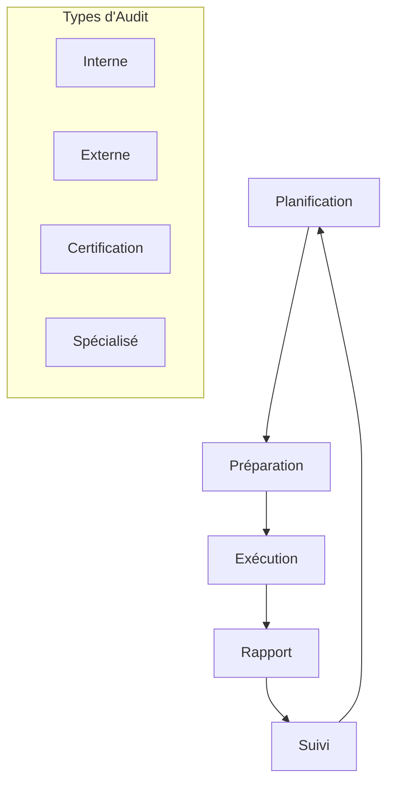

# Procédures d'Audit - AindusDB Core

**Version:** 1.0  
**Date:** 21/01/2026  
**Auteur:** Équipe AindusDB  
**Statut:** En rédaction  

---

## 🔍 Vue d'ensemble

Ce document détaille les procédures d'audit internes et externes pour garantir la conformité de AindusDB Core aux standards applicables.

---

## 📊 Cycle d'Audit



---

## 📋 Planification d'Audit

### Calendrier Annuel

```yaml
audit_calendar_2026:
  q1:
    - type: "Interne"
      scope: "ISO 27001 Controls Review"
      duration: "2 semaines"
      start_date: "2024-02-01"
      
    - type: "Spécialisé"
      scope: "VERITAS Engine Security"
      duration: "1 semaine"
      start_date: "2024-03-15"
  
  q2:
    - type: "Externe"
      scope: "SOC 2 Type II"
      duration: "3 semaines"
      start_date: "2026-05-01"
      
    - type: "Interne"
      scope: "GDPR Compliance"
      duration: "1 semaine"
      start_date: "2026-06-10"
  
  q3:
    - type: "Certification"
      scope: "ISO 27001 Surveillance"
      duration: "1 semaine"
      start_date: "2026-08-01"
      
    - type: "Spécialisé"
      scope: "Cloud Security (ISO 27017/27018)"
      duration: "2 semaines"
      start_date: "2026-09-01"
  
  q4:
    - type: "Interne"
      scope: "Annual Risk Assessment"
      duration: "2 semaines"
      start_date: "2026-10-15"
      
    - type: "Externe"
      scope: "Penetration Testing"
      duration: "1 semaine"
      start_date: "2026-11-15"
```

### Méthodologie de Planification

```python
# app/audit/audit_planning.py
from dataclasses import dataclass
from datetime import datetime, timedelta
from typing import List, Dict, Optional
import pandas as pd

@dataclass
class AuditScope:
    name: str
    standard: str
    controls: List[str]
    departments: List[str]
    systems: List[str]
    risk_level: str  # low, medium, high, critical
    estimated_duration: int  # days
    required_resources: List[str]

@dataclass
class AuditSchedule:
    audit_id: str
    scope: AuditScope
    start_date: datetime
    end_date: datetime
    auditors: List[str]
    status: str  # planned, in_progress, completed, cancelled

class AuditPlanner:
    def __init__(self):
        self.audit_scopes = self.load_audit_scopes()
        self.audit_calendar = {}
        self.resource_pool = self.load_resource_pool()
    
    def create_annual_plan(self) -> Dict:
        """Crée le plan d'audit annuel"""
        plan = {
            "year": datetime.now().year,
            "audits": [],
            "resource_allocation": {},
            "milestones": []
        }
        
        # Prioriser les audits par risque
        prioritized_scopes = self.prioritize_by_risk()
        
        # Allouer les ressources
        for scope in prioritized_scopes:
            audit = self.schedule_audit(scope)
            plan["audits"].append(audit)
        
        # Calculer l'allocation des ressources
        plan["resource_allocation"] = self.calculate_resource_allocation(plan["audits"])
        
        # Définir les jalons
        plan["milestones"] = self.define_milestones(plan["audits"])
        
        return plan
    
    def prioritize_by_risk(self) -> List[AuditScope]:
        """Priorise les scopes d'audit par niveau de risque"""
        risk_weights = {
            "critical": 4,
            "high": 3,
            "medium": 2,
            "low": 1
        }
        
        # Trier par risque puis par durée
        return sorted(
            self.audit_scopes,
            key=lambda x: (risk_weights[x.risk_level], x.estimated_duration),
            reverse=True
        )
    
    def schedule_audit(self, scope: AuditScope) -> AuditSchedule:
        """Planifie un audit dans le calendrier"""
        audit_id = f"AUD-{datetime.now().year}-{len(self.audit_calendar) + 1:03d}"
        
        # Trouver une fenêtre disponible
        start_date = self.find_available_slot(scope)
        end_date = start_date + timedelta(days=scope.estimated_duration)
        
        # Allouer les auditeurs
        auditors = self.assign_auditors(scope)
        
        schedule = AuditSchedule(
            audit_id=audit_id,
            scope=scope,
            start_date=start_date,
            end_date=end_date,
            auditors=auditors,
            status="planned"
        )
        
        self.audit_calendar[audit_id] = schedule
        
        return schedule
    
    def generate_audit_charter(self, audit_id: str) -> Dict:
        """Génère la charte d'audit"""
        schedule = self.audit_calendar[audit_id]
        scope = schedule.scope
        
        charter = {
            "audit_id": audit_id,
            "title": f"Audit of {scope.name}",
            "objective": self.define_objective(scope),
            "scope": {
                "standard": scope.standard,
                "controls": scope.controls,
                "departments": scope.departments,
                "systems": scope.systems,
                "exclusions": self.define_exclusions(scope)
            },
            "methodology": self.define_methodology(scope),
            "deliverables": [
                "Audit Planning Memorandum",
                "Fieldwork Documentation",
                "Draft Report",
                "Final Report",
                "Management Action Plan"
            ],
            "timeline": {
                "planning": schedule.start_date,
                "fieldwork": schedule.start_date + timedelta(days=3),
                "reporting": schedule.end_date - timedelta(days=2),
                "completion": schedule.end_date
            },
            "resources": {
                "auditors": schedule.auditors,
                "support_staff": self.assign_support_staff(scope),
                "tools": self.required_audit_tools(scope)
            },
            "approval": {
                "prepared_by": "Audit Manager",
                "approved_by": "CISO / Audit Committee",
                "date": datetime.now().isoformat()
            }
        }
        
        return charter
```

---

## 🔬 Exécution de l'Audit

### Phase 1 : Préparation

```python
# app/audit/audit_execution.py
class AuditExecution:
    def __init__(self, audit_id: str):
        self.audit_id = audit_id
        self.charter = self.load_audit_charter(audit_id)
        self.fieldwork = FieldworkManager()
        self.evidence_collector = EvidenceCollector()
        self.testing_procedures = TestingProcedures()
    
    async def execute_planning_phase(self) -> Dict:
        """Exécute la phase de planification"""
        planning_results = {
            "risk_assessment": await self.perform_risk_assessment(),
            "materiality": self.assess_materiality(),
            "sampling_strategy": self.define_sampling_strategy(),
            "audit_program": self.create_audit_program(),
            "kickoff_meeting": await self.conduct_kickoff_meeting()
        }
        
        # Documenter la planification
        await self.document_planning(planning_results)
        
        return planning_results
    
    async def perform_risk_assessment(self) -> Dict:
        """Effectue l'évaluation des risques"""
        risks = []
        
        # Risques inhérents
        inherent_risks = await self.identify_inherent_risks()
        
        # Risques de contrôle
        control_risks = await self.assess_control_risks()
        
        # Risques de détection
        detection_risks = await self.assess_detection_risks()
        
        # Calculer le risque d'audit
        for risk in inherent_risks:
            audit_risk = self.calculate_audit_risk(
                risk,
                control_risks.get(risk["id"], {}),
                detection_risks.get(risk["id"], {})
            )
            
            risks.append({
                **risk,
                "audit_risk": audit_risk,
                "response": self.define_risk_response(audit_risk)
            })
        
        return {
            "risk_assessment": risks,
            "risk_matrix": self.create_risk_matrix(risks),
            "key_risks": [r for r in risks if r["audit_risk"]["score"] > 70]
        }
    
    def create_audit_program(self) -> Dict:
        """Crée le programme d'audit"""
        program = {
            "objectives": self.charter["objective"],
            "areas": [],
            "procedures": []
        }
        
        # Pour chaque domaine d'audit
        for area in self.charter["scope"]["controls"]:
            area_program = {
                "area": area,
                "assertions": self.get_assertions(area),
                "procedures": self.design_procedures(area),
                "sample_size": self.calculate_sample_size(area),
                "timing": self.define_timing(area)
            }
            
            program["areas"].append(area_program)
            program["procedures"].extend(area_program["procedures"])
        
        return program
```

### Phase 2 : Collecte de Preuves

```python
# app/audit/evidence_collection.py
class EvidenceCollector:
    def __init__(self):
        self.collection_methods = {
            "interview": self.conduct_interview,
            "observation": self.perform_observation,
            "inspection": self.inspect_documents,
            "reperformance": self.reperform_procedures,
            "analytical": self.perform_analytical_procedures,
            "computer_assisted": self.run_caats
        }
    
    async def collect_evidence(self, procedure: Dict) -> Dict:
        """Collecte les preuves pour une procédure d'audit"""
        evidence = {
            "procedure_id": procedure["id"],
            "assertion": procedure["assertion"],
            "method": procedure["method"],
            "collected_at": datetime.utcnow().isoformat(),
            "evidence_items": []
        }
        
        # Exécuter la méthode de collecte
        collect_method = self.collection_methods[procedure["method"]]
        evidence_items = await collect_method(procedure)
        
        # Valider les preuves
        validated_items = []
        for item in evidence_items:
            if self.validate_evidence(item):
                validated_items.append(item)
        
        evidence["evidence_items"] = validated_items
        evidence["conclusion"] = self.draw_conclusion(procedure, validated_items)
        
        # Documenter
        await self.document_evidence(evidence)
        
        return evidence
    
    async def conduct_interview(self, procedure: Dict) -> List[Dict]:
        """Mène un entretien"""
        interview_plan = procedure["interview_plan"]
        
        # Préparer les questions
        questions = self.prepare_interview_questions(interview_plan)
        
        # Conduire l'entretien
        interview_transcript = await self.execute_interview(
            interview_plan["interviewee"],
            questions
        )
        
        # Analyser les réponses
        analysis = self.analyze_interview_responses(interview_transcript)
        
        return [{
            "type": "interview",
            "interviewee": interview_plan["interviewee"],
            "date": datetime.utcnow().isoformat(),
            "transcript": interview_transcript,
            "analysis": analysis,
            "evidence_strength": "medium"
        }]
    
    async def inspect_documents(self, procedure: Dict) -> List[Dict]:
        """Inspecte des documents"""
        documents = []
        
        for doc_spec in procedure["documents"]:
            # Récupérer le document
            document = await self.retrieve_document(doc_spec)
            
            # Valider l'authenticité
            if self.validate_document(document):
                # Analyser le contenu
                analysis = self.analyze_document(document, procedure["assertion"])
                
                documents.append({
                    "type": "document",
                    "name": doc_spec["name"],
                    "reference": doc_spec["reference"],
                    "date": document["date"],
                    "content": document["content"],
                    "analysis": analysis,
                    "evidence_strength": "high"
                })
        
        return documents
    
    async def run_caats(self, procedure: Dict) -> List[Dict]:
        """Exécute les Computer Assisted Audit Techniques"""
        caats_results = []
        
        for test in procedure["caats"]:
            # Exécuter le test
            result = await self.execute_caats_test(test)
            
            # Analyser les résultats
            analysis = self.analyze_caats_result(result, test["expectation"])
            
            caats_results.append({
                "type": "caats",
                "test_name": test["name"],
                "description": test["description"],
                "parameters": test["parameters"],
                "results": result,
                "analysis": analysis,
                "evidence_strength": "high"
            })
        
        return caats_results
    
    def validate_evidence(self, evidence: Dict) -> bool:
        """Valide une preuve d'audit"""
        criteria = {
            "sufficiency": self.check_sufficiency(evidence),
            "competence": self.check_competence(evidence),
            "relevance": self.check_relevance(evidence)
        }
        
        return all(criteria.values())
```

### Phase 3 : Tests de Contrôle

```python
# app/audit/control_testing.py
class ControlTester:
    def __init__(self):
        self.test_types = {
            "design_effectiveness": self.test_design_effectiveness,
            "operating_effectiveness": self.test_operating_effectiveness,
            "automated_controls": self.test_automated_controls,
            "manual_controls": self.test_manual_controls
        }
    
    async def test_control(self, control: Dict) -> Dict:
        """Test un contrôle"""
        test_result = {
            "control_id": control["id"],
            "control_description": control["description"],
            "test_type": control["test_type"],
            "test_date": datetime.utcnow().isoformat(),
            "samples_tested": 0,
            "exceptions": [],
            "conclusion": ""
        }
        
        # Exécuter le test approprié
        test_method = self.test_types[control["test_type"]]
        result = await test_method(control)
        
        test_result.update(result)
        
        # Tirer une conclusion
        test_result["conclusion"] = self.draw_control_conclusion(test_result)
        
        return test_result
    
    async def test_design_effectiveness(self, control: Dict) -> Dict:
        """Test l'efficacité du design du contrôle"""
        design_assessment = {
            "criteria_met": [],
            "gaps": [],
            "recommendations": []
        }
        
        # Vérifier les critères de design
        for criterion in control["design_criteria"]:
            if self.evaluate_criterion(criterion, control):
                design_assessment["criteria_met"].append(criterion["id"])
            else:
                design_assessment["gaps"].append({
                    "criterion": criterion["id"],
                    "issue": "Not properly implemented",
                    "recommendation": criterion["recommendation"]
                })
        
        # Échantillonnage pour l'efficacité opérationnelle
        if design_assessment["gaps"]:
            sample_size = 0
        else:
            sample_size = self.calculate_sample_size(control)
        
        return {
            "design_assessment": design_assessment,
            "samples_tested": sample_size,
            "design_effective": len(design_assessment["gaps"]) == 0
        }
    
    async def test_operating_effectiveness(self, control: Dict) -> Dict:
        """Test l'efficacité opérationnelle du contrôle"""
        operating_test = {
            "population_size": await self.get_population_size(control),
            "sample_size": self.calculate_sample_size(control),
            "sample_items": [],
            "deviations": []
        }
        
        # Sélectionner l'échantillon
        sample = await self.select_sample(control, operating_test["sample_size"])
        
        # Tester chaque élément
        for item in sample:
            test_result = await self.test_control_instance(item, control)
            
            operating_test["sample_items"].append({
                "item_id": item["id"],
                "test_result": test_result,
                "tested_at": datetime.utcnow().isoformat()
            })
            
            if not test_result["compliant"]:
                operating_test["deviations"].append({
                    "item_id": item["id"],
                    "deviation": test_result["deviation"],
                    "impact": test_result["impact"]
                })
        
        # Calculer le taux de déviation
        deviation_rate = len(operating_test["deviations"]) / operating_test["sample_size"]
        
        return {
            **operating_test,
            "deviation_rate": deviation_rate,
            "operating_effective": deviation_rate < control["tolerable_deviation"]
        }
    
    async def test_automated_controls(self, control: Dict) -> Dict:
        """Test les contrôles automatisés"""
        automated_test = {
            "system": control["system"],
            "configuration": await self.get_system_configuration(control["system"]),
            "test_scenarios": [],
            "results": []
        }
        
        # Définir les scénarios de test
        scenarios = self.define_test_scenarios(control)
        
        # Exécuter chaque scénario
        for scenario in scenarios:
            result = await self.execute_scenario(scenario, control)
            
            automated_test["test_scenarios"].append(scenario)
            automated_test["results"].append(result)
        
        # Analyser les résultats
        failed_scenarios = [r for r in automated_test["results"] if not r["passed"]]
        
        return {
            **automated_test,
            "scenarios_tested": len(scenarios),
            "scenarios_passed": len(scenarios) - len(failed_scenarios),
            "control_effective": len(failed_scenarios) == 0
        }
```

---

## 📝 Rapport d'Audit

### Structure du Rapport

```python
# app/audit/reporting.py
class AuditReporter:
    def __init__(self, audit_id: str):
        self.audit_id = audit_id
        self.audit_data = self.load_audit_data(audit_id)
    
    async def generate_draft_report(self) -> Dict:
        """Génère le rapport d'audit provisoire"""
        report = {
            "header": self.create_report_header(),
            "executive_summary": await self.create_executive_summary(),
            "introduction": self.create_introduction(),
            "scope_and_methodology": self.create_scope_section(),
            "findings": await self.compile_findings(),
            "recommendations": await self.generate_recommendations(),
            "management_response": "To be completed",
            "opinion": self.formulate_opinion(),
            "appendices": self.create_appendices()
        }
        
        return report
    
    async def compile_findings(self) -> List[Dict]:
        """Compile les conclusions d'audit"""
        findings = []
        
        # Analyser les résultats des tests
        for control_test in self.audit_data["control_tests"]:
            if not control_test["effective"]:
                finding = {
                    "id": f"FIND-{len(findings) + 1:03d}",
                    "title": self.create_finding_title(control_test),
                    "condition": self.describe_condition(control_test),
                    "criteria": self.reference_criteria(control_test),
                    "cause": self.determine_cause(control_test),
                    "effect": self.assess_effect(control_test),
                    "recommendation": self.create_recommendation(control_test),
                    "risk_rating": self.assess_risk_rating(control_test),
                    "management_action_required": True
                }
                
                findings.append(finding)
        
        # Regrouper par thèmes
        themed_findings = self.group_by_theme(findings)
        
        return themed_findings
    
    def formulate_opinion(self) -> Dict:
        """Formule l'opinion d'audit"""
        # Calculer le score global de conformité
        compliance_score = self.calculate_compliance_score()
        
        # Déterminer l'opinion
        if compliance_score >= 95:
            opinion_type = "Unqualified"
            opinion_text = "In our opinion, the controls are operating effectively"
        elif compliance_score >= 85:
            opinion_type = "Qualified"
            opinion_text = "In our opinion, except for the matters described in the findings, the controls are operating effectively"
        elif compliance_score >= 70:
            opinion_type = "Adverse"
            opinion_text = "In our opinion, the controls are not operating effectively"
        else:
            opinion_type = "Disclaimer"
            opinion_text = "We do not express an opinion on the effectiveness of controls"
        
        return {
            "type": opinion_type,
            "text": opinion_text,
            "basis": self.explain_opinion_basis(),
            "compliance_score": compliance_score,
            "significant_findings": len([f for f in self.audit_data["findings"] if f["risk_rating"] in ["High", "Critical"]])
        }
    
    async def generate_final_report(self, management_responses: Dict) -> Dict:
        """Génère le rapport final avec les réponses du management"""
        draft = await self.generate_draft_report()
        
        # Ajouter les réponses du management
        draft["management_response"] = management_responses
        
        # Mettre à jour l'opinion si nécessaire
        if self.responses_affect_opinion(management_responses):
            draft["opinion"] = self.revise_opinion(draft["opinion"], management_responses)
        
        # Ajouter le plan d'action
        draft["action_plan"] = self.create_action_plan(draft["findings"], management_responses)
        
        return draft
```

### Modèle de Rapport

```markdown
# Rapport d'Audit - [AUDIT_ID]

## Informations Générales

**Titre de l'Audit**: [TITRE]  
**Période d'Audit**: [DATE_DEBUT] - [DATE_FIN]  
**Date du Rapport**: [DATE_RAPPORT]  
**Auditeurs**: [LISTE_AUDITEURS]

## Résumé Exécutif

[Paragraphe résumant les points clés, l'opinion et les conclusions principales]

## Introduction

[Contexte de l'audit, objectifs et périmètre]

## Méthodologie

[Description des approches et procédures d'audit utilisées]

## Conclusions

### [THÈME 1]

#### Conclusion #[NUMÉRO]
- **Condition**: [Description de la situation trouvée]
- **Critère**: [Référence au standard ou politique]
- **Cause**: [Cause racine identifiée]
- **Effet**: [Impact potentiel]
- **Recommandation**: [Action recommandée]
- **Évaluation du risque**: [Niveau de risque]

### [THÈME 2]

[Autres conclusions...]

## Opinion d'Audit

[Opinion formelle basée sur les résultats]

## Réponses du Management

[Réponses du management à chaque conclusion]

## Plan d'Action

[Plan d'action détaillé avec responsabilités et délais]

## Annexes

- Annexe A: Programme d'Audit
- Annexe B: Détail des Tests
- Annexe C: Preuves d'Audit
```

---

## 🔄 Suivi des Actions

### Système de Suivi

```python
# app/audit/follow_up.py
class AuditFollowUp:
    def __init__(self):
        self.action_tracker = ActionTracker()
        self.notification_system = NotificationSystem()
    
    def track_findings(self, findings: List[Dict]) -> Dict:
        """Assure le suivi des conclusions d'audit"""
        tracking = {
            "total_findings": len(findings),
            "by_status": {},
            "overdue_actions": [],
            "upcoming_deadlines": []
        }
        
        for finding in findings:
            # Créer ou mettre à jour les actions
            actions = self.create_actions_from_finding(finding)
            
            for action in actions:
                self.action_tracker.track(action)
                
                # Vérifier les échéances
                if action["status"] == "overdue":
                    tracking["overdue_actions"].append(action)
                
                if action["due_date"] <= datetime.now() + timedelta(days=30):
                    tracking["upcoming_deadlines"].append(action)
        
        # Calculer les statistiques
        tracking["by_status"] = self.action_tracker.get_statistics()
        
        return tracking
    
    def generate_follow_up_report(self) -> Dict:
        """Génère le rapport de suivi"""
        report = {
            "report_date": datetime.utcnow().isoformat(),
            "period": "Last 90 days",
            "summary": self.generate_summary(),
            "detailed_status": self.get_detailed_status(),
            "risk_treatment": self.assess_risk_treatment(),
            "recommendations": self.make_follow_up_recommendations()
        }
        
        return report
    
    async def send_reminders(self):
        """Envoie des rappels pour les actions en retard"""
        overdue_actions = self.action_tracker.get_overdue_actions()
        
        for action in overdue_actions:
            # Envoyer un email au responsable
            await self.notification_system.send_email_reminder(action)
            
            # Envoyer une notification Slack si critique
            if action["priority"] == "critical":
                await self.notification_system.send_slack_alert(action)
            
            # Logger le rappel
            self.log_reminder_sent(action)
    
    def escalate_overdue_actions(self) -> List[Dict]:
        """Escalade les actions en retard critiques"""
        escalation_criteria = {
            "overdue_days": 30,
            "risk_level": ["high", "critical"],
            "impact": "financial"
        }
        
        escalated = []
        
        for action in self.action_tracker.get_all_actions():
            if self.should_escalate(action, escalation_criteria):
                escalation = {
                    "action": action,
                    "escalation_date": datetime.utcnow(),
                    "escalated_to": action["owner_manager"],
                    "reason": "Overdue critical action"
                }
                
                escalated.append(escalation)
                self.process_escalation(escalation)
        
        return escalated
```

### Tableau de Bord de Suivi

```python
# app/audit/follow_up_dashboard.py
@app.get("/audit/follow-up/dashboard")
async def follow_up_dashboard():
    """Endpoint pour le tableau de bord de suivi"""
    tracker = AuditFollowUp()
    
    dashboard_data = {
        "overview": {
            "total_findings": tracker.get_total_findings(),
            "open_findings": tracker.get_open_findings(),
            "closed_findings": tracker.get_closed_findings(),
            "overdue_actions": tracker.get_overdue_count()
        },
        "trends": {
            "closure_rate": tracker.get_closure_trend(),
            "aging_analysis": tracker.get_aging_analysis(),
            "risk_distribution": tracker.get_risk_distribution()
        },
        "priority_actions": tracker.get_priority_actions(),
        "upcoming_deadlines": tracker.get_upcoming_deadlines(30),
        "performance_metrics": {
            "average_closure_time": tracker.get_avg_closure_time(),
            "on_time_completion_rate": tracker.get_on_time_rate(),
            "escalation_rate": tracker.get_escalation_rate()
        }
    }
    
    return dashboard_data
```

---

## 📊 Gestion de la Qualité d'Audit

### Revue de Qualité

```python
# app/audit/quality_assurance.py
class AuditQualityAssurance:
    def __init__(self):
        self.quality_criteria = {
            "planning": {
                "risk_assessment_complete": True,
                "scope_appropriate": True,
                "resources_adequate": True,
                "timeline_realistic": True
            },
            "fieldwork": {
                "evidence_sufficient": True,
                "documentation_complete": True,
                "testing_proper": True,
                "conclusions_supported": True
            },
            "reporting": {
                "findings_clear": True,
                "recommendations_actionable": True,
                "opinion_supported": True,
                "grammar_correct": True
            }
        }
    
    def review_audit_quality(self, audit_id: str) -> Dict:
        """Effectue la revue de qualité d'un audit"""
        audit_data = self.load_audit_data(audit_id)
        
        quality_review = {
            "audit_id": audit_id,
            "review_date": datetime.utcnow().isoformat(),
            "reviewer": "Quality Assurance Manager",
            "scores": {},
            "findings": [],
            "overall_score": 0,
            "approved": False
        }
        
        # Évaluer chaque phase
        for phase, criteria in self.quality_criteria.items():
            phase_score = self.evaluate_phase(audit_data[phase], criteria)
            quality_review["scores"][phase] = phase_score
            
            # Identifier les problèmes de qualité
            issues = self.identify_quality_issues(audit_data[phase], criteria)
            quality_review["findings"].extend(issues)
        
        # Calculer le score global
        quality_review["overall_score"] = sum(quality_review["scores"].values()) / len(quality_review["scores"])
        
        # Approuver si score > 85%
        quality_review["approved"] = quality_review["overall_score"] > 85
        
        return quality_review
    
    def create_quality_improvement_plan(self, reviews: List[Dict]) -> Dict:
        """Crée un plan d'amélioration de la qualité"""
        # Analyser les tendances
        common_issues = self.identify_common_issues(reviews)
        
        plan = {
            "period": "Next 6 months",
            "objectives": [],
            "actions": [],
            "metrics": [],
            "timeline": {}
        }
        
        # Définir les objectifs
        if "insufficient_evidence" in common_issues:
            plan["objectives"].append("Improve evidence collection and documentation")
        
        if "unclear_findings" in common_issues:
            plan["objectives"].append("Enhance finding clarity and actionability")
        
        # Définir les actions
        for objective in plan["objectives"]:
            actions = self.define_improvement_actions(objective)
            plan["actions"].extend(actions)
        
        # Définir les métriques
        plan["metrics"] = [
            "Average audit quality score > 90%",
            "Zero findings rejected by management",
            "100% on-time completion"
        ]
        
        return plan
```

---

## 🎯 Bonnes Pratiques

### 1. Planification
- Impliquer les parties prenantes tôt
- Baser la planification sur l'évaluation des risques
- Allouer des ressources adéquates
- Définir clairement le périmètre

### 2. Exécution
- Documenter toutes les procédures
- Collecter des preuves suffisantes et appropriées
- Maintenir le scepticisme professionnel
- Communiquer régulièrement avec le management

### 3. Rapport
- Être clair et concis
- Fournir des recommandations actionnables
- Supporter toutes les conclusions
- Maintenir l'indépendance et l'objectivité

### 4. Suivi
- Suivre systématiquement les actions
- Escalader lorsque nécessaire
- Mesurer l'efficacité des actions
- Améliorer continuellement le processus

---

**Document maintenu par l'équipe AindusDB Core**  
**Dernière mise à jour:** 21/01/2026
