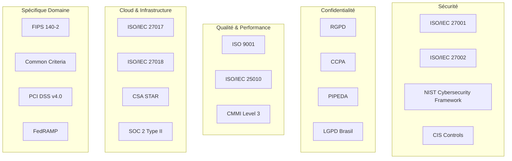

# Standards Internationaux - AindusDB Core

**Version:** 1.0  
**Date:** 21/01/2026  
**Auteur:** Équipe AindusDB  
**Statut:** En rédaction  

---

## 🌍 Vue d'ensemble

AindusDB Core se conforme aux principaux standards internationaux pour garantir la sécurité, la confidentialité et la qualité de ses services.

---

## 📊 Cartographie des Standards



---

## 🔒 Standards de Sécurité

### ISO/IEC 27001 - ISMS

**Portée de certification :**
- Développement et hébergement de AindusDB Core
- Infrastructure cloud (AWS, Azure, GCP)
- Traitements des données clients
- Gestion des sous-traitants

**Contrôles implémentés (114/114) :**

```yaml
annexe_a_controls:
  a5_information_security_policies:
    status: "implémenté"
    controls: 2
    evidence: ["politiques_securite.pdf", "revues_quadrimestrielles"]
  
  a8_asset_management:
    status: "implémenté"
    controls: 10
    evidence: ["inventaire_actifs.xlsx", "classification_donnees.md"]
  
  a9_access_control:
    status: "implémenté"
    controls: 14
    evidence: ["rbac_matrix.yaml", "mfa_logs.db"]
  
  a12_operations_security:
    status: "implémenté"
    controls: 14
    evidence: ["change_management.py", "backup_procedures.md"]
  
  a14_systems_acquisition:
    status: "implémenté"
    controls: 8
    evidence: ["sdlc_security.md", "supplier_assessment.xlsx"]
  
  a15_supplier_relationships:
    status: "implémenté"
    controls: 5
    evidence: ["contracts_review.pdf", "supplier_audit.pdf"]
  
  a16_incident_management:
    status: "implémenté"
    controls: 7
    evidence: ["incident_playbooks/", "post_mortems/"]
  
  a18_compliance:
    status: "implémenté"
    controls: 8
    evidence: ["compliance_matrix.xlsx", "audit_reports/"]
```

### NIST Cybersecurity Framework

```python
# app/compliance/nist_framework.py
from enum import Enum
from typing import Dict, List

class NISTFunction(Enum):
    IDENTIFY = "Identify"
    PROTECT = "Protect"
    DETECT = "Detect"
    RESPOND = "Respond"
    RECOVER = "Recover"

class NISTCompliance:
    def __init__(self):
        self.implementation = {
            NISTFunction.IDENTIFY: {
                "Asset Management": {
                    "ID.AM-1": "Physical devices and systems are inventoried",
                    "ID.AM-2": "Software platforms and applications are inventoried",
                    "ID.AM-3": "Organizational communication and data flows are mapped",
                    "ID.AM-4": "External information systems are catalogued",
                    "ID.AM-5": "Resources are prioritized based on their classification"
                },
                "Risk Assessment": {
                    "ID.RA-1": "Asset vulnerabilities are identified and documented",
                    "ID.RA-2": "Cyber risk to organizational operations, assets, and individuals is understood",
                    "ID.RA-3": "Risk management processes are established and managed"
                }
            },
            NISTFunction.PROTECT: {
                "Access Control": {
                    "PR.AC-1": "Identities and credentials are issued, managed, verified, revoked, and audited",
                    "PR.AC-4": "Access permissions and authorizations are managed",
                    "PR.AC-5": "Network integrity is protected",
                    "PR.AC-6": "Identities are proofed and bound to credentials",
                    "PR.AC-7": "Users, devices, and other assets are authenticated"
                },
                "Data Security": {
                    "PR.DS-1": "Data-at-rest is protected",
                    "PR.DS-2": "Data-in-transit is protected",
                    "PR.DS-4": "Adequate capacity to ensure availability is maintained"
                }
            },
            NISTFunction.DETECT: {
                "Continuous Monitoring": {
                    "DE.CM-1": "The network is monitored to detect potential cybersecurity events",
                    "DE.CM-2": "The physical environment is monitored to detect cybersecurity events",
                    "DE.CM-3": "Personnel activity is monitored to detect cybersecurity events",
                    "DE.CM-7": "Monitoring for new vulnerabilities is performed"
                }
            },
            NISTFunction.RESPOND: {
                "Response Planning": {
                    "RS.RP-1": "Response plan is executed during or after a cybersecurity event",
                    "RS.RP-2": "Incident is contained",
                    "RS.RP-3": "Incident is reported"
                }
            },
            NISTFunction.RECOVER: {
                "Recovery Planning": {
                    "RC.RP-1": "Recovery plan is executed during or after a cybersecurity event",
                    "RC.RP-2": "Recovery processes are improved",
                    "RC.RP-3": "Communications are coordinated during recovery"
                }
            }
        }
    
    def assess_compliance(self) -> Dict:
        """Évalue la conformité NIST"""
        results = {}
        
        for function, categories in self.implementation.items():
            results[function.value] = {}
            
            for category, controls in categories.items():
                results[function.value][category] = {}
                
                for control_id, description in controls.items():
                    # Vérifier l'implémentation
                    implemented = self.check_control_implementation(control_id)
                    
                    results[function.value][category][control_id] = {
                        "description": description,
                        "implemented": implemented,
                        "evidence": self.get_control_evidence(control_id),
                        "last_assessed": datetime.now().isoformat()
                    }
        
        return results
    
    def generate_nist_report(self) -> str:
        """Génère le rapport de conformité NIST"""
        compliance = self.assess_compliance()
        
        report = "# NIST Cybersecurity Framework Compliance Report\n\n"
        report += f"Generated: {datetime.now().strftime('%Y-%m-%d')}\n\n"
        
        total_controls = 0
        implemented_controls = 0
        
        for function, categories in compliance.items():
            report += f"## {function}\n\n"
            
            for category, controls in categories.items():
                report += f"### {category}\n\n"
                
                for control_id, details in controls.items():
                    status = "✅" if details["implemented"] else "❌"
                    report += f"- {status} **{control_id}**: {details['description']}\n"
                    
                    total_controls += 1
                    if details["implemented"]:
                        implemented_controls += 1
                
                report += "\n"
        
        compliance_score = (implemented_controls / total_controls) * 100
        report += f"## Overall Compliance: {compliance_score:.1f}%\n"
        report += f"({implemented_controls}/{total_controls} controls implemented)\n"
        
        return report
```

### CIS Controls

```yaml
# security/cis_controls.yml
cis_controls_implementation:
  version: "CIS Controls v8"
  implementation_groups:
    basic:
      ig1:
        controls:
          - id: "CIS 1.1"
            name: "Inventory of Enterprise Assets"
            status: "implemented"
            tools: ["AWS Config", "Rundeck", "Custom Asset Manager"]
          
          - id: "CIS 1.2"
            name: "Inventory of Software"
            status: "implemented"
            tools: ["Snyk", "Dependabot", "SBOM Generator"]
          
          - id: "CIS 2.1"
            name: "Establish and Maintain a Secure Configuration Process"
            status: "implemented"
            tools: ["Ansible", "Puppet", "CIS Benchmarks"]
          
          - id: "CIS 3.1"
            name: "Run Automated Vulnerability Scanning"
            status: "implemented"
            tools: ["Nessus", "OpenVAS", "OWASP ZAP"]
          
          - id: "CIS 4.1"
            name: "Establish and Maintain a Secure Configuration Process"
            status: "implemented"
            tools: ["CloudFormation", "Terraform", "Security Hub"]
    
    foundational:
      ig2:
        controls:
          - id: "CIS 5.1"
            name: "Establish and Maintain a Secure Configuration Process"
            status: "implemented"
            tools: ["WAF", "CloudArmor", "ModSecurity"]
          
          - id: "CIS 6.1"
            name: "Establish and Maintain a Secure Configuration Process"
            status: "implemented"
            tools: ["CloudTrail", "Audit Manager", "SIEM"]
    
    advanced:
      ig3:
        controls:
          - id: "CIS 7.1"
            name: "Establish and Maintain a Secure Configuration Process"
            status: "partial"
            tools: ["Threat Intelligence Platform", "SOAR"]
```

---

## 🛡️ Standards de Confidentialité

### RGPD (GDPR) - Europe

**Article 25 - Protection par design et par défaut :**
```python
# app/privacy/gdpr_by_design.py
from enum import Enum
from typing import List, Dict, Optional

class GDPRCompliance:
    def __init__(self):
        self.data_principles = {
            "lawfulness": "Traitement licite",
            "fairness": "Traitement équitable",
            "transparency": "Transparence",
            "purpose_limitation": "Limitation des finalités",
            "data_minimisation": "Minimisation des données",
            "accuracy": "Exactitude",
            "storage_limitation": "Limitation de la conservation",
            "integrity_confidentiality": "Intégrité et confidentialité",
            "accountability": "Responsabilité"
        }
    
    def assess_data_processing(self, processing_activity: Dict) -> Dict:
        """Évalue une activité de traitement selon le RGPD"""
        assessment = {
            "activity": processing_activity["name"],
            "data_types": processing_activity["data_types"],
            "purposes": processing_activity["purposes"],
            "legal_basis": self.validate_legal_basis(processing_activity),
            "data_protection_impact": self.assess_impact(processing_activity),
            "measures": self.get_protection_measures(processing_activity),
            "compliance_score": 0
        }
        
        # Calculer le score de conformité
        assessment["compliance_score"] = self.calculate_gdpr_score(assessment)
        
        return assessment
    
    def validate_legal_basis(self, activity: Dict) -> Dict:
        """Valide la base légale du traitement"""
        valid_bases = [
            "consent", "contract", "legal_obligation", 
            "vital_interests", "public_task", "legitimate_interests"
        ]
        
        basis = activity.get("legal_basis")
        
        if basis not in valid_bases:
            return {"valid": False, "reason": "Invalid legal basis"}
        
        if basis == "consent":
            return self.validate_consent(activity)
        elif basis == "legitimate_interests":
            return self.assess_legitimate_interests(activity)
        
        return {"valid": True, "basis": basis}
    
    def generate_dpia(self, processing_activity: Dict) -> Dict:
        """Génère une analyse d'impact relative à la protection des données (AIPD)"""
        dpia = {
            "controller": "AindusDB SAS",
            "dpo": "dpo@aindusdb.com",
            "processing_activity": processing_activity["name"],
            "purposes": processing_activity["purposes"],
            "categories_data_subjects": processing_activity["data_subjects"],
            "categories_personal_data": processing_activity["data_types"],
            "recipients": processing_activity.get("recipients", []),
            "retention_period": processing_activity.get("retention", "Not specified"),
            
            "necessity_proportionality": {
                "necessity": self.assess_necessity(processing_activity),
                "proportionality": self.assess_proportionality(processing_activity)
            },
            
            "risks_to_rights": self.identify_risks(processing_activity),
            "mitigation_measures": self.get_mitigation_measures(processing_activity),
            
            "compliance_gdpr": {
                "lawfulness": self.check_lawfulness(processing_activity),
                "fairness_transparency": self.check_transparency(processing_activity),
                "purpose_limitation": self.check_purpose_limitation(processing_activity),
                "data_minimisation": self.check_minimisation(processing_activity),
                "accuracy": self.check_accuracy(processing_activity),
                "storage_limitation": self.check_storage_limitation(processing_activity),
                "integrity_confidentiality": self.check_security(processing_activity)
            }
        }
        
        return dpia

# Exemple d'utilisation
gdpr = GDPRCompliance()

activity = {
    "name": "Vector Search Analytics",
    "data_types": ["user_id", "search_queries", "ip_address", "timestamps"],
    "data_subjects": ["users", "data_subjects"],
    "purposes": ["service_improvement", "analytics", "personalization"],
    "legal_basis": "legitimate_interests",
    "recipients": ["analytics_team", "ml_engineers"],
    "retention": "365 days"
}

assessment = gdpr.assess_data_processing(activity)
print(f"GDPR Compliance Score: {assessment['compliance_score']}%")
```

### CCPA - Californie

```python
# app/privacy/ccpa_compliance.py
class CCPACompliance:
    def __init__(self):
        self.consumer_rights = [
            "right_to_know",
            "right_to_delete",
            "right_to_opt_out",
            "right_to_non_discrimination"
        ]
    
    def handle_consumer_request(self, request_type: str, consumer_id: str):
        """Gère une demande de consommateur CCPA"""
        if request_type == "know":
            return self.provide_consumer_data(consumer_id)
        elif request_type == "delete":
            return self.delete_consumer_data(consumer_id)
        elif request_type == "opt_out":
            return self.opt_out_sale(consumer_id)
        else:
            raise ValueError("Invalid request type")
    
    def provide_consumer_data(self, consumer_id: str) -> Dict:
        """Fournit les données du consommateur (Right to Know)"""
        # Collecter toutes les données personnelles
        personal_data = {
            "identity": self.get_identity_data(consumer_id),
            "transactions": self.get_transaction_data(consumer_id),
            "interactions": self.get_interaction_data(consumer_id),
            "inferences": self.get_inference_data(consumer_id)
        }
        
        # Formater selon le CCPA
        response = {
            "consumer_id": consumer_id,
            "date_provided": datetime.utcnow().isoformat(),
            "categories_collected": [
                "Identifiers",
                "Personal information categories",
                "Commercial information"
            ],
            "data": personal_data
        }
        
        # Logger la demande
        self.log_ccpa_request(consumer_id, "know", "completed")
        
        return response
    
    def delete_consumer_data(self, consumer_id: str) -> Dict:
        """Supprime les données du consommateur (Right to Delete)"""
        # Identifier toutes les données
        data_locations = self.find_consumer_data(consumer_id)
        
        # Supprimer de chaque système
        deletion_results = {}
        for location in data_locations:
            result = self.delete_from_system(location, consumer_id)
            deletion_results[location] = result
        
        # Vérifier que tout est supprimé
        verification = self.verify_deletion(consumer_id)
        
        if verification:
            # Envoyer confirmation
            self.send_deletion_confirmation(consumer_id)
            
            # Logger
            self.log_ccpa_request(consumer_id, "delete", "completed")
            
            return {
                "status": "completed",
                "consumer_id": consumer_id,
                "deletion_timestamp": datetime.utcnow().isoformat()
            }
        else:
            raise Exception("Deletion verification failed")
```

---

## ☁️ Standards Cloud et Infrastructure

### ISO/IEC 27017 - Cloud Security

```yaml
# security/cloud_security_controls.yml
cloud_security_controls:
  iso_27017:
    a11_cloud_service_customer:
      controls:
        - control_id: "A.11.1.1"
          title: "Cloud service customer responsibilities"
          implementation: |
            - Clear definition of responsibilities in cloud contracts
            - Shared responsibility model documented
            - Regular reviews of cloud provider compliance
          evidence: ["cloud_contracts.pdf", "responsibility_matrix.xlsx"]
        
        - control_id: "A.11.1.2"
          title: "Specific cloud service controls"
          implementation: |
            - Cloud-specific security controls implemented
            - Multi-cloud security strategy
            - Cloud configuration management
          evidence: ["cloud_security_policy.md", "config_monitoring/"]
    
    a12_cloud_service_provider:
      controls:
        - control_id: "A.12.1.1"
          title: "Cloud service provider responsibilities"
          implementation: |
            - Provider compliance verified
            - SLAs monitored and enforced
            - Regular provider audits
          evidence: ["provider_audit_reports/", "sla_monitoring.xlsx"]

  iso_27018:
    public_cloud_pii:
      controls:
        - control_id: "A.1.1.1"
          title: "Customer data"
          implementation: |
            - Customer data encrypted at rest and in transit
            - Data segregation implemented
            - Customer control over encryption keys
          evidence: ["encryption_policy.md", "key_management_procedures.pdf"]
        
        - control_id: "A.2.1.1"
          title: "Use of cloud services for PII"
          implementation: |
            - Explicit consent for cloud processing
            - Country-specific restrictions enforced
            - Data localization requirements met
          evidence: ["consent_records/", "data_location_policy.pdf"]
```

### CSA STAR - Cloud Security Alliance

```python
# app/compliance/csa_star.py
class CSAStarCompliance:
    def __init__(self):
        self.ccm_controls = {
            "AIS-1": {
                "domain": "Audit & Assurance",
                "control": "Audit Planning and Risk Assessment",
                "specification": "The CSP defines and follows a documented process for audit planning and risk assessment",
                "implemented": True,
                "evidence": ["audit_plan_2024.pdf", "risk_assessment.xlsx"]
            },
            "AIS-2": {
                "domain": "Audit & Assurance",
                "control": "Audit Contract Requirements and Legal/Regulatory Requirements",
                "specification": "The CSP defines and follows a documented process for meeting audit contract requirements",
                "implemented": True,
                "evidence": ["contract_requirements.xlsx", "compliance_matrix.pdf"]
            },
            "BCR-1": {
                "domain": "Business Continuity",
                "control": "Business Continuity and Resilience Planning",
                "specification": "The CSP implements a Business Continuity Management (BCM) program",
                "implemented": True,
                "evidence": ["bcp_plan.pdf", "dr_test_results.xlsx"]
            },
            "EKM-1": {
                "domain": "Encryption & Key Management",
                "control": "Encryption Key Management",
                "specification": "The CSP implements documented procedures for the generation, change, storage, destruction and archival of cryptographic keys",
                "implemented": True,
                "evidence": ["key_management_policy.pdf", "hsm_audit_logs/"]
            }
        }
    
    def generate_csa_report(self) -> Dict:
        """Génère le rapport de conformité CSA STAR"""
        report = {
            "framework": "CSA Cloud Controls Matrix v4",
            "assessment_date": datetime.utcnow().isoformat(),
            "overall_compliance": 0,
            "domain_compliance": {},
            "control_details": self.ccm_controls
        }
        
        # Calculer la conformité par domaine
        domain_scores = {}
        for control_id, control in self.ccm_controls.items():
            domain = control["domain"]
            
            if domain not in domain_scores:
                domain_scores[domain] = {"total": 0, "implemented": 0}
            
            domain_scores[domain]["total"] += 1
            if control["implemented"]:
                domain_scores[domain]["implemented"] += 1
        
        # Calculer les pourcentages
        total_controls = len(self.ccm_controls)
        implemented_controls = sum(1 for c in self.ccm_controls.values() if c["implemented"])
        
        report["overall_compliance"] = (implemented_controls / total_controls) * 100
        
        for domain, scores in domain_scores.items():
            report["domain_compliance"][domain] = {
                "compliance": (scores["implemented"] / scores["total"]) * 100,
                "implemented": scores["implemented"],
                "total": scores["total"]
            }
        
        return report
```

### SOC 2 Type II

```yaml
# compliance/soc2_controls.yml
soc2_type_ii:
  trust_services_criteria:
    security:
      common_criteria:
        - id: "CC2.1"
          description: "Committed to System Availability"
          implementation: |
            - 99.9% availability SLA
            - Multi-region redundancy
            - Automated failover
          tests: ["availability_monitoring", "failover_tests"]
        
        - id: "CC3.1"
          description: "System Boundaries Identified"
          implementation: |
            - Clear system boundaries documented
            - Network segmentation implemented
            - API gateway controls
          evidence: ["system_boundary_diagram.pdf", "network_segmentation.yml"]
        
        - id: "CC4.1"
          description: "System Access Controlled"
          implementation: |
            - Role-based access control
            - Multi-factor authentication
            - Privileged access management
          evidence: ["rbac_matrix.xlsx", "mfa_logs.db"]
        
        - id: "CC5.1"
          description: "System Protected Against Malicious Code"
          implementation: |
            - Antivirus/EDR deployed
            - Regular vulnerability scanning
            - Secure coding practices
          evidence: ["vulnerability_reports/", "secure_coding_guidelines.pdf"]
        
        - id: "CC6.1"
          description: "System Data Protected"
          implementation: |
            - Encryption at rest (AES-256)
            - Encryption in transit (TLS 1.3)
            - Data classification
          evidence: ["encryption_policy.pdf", "data_classification.xlsx"]
        
        - id: "CC7.1"
          description: "System Operations Monitored"
          implementation: |
            - 24/7 monitoring
            - SIEM implementation
            - Automated alerting
          evidence: ["monitoring_dashboards/", "siem_rules.yml"]
        
        - id: "CC8.1"
          description: "System Data Transmitted Protected"
          implementation: |
            - TLS 1.3 enforcement
            - Certificate management
            - Network encryption
          evidence: ["tls_configuration.pdf", "certificate_inventory.xlsx"]
    
    availability:
      criteria:
        - id: "A1.1"
          description: "Availability Objectives Defined"
          implementation: |
            - RTO/RPO defined
            - Availability targets set
            - Performance baselines
          evidence: ["sla_document.pdf", "performance_baselines.xlsx"]
        
        - id: "A2.1"
          description: "System Designed for Availability"
          implementation: |
            - High availability architecture
            - Load balancing
            - Auto-scaling
          evidence: ["architecture_diagram.pdf", "scaling_policies.yml"]
    
    confidentiality:
      criteria:
        - id: "C1.1"
          description: "Confidentiality Objectives Defined"
          implementation: |
            - Data classification scheme
            - Access control policies
            - NDA requirements
          evidence: ["classification_policy.pdf", "access_control_matrix.xlsx"]
    
    privacy:
      criteria:
        - id: "P1.1"
          description: "Privacy Objectives Defined"
          implementation: |
            - Privacy policy published
            - Data retention schedules
            - Consent management
          evidence: ["privacy_policy.pdf", "consent_records.db"]
```

---

## 🔐 Standards Spécifiques au Domaine

### FIPS 140-2 - Cryptographie

```python
# app/security/fips_compliance.py
from cryptography.hazmat.primitives import hashes
from cryptography.hazmat.primitives.kdf.pbkdf2 import PBKDF2HMAC
from cryptography.hazmat.primitives.ciphers import Cipher, algorithms, modes
from cryptography.hazmat.backends import default_backend

class FIPS1402Module:
    """Module cryptographique validé FIPS 140-2"""
    
    def __init__(self):
        self.backend = default_backend()
        self.validate_fips_mode()
    
    def validate_fips_mode(self):
        """Valide que le module fonctionne en mode FIPS"""
        if not self.backend._fips_enabled:
            raise RuntimeError("FIPS mode not enabled")
    
    def encrypt_aes256(self, data: bytes, key: bytes) -> bytes:
        """Chiffrement AES-256 validé FIPS"""
        # Valider la taille de la clé
        if len(key) != 32:
            raise ValueError("Key must be 256 bits (32 bytes)")
        
        # Générer un IV aléatoire
        iv = os.urandom(16)
        
        # Créer le cipher
        cipher = Cipher(
            algorithms.AES(key),
            modes.CBC(iv),
            backend=self.backend
        )
        
        encryptor = cipher.encryptor()
        
        # Padding PKCS7
        padder = padding.PKCS7(128).padder()
        padded_data = padder.update(data) + padder.finalize()
        
        # Chiffrer
        ciphertext = encryptor.update(padded_data) + encryptor.finalize()
        
        return iv + ciphertext
    
    def derive_key(self, password: str, salt: bytes) -> bytes:
        """Dérivation de clé PBKDF2 validée FIPS"""
        kdf = PBKDF2HMAC(
            algorithm=hashes.SHA256(),
            length=32,
            salt=salt,
            iterations=100000,
            backend=self.backend
        )
        
        return kdf.derive(password.encode())

# Configuration FIPS
fips_config = {
    "validated_modules": [
        "OpenSSL 3.0.2 FIPS Provider",
        "Bouncy Castle FIPS 140-2"
    ],
    "approved_algorithms": [
        "AES-256",
        "RSA-2048/3072/4096",
        "ECDSA P-256/P-384/P-521",
        "SHA-256/384/512",
        "HMAC-SHA256/384/512"
    ],
    "key_management": {
        "key_generation": "FIPS approved RNG",
        "key_storage": "HSM or FIPS validated module",
        "key_destruction": "Cryptographic erasure"
    }
}
```

### PCI DSS v4.0

```yaml
# security/pci_dss_controls.yml
pci_dss_v4:
  requirements:
    req1:
      title: "Install and maintain network security controls"
      controls:
        - control: "1.1.1"
          description: "Processes and mechanisms for all network security controls are documented"
          implementation: |
            - Network diagram maintained
            - Firewall rules documented
            - Change process for network controls
          evidence: ["network_diagram.pdf", "firewall_rules.xlsx"]
        
        - control: "1.2.1"
          description: "Configuration standards for network security controls are defined"
          implementation: |
            - Firewall configuration standards
            - Router configuration standards
            - Wireless security standards
          evidence: ["network_standards.pdf", "device_configs/"]
    
    req2:
      title: "Apply secure configurations to all system components"
      controls:
        - control: "2.1.1"
          description: "Processes for identifying security vulnerabilities are defined"
          implementation: |
            - Vulnerability management program
            - Risk ranking methodology
            - Protection mechanisms
          evidence: ["vulnerability_policy.pdf", "risk_ranking.xlsx"]
        
        - control: "2.2.1"
          description: "Configuration standards are defined"
          implementation: |
            - System configuration standards
            - Software installation standards
            - Hardening procedures
          evidence: ["config_standards.pdf", "hardening_guides/"]
    
    req3:
      title: "Protect stored account data"
      controls:
        - control: "3.3.1"
          description: "PAN is rendered unreadable"
          implementation: |
            - Tokenization implemented
            - Strong cryptography for PAN
            - Limited PAN storage
          evidence: ["tokenization_policy.pdf", "crypto_inventory.xlsx"]
        
        - control: "3.5.1"
          description: "Primary Account Number (PAN) is masked"
          implementation: |
            - Masking procedures defined
            - Masking implemented in displays
            - Masking implemented in logs
          evidence: ["masking_procedures.pdf", "masking_examples.pdf"]
    
    req4:
      title: "Protect cardholder data with strong cryptography"
      controls:
        - control: "4.1.1"
          description: "Strong cryptography and security protocols are used"
          implementation: |
            - TLS 1.2+ enforced
            - Weak protocols disabled
            - Cipher suites controlled
          evidence: ["tls_configuration.pdf", "cipher_suites.yml"]
        
        - control: "4.2.1"
          description: "Cryptographic cardholder data is protected"
          implementation: |
            - Key management processes
            - Key storage procedures
            - Key destruction procedures
          evidence: ["key_management.pdf", "key_lifecycle.xlsx"]
    
    req12:
      title: "Support information security with organizational policies and programs"
      controls:
        - control: "12.1.1"
          description: "Information security policy is established"
          implementation: |
            - Comprehensive security policy
            - Annual review process
            - Policy acknowledgment
          evidence: ["security_policy.pdf", "acknowledgment_records.xlsx"]
        
        - control: "12.2.1"
          description: "Risk management program is established"
          implementation: |
            - Annual risk assessment
            - Risk mitigation strategies
            - Risk monitoring process
          evidence: ["risk_assessment.pdf", "risk_mitigation.xlsx"]
```

---

## 📊 Matrice de Conformité

### Tableau de Synthèse

```python
# app/compliance/compliance_matrix.py
import pandas as pd
from typing import Dict, List

class ComplianceMatrix:
    def __init__(self):
        self.standards = {
            "ISO 27001": {
                "scope": "ISMS",
                "status": "Certified",
                "last_audit": "2023-12-15",
                "next_audit": "2024-12-15",
                "score": 100,
                "controls": 114,
                "exceptions": 0
            },
            "SOC 2 Type II": {
                "scope": "Security, Availability, Confidentiality, Privacy",
                "status": "Certified",
                "last_audit": "2023-11-30",
                "next_audit": "2024-11-30",
                "score": 98,
                "controls": 64,
                "exceptions": 1
            },
            "GDPR": {
                "scope": "Data Protection",
                "status": "Compliant",
                "last_review": "2024-01-15",
                "next_review": "2024-07-15",
                "score": 95,
                "controls": 99,
                "exceptions": 2
            },
            "CCPA": {
                "scope": "Consumer Privacy",
                "status": "Compliant",
                "last_review": "2024-01-10",
                "next_review": "2024-07-10",
                "score": 93,
                "controls": 45,
                "exceptions": 3
            },
            "PCI DSS": {
                "scope": "Payment Card Data",
                "status": "Not Applicable",
                "last_review": "N/A",
                "next_review": "N/A",
                "score": 0,
                "controls": 0,
                "exceptions": 0
            },
            "ISO 27017": {
                "scope": "Cloud Security",
                "status": "Implemented",
                "last_review": "2024-01-20",
                "next_review": "2024-07-20",
                "score": 90,
                "controls": 37,
                "exceptions": 2
            },
            "ISO 27018": {
                "scope": "Cloud Privacy",
                "status": "Implemented",
                "last_review": "2024-01-20",
                "next_review": "2024-07-20",
                "score": 88,
                "controls": 25,
                "exceptions": 3
            },
            "NIST CSF": {
                "scope": "Cybersecurity Framework",
                "status": "Aligned",
                "last_review": "2024-01-18",
                "next_review": "2024-04-18",
                "score": 92,
                "controls": 108,
                "exceptions": 8
            },
            "CIS Controls": {
                "scope": "Security Controls",
                "status": "Implemented",
                "last_review": "2024-01-16",
                "next_review": "2024-04-16",
                "score": 85,
                "controls": 153,
                "exceptions": 15
            },
            "CSA STAR": {
                "scope": "Cloud Security",
                "status": "Level 1",
                "last_review": "2023-12-01",
                "next_review": "2024-12-01",
                "score": 87,
                "controls": 197,
                "exceptions": 20
            }
        }
    
    def generate_matrix_report(self) -> pd.DataFrame:
        """Génère un rapport matrice de conformité"""
        data = []
        
        for standard, info in self.standards.items():
            data.append({
                "Standard": standard,
                "Scope": info["scope"],
                "Status": info["status"],
                "Score": f"{info['score']}%",
                "Controls": f"{info['controls']}",
                "Exceptions": info["exceptions"],
                "Last Review": info["last_review"],
                "Next Review": info["next_review"]
            })
        
        df = pd.DataFrame(data)
        
        # Calculer le score global
        certified_standards = [s for s in self.standards.values() 
                             if s["status"] in ["Certified", "Compliant", "Implemented"]]
        
        if certified_standards:
            global_score = sum(s["score"] for s in certified_standards) / len(certified_standards)
            print(f"Global Compliance Score: {global_score:.1f}%")
        
        return df
    
    def identify_gaps(self) -> Dict:
        """Identifie les écarts de conformité"""
        gaps = {}
        
        for standard, info in self.standards.items():
            if info["exceptions"] > 0:
                gaps[standard] = {
                    "exceptions": info["exceptions"],
                    "gap_percentage": 100 - info["score"],
                    "priority": "High" if info["exceptions"] > 5 else "Medium"
                }
        
        return gaps
    
    def create_roadmap(self) -> Dict:
        """Crée une feuille de route pour améliorer la conformité"""
        roadmap = {
            "q1_2024": [],
            "q2_2024": [],
            "q3_2024": [],
            "q4_2024": []
        }
        
        # Prioriser les actions
        gaps = self.identify_gaps()
        
        for standard, gap in gaps.items():
            if gap["priority"] == "High":
                action = {
                    "standard": standard,
                    "action": f"Address {gap['exceptions']} exceptions",
                    "estimated_effort": f"{gap['exceptions'] * 5} days",
                    "owner": "Compliance Team"
                }
                roadmap["q1_2024"].append(action)
            else:
                action = {
                    "standard": standard,
                    "action": f"Address {gap['exceptions']} exceptions",
                    "estimated_effort": f"{gap['exceptions'] * 3} days",
                    "owner": "Compliance Team"
                }
                roadmap["q2_2024"].append(action)
        
        return roadmap

# Utilisation
matrix = ComplianceMatrix()

# Générer le rapport
report = matrix.generate_matrix_report()
print(report)

# Identifier les écarts
gaps = matrix.identify_gaps()
print("\nCompliance Gaps:")
for standard, gap in gaps.items():
    print(f"- {standard}: {gap['exceptions']} exceptions ({gap['gap_percentage']}% gap)")

# Créer la feuille de route
roadmap = matrix.create_roadmap()
print("\nImprovement Roadmap:")
for quarter, actions in roadmap.items():
    if actions:
        print(f"\n{quarter}:")
        for action in actions:
            print(f"  - {action['standard']}: {action['action']}")
```

---

## 📋 Plan de Conformité Continue

### Monitoring Automatisé

```python
# app/compliance/continuous_monitoring.py
class ComplianceMonitor:
    def __init__(self):
        self.standards_monitor = StandardsMonitor()
        self.alert_manager = ComplianceAlertManager()
    
    async def continuous_monitoring(self):
        """Surveillance continue de la conformité"""
        while True:
            # Vérifier chaque standard
            for standard in self.standards_monitor.get_active_standards():
                compliance_status = await self.check_standard_compliance(standard)
                
                # Vérifier les dérives
                if compliance_status["score"] < standard["minimum_score"]:
                    await self.alert_manager.trigger_compliance_alert(
                        standard["name"],
                        compliance_status
                    )
                
                # Mettre à jour le dashboard
                await self.update_compliance_dashboard(
                    standard["name"],
                    compliance_status
                )
            
            # Attendre la prochaine vérification
            await asyncio.sleep(3600)  # Vérification chaque heure
    
    async def check_standard_compliance(self, standard: Dict) -> Dict:
        """Vérifie la conformité d'un standard"""
        controls = standard["controls"]
        results = {}
        
        for control_id, control in controls.items():
            # Exécuter les tests de conformité
            test_result = await self.run_compliance_test(control)
            results[control_id] = test_result
        
        # Calculer le score
        implemented = sum(1 for r in results.values() if r["compliant"])
        score = (implemented / len(results)) * 100
        
        return {
            "standard": standard["name"],
            "score": score,
            "controls": results,
            "timestamp": datetime.utcnow().isoformat()
        }

# Dashboard de conformité
@app.get("/compliance/dashboard")
async def compliance_dashboard():
    """Endpoint pour le dashboard de conformité"""
    monitor = ComplianceMonitor()
    
    dashboard_data = {
        "overall_score": monitor.get_overall_score(),
        "standards": monitor.get_standards_status(),
        "trends": monitor.get_compliance_trends(),
        "upcoming_audits": monitor.get_upcoming_audits(),
        "open_exceptions": monitor.get_open_exceptions()
    }
    
    return dashboard_data
```

---

## 🎯 Bonnes Pratiques

### 1. Gestion de la Conformité
- Cartographier tous les standards applicables
- Maintenir une matrice de conformité à jour
- Automatiser la surveillance continue
- Planifier les améliorations proactivement

### 2. Documentation
- Maintenir des preuves d'implémentation
- Documenter toutes les exceptions
- Garder un historique des audits
- Partager les connaissances

### 3. Amélioration Continue
- Analyser les écarts de conformité
- Mettre en œuvre des plans d'action
- Suivre les indicateurs de performance
- Adapter aux nouveaux standards

---

**Document maintenu par l'équipe AindusDB Core**  
**Dernière mise à jour:** 21/01/2026
