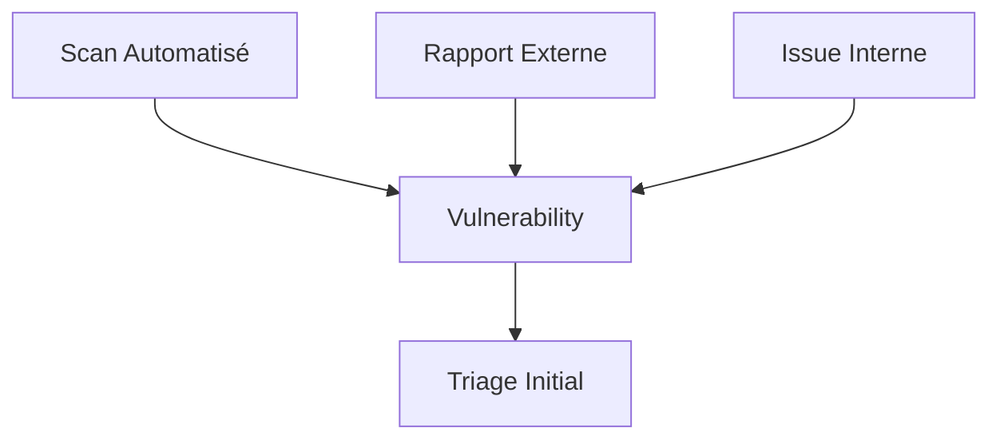

# 🛡️ Plan de Réponse aux Vulnérabilités

**Version**: 1.0  
**Date**: 20 janvier 2026  
**Applicable**: AindusDB Core & Écosystème

---

## 📋 Table des Matières

1. [Vue d'ensemble](#vue-densemble)
2. [Classification des Vulnérabilités](#classification-des-vulnérabilités)
3. [Processus de Gestion](#processus-de-gestion)
4. [Plans de Réponse par Sévérité](#plans-de-réponse-par-sévérité)
5. [Communication](#communication)
6. [Outils et Ressources](#outils-et-ressources)
7. [Checklists](#checklists)

---

## 🎯 Vue d'ensemble

Ce document définit le processus standardisé pour gérer les vulnérabilités découvertes dans AindusDB Core, de la détection à la résolution.

### Objectifs
- **Réponse rapide** : Intervention dans les délais définis
- **Priorisation** : Basée sur l'impact et le risque
- **Traçabilité** : Suivi complet du cycle de vie
- **Amélioration continue** : Apprentissage de chaque incident

---

## 🏷️ Classification des Vulnérabilités

### Niveaux de Sévérité

| Sévérité | Critères | Délai de Correction | Exemples |
|----------|----------|--------------------|----------|
| **CRITICAL** | Exploitable sans auth, impact critique | 24-48h | RCE, injection SQL avec droits admin |
| **HIGH** | Exploitable avec auth, impact élevé | 72h | XSS vol de session, élévation de privilèges |
| **MEDIUM** | Exploitation complexe, impact modéré | 7 jours | CSRF, information disclosure |
| **LOW** | Impact limité, difficile à exploiter | 30 jours | Headers manquants, version exposée |
| **INFO** | Recommandation, pas de risque immédiat | 90 jours | Best practices, optimisations |

### CVSS Score Mapping
- **9.0-10.0** → CRITICAL
- **7.0-8.9** → HIGH
- **4.0-6.9** → MEDIUM
- **0.1-3.9** → LOW
- **0.0** → INFO

---

## 🔄 Processus de Gestion

### 1. Détection


**Sources de détection:**
- Scans automatisés (quotidiens)
- Rapports de chercheurs
- Issues de sécurité
- Monitoring d'anomalies

### 2. Triage Initial
```python
# Triage automation script
def triage_vulnerability(vuln_data):
    score = calculate_cvss_score(vuln_data)
    severity = map_severity(score)
    
    # Vérifier si déjà connue
    if is_duplicate(vuln_data):
        return update_existing(vuln_data)
    
    # Créer le ticket
    ticket = create_security_ticket(
        title=vuln_data['title'],
        severity=severity,
        description=vuln_data['description']
    )
    
    # Notifier l'équipe
    notify_security_team(ticket, severity)
    
    return ticket
```

### 3. Analyse
- **Impact assessment**
- **Vecteur d'attaque**
- **Composants affectés**
- **Données à risque**

### 4. Planification
- **Assignation** : Développeur lead + Security
- **Estimation** : Effort et complexité
- **Dépendances** : Blocages ou prérequis
- **Backport plan** : Versions affectées

### 5. Développement du Correctif
```python
# Secure development workflow
def develop_fix(vulnerability):
    # 1. Branch de sécurité
    create_security_branch(f"fix/{vulnerability.id}")
    
    # 2. Développement avec tests
    write_fix_code(vulnerability)
    write_security_tests(vulnerability)
    
    # 3. Review obligatoire
    request_security_review()
    
    # 4. Validation
    run_security_scan()
    manual_penetration_test()
    
    # 5. Merge
    merge_to_main()
    tag_security_release()
```

### 6. Déploiement
- **Staging validation**
- **Rollback plan**
- **Maintenance window**
- **Monitoring post-déploiement**

### 7. Communication
- Interne : Équipe, management
- Externe : Clients, public (si nécessaire)
- Documentation : Mise à jour

---

## 🚨 Plans de Réponse par Sévérité

### CRITICAL - "All Hands on Deck"
```yaml
timeline:
  detection: "0h"
  triage: "1h"
  analysis: "2h"
  fix_development: "12h"
  testing: "6h"
  deployment: "2h"
  total: "24h"

actions:
  - "War room activation"
  - "All developers assigned"
  - "Customer communication prepared"
  - "Legal notified if PII affected"
  - "Hotline support ready"

escalation:
  - "Immediate CISO notification"
  - "CTO involvement"
  - "Executive committee update"

examples:
  - "Remote Code Execution"
  - "Database access without auth"
  - "Private data exposure"
```

### HIGH - "Priority Response"
```yaml
timeline:
  detection: "0h"
  triage: "4h"
  analysis: "8h"
  fix_development: "24h"
  testing: "12h"
  deployment: "4h"
  total: "48h"

actions:
  - "Security team lead assigned"
  - "Dedicated developer(s)"
  - "Staging validation required"
  - "Release notes prepared"

escalation:
  - "CISO notification in 4h"
  - "Weekly status updates"

examples:
  - "XSS with session theft"
  - "SQL injection with user access"
  - "Authentication bypass"
```

### MEDIUM - "Standard Process"
```yaml
timeline:
  detection: "0h"
  triage: "24h"
  analysis: "48h"
  fix_development: "3 days"
  testing: "2 days"
  deployment: "1 day"
  total: "7 days"

actions:
  - "Backlog prioritization"
  - "Next sprint assignment"
  - "Standard testing process"

escalation:
  - "Security team notification"
  - "Bi-weekly status"

examples:
  - "CSRF vulnerabilities"
  - "Information disclosure"
  - "Missing security headers"
```

---

## 📢 Communication

### Interne - Slack/Teams
```yaml
critical:
  channel: "#security-critical"
  frequency: "Hourly updates"
  stakeholders: ["CISO", "CTO", "DevOps Lead", "Product Owner"]

high:
  channel: "#security-high"
  frequency: "Daily updates"
  stakeholders: ["Security Lead", "Dev Lead"]

medium:
  channel: "#security"
  frequency: "Weekly updates"
  stakeholders: ["Security Team"]
```

### Externe - Client Communication
```markdown
### Template Vulnérabilité Critique

**Sujet**: Action de sécurité requise - [Nom du produit]

**Cher client,**

Nous avons identifié une vulnérabilité de sécurité critique dans [composant].

**Impact**: [Description claire de l'impact]
**Action requise**: [Instructions précises]
**Délai**: [Date limite]

Nous travaillons sur un correctif qui sera disponible le [date].

Pour toute question: security@aindusdb.com

Cordialement,
Équipe de Sécurité AindusDB
```

### Public - CVE Process
1. **Coordination** avec le découvreur
2. **Délai de divulgation** : 90 jours standard
3. **Publication CVE** si applicable
4. **Advisory public** avec détails

---

## 🛠️ Outils et Ressources

### Outils de Gestion
```yaml
ticketing:
  tool: "Jira"
  project: "SEC"
  workflow: "Vulnerability Management"

tracking:
  tool: "DefectDojo"
  features: ["CVSS scoring", "tracking", "reporting"]

communication:
  tool: "Slack"
  channels: ["#security", "#security-critical"]
  integrations: ["Jira", "PagerDuty"]

automation:
  ci_cd: "GitHub Actions"
  scans: ["SAST", "DAST", "SCA"]
  deployment: "Automated with manual approval"
```

### Scripts Automatisés
```python
# vulnerability_manager.py
class VulnerabilityManager:
    def create_ticket(self, vuln):
        """Créer un ticket Jira automatiquement"""
        ticket = {
            "project": "SEC",
            "summary": f"[{vuln.severity}] {vuln.title}",
            "description": vuln.description,
            "priority": map_priority(vuln.severity),
            "labels": ["security", vuln.type]
        }
        return jira.create_issue(ticket)
    
    def assign_developer(self, ticket_id, expertise_required):
        """Assigner automatiquement selon l'expertise"""
        available = get_available_developers()
        assigned = match_expertise(available, expertise_required)
        jira.assign_issue(ticket_id, assigned)
    
    def schedule_reminders(self, ticket_id, due_date):
        """Programmer des rappels automatiques"""
        schedule_reminder(due_date - timedelta(days=1), ticket_id)
        schedule_reminder(due_date - timedelta(hours=4), ticket_id)
        schedule_escalation(due_date, ticket_id)
```

---

## ✅ Checklists

### Checklist Triage (1h)
- [ ] Score CVSS calculé
- [ ] Sévérité déterminée
- [ ] Impact évalué
- [ ] Composants identifiés
- [ ] Doublon vérifié
- [ ] Ticket créé
- [ ] Équipe notifiée

### Checklist Analyse (4-8h)
- [ ] Reproduction réussie
- [ ] Vecteur d'attaque compris
- [ ] Données à risque identifiées
- [ ] Portée déterminée
- [ ] Correctif envisagé
- [ ] Risque accepté si non-correction

### Checklist Développement
- [ ] Branch de sécurité créée
- [ ] Tests unitaires écrits
- [ ] Tests sécurité ajoutés
- [ ] Code review effectué
- [ ] Scan statique passé
- [ ] Documentation mise à jour

### Checklist Déploiement
- [ ] Validé en staging
- [ ] Rollback testé
- [ ] Monitoring configuré
- [ ] Équipes notifiées
- [ ] Maintenance planifiée
- [ ] Post-déploiement vérifié

### Checklist Post-Incident
- [ ] Rapport d'incident rédigé
- [ ] Leçons apprises documentées
- [ ] Procédures mises à jour
- [ ] Équipe formée
- [ ] Outils améliorés
- [ ] Suivi planifié

---

## 📊 Métriques et KPIs

### Temps de Résolution
- **MTTR Critical**: < 48h
- **MTTR High**: < 72h
- **MTTR Medium**: < 7 jours
- **MTTR Low**: < 30 jours

### Qualité
- **% résolues dans les délais**
- **% récidives (même type)**
- **Temps moyen de détection**
- **Nombre de vulnérabilités par release**

### Tendance
- **Évolution du backlog**
- **Sévérité moyenne**
- **Vulnérabilités introduites vs corrigées**

---

## 🔄 Processus d'Amélioration

### Revue Trimestrielle
1. Analyse des métriques
2. Identification des patterns
3. Mise à jour des procédures
4. Formation équipe

### Mise à Jour Annuelle
1. Révision complète du processus
2. Mise à jour des outils
3. Certification externe si nécessaire
4. Communication des améliorations

---

## 📞 Contacts d'Urgence

| Rôle | Contact | Disponibilité |
|------|---------|---------------|
| CISO | ciso@aindusdb.com | 24/7 |
| Security Lead | security@aindusdb.com | 24/7 |
| DevOps Lead | devops@aindusdb.com | 24/7 |
| Legal | legal@aindusdb.com | Business hours |

---

**Ce document est vivant et doit être mis à jour régulièrement.**

Dernière mise à jour : 20 janvier 2026  
Prochaine révision planifiée : 20 avril 2026
